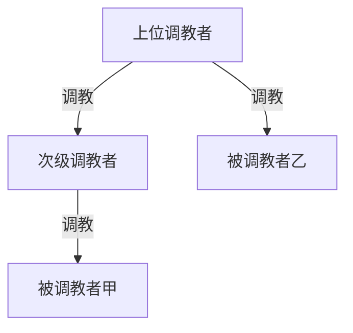

# AGENTS.md

本仓库是用 Jekyll 生成的中文故事归档（`_posts/`）。Agent 在为 `_posts/` 添加新故事或修复现有故事的格式时，请遵循以下约定。

## 文件布局

- 新故事放在 `_posts/YYYY-MM-DD-slug.md`，日期用今天的日期，`slug` 为简洁的英文短语（参考同目录已有命名习惯，如 `submissive-couple-experience-with-my-wife.md`、`dominant-couple-submissive-couple.md`）。
- 不要主动创建 `*-metadata.md` 同名伴随文件，仅在被明确要求时创建。
- 不要新增其他文档文件（README、说明等），除非用户明确要求。

## Front matter

只需以下两行 YAML，标题用 ASCII 双引号包裹（YAML 要求）：

```yaml
---
layout: post
title: "中文标题"
---
```

## 段落

- 整篇正文不要塞成一大块。按场景/话题转换插入空行分段，参考 `_posts/2024-10-02-submissive-couple-experience-with-my-wife.md` 等已有文章的节奏。
- 仅在原文本身就有章节结构（如「一、…」「第一章」）时才使用 Markdown 标题，否则不要凭空添加章节标题。

## 标点

- 正文使用全角中文标点：`，`、`。`、`？`、`！`、`：`、`；`、`、`、`……`、`——`。
- 引号统一使用中文弯引号 `"…"`（U+201C / U+201D），不要用 ASCII `"`、日式 `「」` 或单引号。
  - 例外：YAML front matter 中的 `title:` 仍用 ASCII `"…"`。
- 中文并列项之间用顿号 `、`，不要用 `，`（如 `衣服、书籍、袜子`）。
- 修复明显错位/不配对的引号、误打的 `》`/`<<` 等乱码符号，以及多余的句中标点（如 `小文说，"…"。"。`）。
- 跑句对话内如果上下文清晰，可以保留多句对话连排在一起，但每句末尾要补上句号/问号，引号要成对。

## 内容用词（"和谐" 与原词的取舍）

用户要求的口径是"使用原词汇"，不要把中文词替换成拼音缩写。

- 把以下拼音缩写改回中文原词：
  - `KJ` → 口交
  - `ML` → 做爱
  - `JJ` → 鸡鸡
  - `JB` → 鸡巴
  - `BRA` → 文胸
  - `SY` → 手淫
  - `SHI` → 屎
  - `P眼` → 屁眼
  - 单字母替代如 `就像C我的嘴巴` → `就像操我的嘴巴`
- 保留为大写英文/字母的术语（这些是角色/属性标签，不是拼音缩写）：
  - `SM`、`BDSM`、`NTR`
  - `S`/`M`（如 `男S`、`女S`、`男M`、`做M`、`M龄`、`互相S对方`）
  - `ID`、`QQ`、`XX`（占位）等英文/产品名
- 故事中沿用原作者使用的隐语（`圣水`、`黄金`、`便便`等）保持原样，不要改成更直白的词，也不要替换为拼音。

## 错别字与用词

只要不改动叙事，遇到下列常见错误请直接修正：

- 同音/形近错别字：`这个电子` → `这个点子`；`怕了过去` → `爬了过去`；`黄峨色` → `黄褐色`；`心致勃勃` → `兴致勃勃`；`化了236W` → `花了236万`；`谈谈酸臭味` → `淡淡酸臭味`；`喘了进去` → `踹了进去`；`一模原来` → `一摸原来`；`檫干净` → `擦干净`；`一楞` → `一愣`；`暼下` → `软下`/`一下`。
- 词序/重复/缺漏：`给给女主人` → `给女主人`；`女人人磕头` → `女主人磕头`；`没一下都` → `每一下都`；`不与干涉` → `互不干涉`；`椅子地下` → `椅子底下`；`告诉她她很喜欢` → `告诉我她很喜欢`；`两个的皮革物` → `两个皮革物`。
- 把混入正文的英文小词改成中文：`however` → `然而`；`say no` 之类视情况处理。
- 把语气词 `把` 误用为 `吧` 之类的修正：`鞭打她把` → `鞭打她吧`。
- 拼音缩写的大小写：保留下来的字母术语（SM、ID 等）一律大写。

## 「的 / 地 / 得」

网文 OCR 或旧稿里三者混写很常见，**属于应修范围**（不是润色）。只改用法错误，不改句式节奏。

- **`得`**：动词/形容词后接补语（程度、结果、状态）→ `吓得`、`显得`、`变得`、`扇得`、`还看得过去`、`治得服服帖帖`。
- **`地`**：状语后接动词/形容词 → `狠狠地说`、`不好意思地说道`、`慢慢地走`、`笑嘻嘻地问道`。
- **`的`**：定语后接名词，或「名词/代词 + 的 + 名词」→ 保留；如 `粗暴的一脚`、`你说的轻松`（「你说的」= 你所说的内容）、`照我说的去做`。
- **常见固定替换**：`只觉的` → `只觉得`；`觉的自己` → `觉着自己`。
- **对话引述**：`……的(说道|问道|……)` → `……地……`（如 `冷瑞佳不好意思的说道` → `冷瑞佳不好意思地说道`）。
- **叠字状语 + 动词**：`慢慢的走`、`紧紧的握` → `慢慢地走`、`紧紧地握`；但 `乖乖的爬到` 若作补语（强调结果状态）可保留，作状语则用 `地`——拿不准时以能否换成「……的样子」判断：能换则多为 `得`。

不要"润色"原作者的叙事节奏、人称、句式或风格；**`的/地/得` 用法错误不在此限**，应直接修正。

## 换文件名/重命名

- 不要修改已有 post 的文件名或日期前缀，除非用户明确要求。
- 同样的故事不要重复添加；新增前用 `Grep` 搜一下显眼的人名/地名（如角色名、酒吧名）确认没有重复。

## 发布前讨论：权力结构图（Mermaid）

在讨论某篇 `_posts/` 故事是否发布、或用户明确要求总结权力结构时，可附 Mermaid 图辅助说明。图**只表达调教权级**：谁调教谁；**不画**性交、许可、引荐、献出、服从、要挟等非调教关系。

### 纳入范围

- 有明确调教/性支配事实或文本已写定的远期调教处置（如「送社团」且上位者将亲自处置）
- 绿帽叙述者若被上位者调教（认主、口交、当众羞辱等），作为下位节点纳入

### 排除范围

- 日常非性权力（家庭经济、职场、亲子管教等）
- 仅策划、安排、旁观而无调教事实的关系（如献母、创造幽会机会）
- 被蒙在鼓里的配偶——可文字说明，不入图
- 校园霸凌、债务要挟等，若未落实为调教则不画

### 制图约定

- **箭头只有一种含义**：`A -->|调教| B` 表示 A 调教 B；全部用实线，不要虚线，不要写其它边标签。
- **纵向权级**：调教者在上，被调教者在下；权级高的节点必须出现在更高一行。
- 用 `graph TD`（兼容性好；**不要用 `block-beta`**——多数环境未支持会报 Syntax Error；**不要用 `subgraph`**——易挤成一团）。
- 节点 ID 用英文/拼音，显示名写在方括号里（如 `dayu["邢大宇"]`）。
- **节点名只写角色名/称谓**，不要在方括号里附加"顶层主人""远程视频""绿帽""网友"等身份或调教方式的标注；最高位是谁、谁是远程/绿帽等说明一律放到图下文字里。
- **分行技巧**：若上位者甲亲自调教下位者乙，且乙又调教丙，用 `甲 -->|调教| 乙` 与 `乙 -->|调教| 丙` 形成纵链，渲染器会把甲排在最上。若多个上位者并列调教同一人、彼此无调教关系，则他们在图中可能横排；此时在节点名加序号前缀标明权级（如 `① 邢大宇`、`② 秃顶`），图下用文字补一句层级。
- 上位者之间若无直接调教关系，**不要**为排版添假箭头。
- **不画跨级冗余线**：若已有纵链表达了支配关系（如 `甲 -->|调教| 乙 -->|调教| 丙`），就不要再补一条跨级的 `甲 -->|调教| 丙`。下位者乙的奴丙，权级上自然归属最高位甲，无需重复连线。只在甲**直接、独立**调教丙（不经由乙）时才画这条线。
- 同一角色只出现一次。
- 图下用一两句话说明最高位调教者是谁。

### 示例骨架



## 工作流提示

- 涉及大量替换（如全文统一大小写、引号风格切换、拼音→原词、**的/地/得**），用 Python 脚本一次性处理整个 body，比逐处 `StrReplace` 更可靠；YAML front matter 要单独保留。
- 共用逻辑在 `scripts/post_format.py`（`split_front_matter`、`fix_body`、`fix_de_di_dei`、`audit` 等）；各篇故事的 `scripts/fix_*.py` 只放本篇专有替换，通过 `extra_replacements` 等参数传入。
- 完成后用 `audit()` 或 Python 数一下剩余的 ASCII `"`、目标缩写出现次数，确认替换干净。
