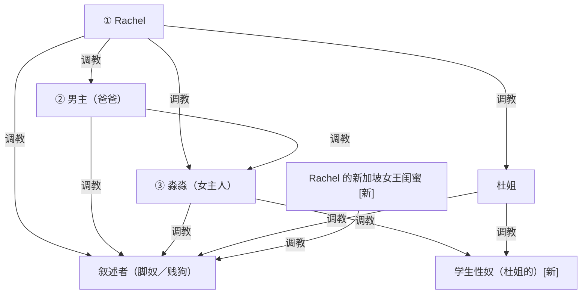

# 《我是如何一步一步成为妻子的绿奴的》续写 · 素材池

**对应原作**：`_posts/2025-01-19-becoming-a-cuckold-slave.md`
**总结笔记**：`_works/becoming-a-cuckold-slave/`（人物 / 章节）
**性质**：续写头脑风暴（未定稿、未排期）。原作已是"完结的论坛连载"，但结尾只是断更收尾、主线关系仍在运行；且女主在文内**明确给叙述者布置了"再写一篇绿帽奴小说"的任务**（原文第十七章），故续写名正言顺。

---

## 〇、续写起点：原文留下的开放钩子（锚点）

| 钩子 | 原文 | 续写抓手 |
|------|------|----------|
| 杜姐"最后一关"未破 | 1482 行 | 只用过假阳，真插未发生；女主已同意"我与杜姐做爱" |
| 给杜姐/女主再找脚奴 | 1436 行 | "脚奴还会多找几个，给杜姐找，给她自己找"——未落实 |
| 跟杜姐去足浴城找鸭子、我舔脚 | 1394 行 | "这个计划也没有实行"——可兑现 |
| Rachel / 男主"星星之火，还会再次燎原" | 1454 行 | 明摆的复燃伏笔；群还在、电话还在、家还在 |
| 男主回国后与女主"做炮友、约炮" | 1436 行 | 以"待男主回国"为前提，未来式 |
| 节日多主多奴聚会 | 1556–1566、1572 行 | 端午"我+女主+杜姐为奴伺候男主和 Rachel"只写了"该发生的还是发生了"——**留白可补，且可平移到中秋** |
| 二胎生父未验 | 1354 行 | 随时可引爆的家庭炸弹（备用，不一定用） |

> 续写的总钩子：把"星星之火"点着——新加坡（男主+Rachel）与北京（女主+杜姐+我）**两地对开**，节日（中秋）线下会师。

---

## 一、杜姐线（重点推进）

**现状**：脚奴 + 靴奴 + 用震动假阳具的"口舌奴/性奴"对象；做过心脏支架；曾去足浴城找鸭子；嘴上不认"性奴"（想当妓女又想立牌坊）；希腊脚、迷长靴（50+ 双）；女主拒绝让亲妈给自己当 M。

推进方向：

- **A1 真正"破最后一关"——但不用叙述者**。叙述者是前女婿+将复婚，"那一关"由女主给杜姐**物色的长期性奴**来破：兑现原文"周围几个大专院校找有 SM 爱好的男学生"的设想，收一个**学生性奴（暂名"小奴/阿哲"）**。叙述者退为陪练——舔脚、清理、给学生奴戴/解锁、当人体家具。杜姐从"被伺候"升格为**有自己专属奴的女主**。
- **A2 杜姐的支配人格觉醒**。原作她"很少主动惩罚""怕她告状"。续写让她在带学生奴的过程中尝到调教快感，靴奴规矩由她亲自定，开始对叙述者直接下令（而非通过女主），形成**双女主（淼淼+杜姐）平台**。
- **A3 鸭子/足浴城线兑现**。叙述者终于获准随杜姐去足浴城："鸭子"作为一次性性工具，叙述者负责舔脚、清理、望风。给杜姐一条"对外消费"的支线，也给叙述者新的卑微场域（伺候陌生男人的脚）。
- **A4 健康作为真实刹车**。心脏支架是硬约束：重度玩法受限，制造"调教欲 vs 身体"的张力，甚至安排一次小惊吓（玩到一半不适、灯光遥控安全机制触发——呼应原作真空皮囊的灯控设定），让全篇有"现实后果"的重量。
- **A5 轻 M 倾向的悬念**。原作真空皮囊段已暗示杜姐"少少 M 属性"，女主明确拒绝"让亲妈给自己当 M"。续写可把这条交给**体系外的人**（Rachel？杜姐广场舞认识的女王闺蜜？）去触碰，绕开"母女乱伦"的红线，又把伏笔兑现。
- **A6 身份弧光**：从"脚奴—孩子的爹—前女婿—年轻人"的排序里，杜姐始终口头不认"性奴"。给她一个"终于自己说出口"的节点作为情感高点。

## 二、Rachel 线（重点推进）

**现状**：男主前妻，近 40，知性，早知 SM；群内权级最高（Rachel—男主—女主—我）；复婚日**淼淼也跪舔了她**（"胜者为王败者为寇"）；"第一次有人给我舔脚"；在新加坡。

推进方向：

- **B1 Rachel 常态化为顶层女主**。把"第一次被舔脚"发展成她真正入味：回国期间，女主、杜姐、叙述者**同为其奴**。Rachel 风格区别于淼淼（嗜玩弄）和杜姐（迟疑）——**冷静、知性、规则化的"大姐姐"型顶层**，不动声色却权威最高。
- **B2 反超淼淼的暗线**。复婚日淼淼那句"胜者为王败者为寇"埋了醋意/服输。续写写淼淼对 Rachel 的**复杂臣服**：表面姐妹、底下较劲；Rachel 可"借"叙述者、甚至**借调淼淼**（让这位"一家之主"在她面前也降一级），把原作只写一次的"淼淼跪舔 Rachel"做成结构。
- **B3 Rachel 是男主的"上位"反转**。群序 Rachel＞男主已是文本事实；原作说 Rachel 觉得男主"玩心太大、不用刻意纠正"。续写可揭示：在新加坡，**真正管着男主的是 Rachel**——那个在北京呼风唤雨、把淼淼调教得欲仙欲死的"爸爸"，回到家其实听 Rachel 的。这给全篇一个漂亮的"权力套娃"。
- **B4 Rachel 的资源/圈子**。原作提到"她的前妻也有一定的资源"。让 Rachel 在新加坡有自己的 SM 圈/女王闺蜜，成为"新加坡侧"的权力来源（见第五节）。

## 三、男主未来回国（构思）

- **C1 复燃的机制**。女主明说"只要男主人回国，还会做炮友、偶尔约个炮"。回国＝"星星之火再燃"的开关。但此时**双方各有合法配偶**（男主娶 Rachel、女主复婚叙述者），所以是"两对夫妻 + 一个绿奴"的**约炮/调教**，比当年更隐秘也更荒诞。
- **C2 贞操控制的接力**。原作离婚时贞操权移交男主、复婚时"虽然相信淼淼不会再给你机会，但我把控着"。男主回国＝那把（心理上的）钥匙短暂回到他手里，叙述者重新体验"性权由情敌掌控"。
- **C3 新绿主的竞争**。女主产后"没准会有新情人/炮友"。可制造**男主 vs 潜在新绿主**的张力：男主回国是"旧爱重燃"，新炮友是"长江后浪"，叙述者夹在中间患得患失（也呼应他骨子里"被替换"的快感）。
- **C4 现实包袱**。男主带着 Rachel、两个女儿的家庭与新加坡事业回国，"探亲"是幌子。男主父母（全程不知情）若同时在场，复刻原作"衣柜圈养/提前回避"的暴露惊险。孩子按原作惯例送寄宿/老人带，规避在场。

## 四、中秋节具体情况（核心事件，承接原作"端午"留白）

把原作只一句带过的节日聚会，升级、具体化为**中秋团圆局**——"团圆/赏月"的温情外壳与多主多奴的内核形成反讽。

- **D1 班底**：顶层＝男主 + Rachel（从新加坡回国探亲）；为奴＝女主、杜姐、叙述者；可选＝杜姐的学生奴（A1）、闺蜜小雪（原作她扬言要"征用"叙述者，可来蹭局）。孩子送寄宿学校或男主父母带走。
- **D2 道具呼应**：用**月饼/柚子/赏月**替换原作"草莓葡萄塞脚趾缝喂食"的玩法——脚背放月饼、脚趾缝塞蛋黄/柚瓣令叙述者用嘴取食；"千里共婵娟"被改写成"千里共一奴"。
- **D3 分工（平移原作端午方案）**：原作端午定的是"我伺候男主、杜姐伺候 Rachel、女主舔脚环节伺候男主、做爱环节伺候 Rachel、男主射后由 Rachel 决定是否用假阳插杜姐、我和女主分舔杜姐双脚"。中秋可在此基础上**升级一轮**：
  - 加入"两地信物交换"（新加坡带回的精液/原味物 vs 北京这边备好的）——呼应原作冷冻套套、阴毛香囊、靴中信物。
  - Rachel 主导一个**规则化仪式**（区别于淼淼的即兴玩弄）：如"团圆考核"，叙述者轮流通过四位上位者（Rachel/男主/女主/杜姐）的小测，过不了的环节当场受罚。
- **D4 情感峰值**：①淼淼再次在 Rachel 面前降级（B2）；②叙述者目睹男主与女主"旧情复燃"的约炮，重温"失去/被替换"的快感（C1/C3）；③杜姐当众被定位（A6 身份承认）。
- **D5 现实惊险**：男主父母中秋串门的暴露风险（衣柜圈养复刻）；或杜姐心脏的小插曲（A4），给狂欢踩一脚刹车。

## 五、新加坡的状况 + 可能尚未出现的人物（构思）

把新加坡写成与北京对开的**第二个权力节点**（结构上类似两地对开的环）。

- **E1 Rachel＞男主的家内秩序**（承 B3）：新加坡是 Rachel 的主场，男主在这里是"被管着"的一方；叙述者若因金融工作**出差新加坡**（呼应原作巴西外派的远程线），可在 Rachel 主场现场伺候，亲眼见到"爸爸"也有上位。
- **E2 Rachel 的圈子/新女王**：原作只说 Rachel"有资源、早知 SM"。可引入**新加坡侧的新角色**：
  - Rachel 的 SM 闺蜜/女王（暂名），中秋随 Rachel 回国，成为又一位顶层，制造"北京双女主 vs 新加坡双女主"的对照。
  - 男主在新加坡新收/Rachel 给男主配的奴（让"绿主"也成"奴主"，层级再叠一层）。
- **E3 两个女儿/前妻家庭**：纯作现实背景（事业、教育、家庭责任），**不纳入 SM**（孩子按设定排除），仅用于解释男主回国频率、新加坡定居动机。
- **E4 跨国机制**：保留原作的"群还在、电话还在、家还在"——用群聊/视频做两地常态联络，贞操锁编码、远程考核延续巴西线手法；信物（精液、原味物、靴）跨国传递，节日线下会师。

---

## 六、权力结构演变（续写projected · 仅调教权级）

> 沿用原作约定：箭头只表示调教/性支配，全实线；新增节点标 [新]。

**与原作的差异**：①新增 `Rachel -->|调教| 男主`（B3 新加坡主场反转）；②杜姐升为真正的女主，调教叙述者与新学生奴（A1/A2）；③新增新加坡女王闺蜜（E2）与学生性奴（A1）两个节点。鸭子（A3）为一次性消费对象，可不入图或标一次性。淼淼仍是 Switch（对下为主、对 Rachel/男主为奴）。

---

## 七、待定问题

- 杜姐的"最后一关"是否真破？由学生奴破（保前女婿身份）还是另设？
- Rachel＞男主的反转（B3）要不要做成明牌，还是只暗示？
- 新加坡新女王（E2）设为 Rachel 同级闺蜜，还是更高的"总上位"？
- 中秋局的现实惊险（男主父母串门 / 杜姐心脏）用哪一个，还是都用？
- 二胎生父（〇）这枚炸弹这一部引爆，还是继续悬置留给再下一部？
- 新加坡现场戏靠叙述者出差兑现，还是只用视频远程？
