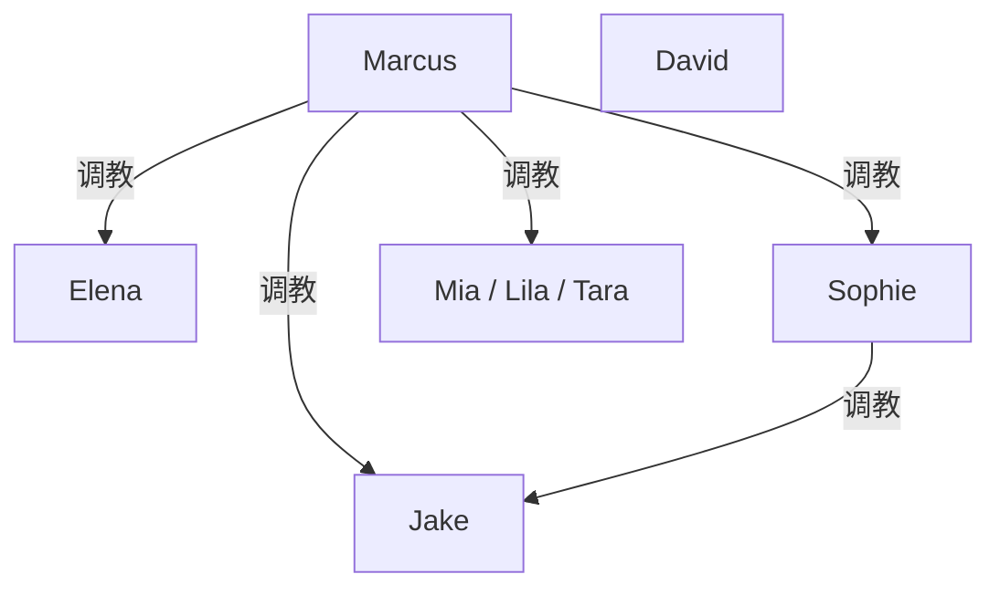
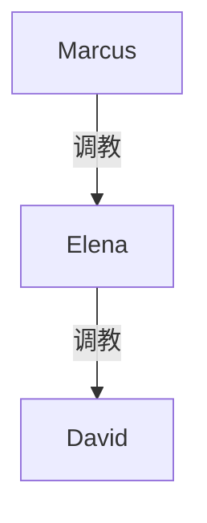

# 《Bull's Dominant Pickup》续写规划 · 素材池

**对应转录**：`_posts/ideas/bulls-dominant-pickup-elena-hotel-grok.md`  
**来源**：https://grok.com/share/bGVnYWN5LWNvcHk_f78503cc-384d-4696-ad80-effb32939c3d  
**性质**：续写方向头脑风暴（未定稿、未排期）。本文件只规划，不直接写成发布稿。

---

## 〇、现状快照（续写起点）

| 人物 | 状态 |
|------|------|
| **Marcus** | 酒店猎手；同时握着 Elena、Sophie/Jake、三闺蜜三条线 |
| **Elena** | 已婚；已被开苞式收编；旅行期间远程学会支配丈夫；回酒店当夜被 Marcus「反施其道」，跪地求高潮未获准 |
| **David** | Elena 丈夫；全程不知情；已被妻子（实为 Marcus）训练成服从姿态 |
| **Sophie** | 有男友；被立为「当家人」；握 Jake 手机家长控制与告状权 |
| **Jake** | Sophie 男友；曾家暴；被 Marcus 殴服；现处 Sophie 之下、心怀怨恨 |
| **Mia / Lila / Tara** | 三单身闺蜜；正被玩具调教，未收尾 |

### 开放钩子

1. Elena 跪求高潮——当夜未完。
2. David 仍在隔壁/同楼层房间，以为妻子只是「出去一下」。
3. Sophie 对 Jake 的新权力刚生效，尚未稳定。
4. 三闺蜜与 Sophie 送玩具线可合流。
5. 早期台词：anniversary 酒店地址——长期占有伏笔。
6. Elena 已会支配 David ↔ Marcus 正用同一套反过来支配 Elena——**镜像权力**可做结构主轴。

### 当前调教权级（事实层）

最高位是 Marcus。David 尚未被 Marcus 当面调教（目前只被 Elena 代行支配，图中不画虚线「许可」关系）；若走「知情绿帽」路线，再把他纳入。

---

## 一、总路线菜单（先选主轴，再叠支线）

| 代号 | 主轴一句话 | 调性 | 建议篇幅感 |
|------|------------|------|------------|
| **A** | Elena 彻底沦为酒店常驻玩物，David 从蒙在鼓里→知情绿帽 | 经典牛头/绿帽升级 | 中长 |
| **B** | Sophie 当家线做实：家暴逆转→女主日常暴君，Marcus 遥控 | 家暴反转 + 远程主 | 中 |
| **C** | 三闺蜜扩成「猎场班底」：拉皮条/诱饵/集体玩 | 猎手产业化 | 中 |
| **D** | 多线同夜合流：Elena 归来撞见 Sophie/三女，公开叠层羞辱 | 高潮会师局 | 短–中（可作一章爆点） |
| **E** | David 发现→冲突→被制服纳入（或被踢出） | 丈夫线爆发 | 中 |
| **F** | Elena 学会的支配外溢：对闺蜜/同事/服务员练手，Marcus 批发任务 | 「女牛」养成 | 中长 |
| **G** | 离开酒店：公寓/婚姻日常长期结构（钥匙、日程、规则） | 从猎艳到圈养 | 长 |
| **H** | 平行猎物：再收一对「强势妻+懦夫」或「女王被反收」填空格子 | 类型扩展 | 可插播 |

可组合示例：`A+D`（会师后捅破 David）、`B+G`（Sophie 日常化）、`A+F+G`（Elena 养成后回家长期制）。

---

## 二、路线 A · Elena / David 绿帽升级（优先候选）

**引擎**：Marcus 不急着让 David 知情；先用 Elena 当遥控器，把「妻子变暴君」做成丈夫无法解释的婚姻异变，再选时机揭底。

### A1 当夜收尾（必写垫场）

- 接转录末句：逼 Elena 求高潮 → 边边缘 → 不准射/不准高潮 → 命令她带着痕迹回 David 房「正常睡觉」。
- 可选加码：回房后必须骑在睡着的/半醒的 David 脸上清理；或把 Marcus 的精液以接吻喂给丈夫（呼应第 5 轮吻戏）。

### A2 「妻子突然强势」日常滑坡

- 回家后数日：穿衣、花钱、性生活节奏全由 Elena（实为 Marcus 日报）决定。
- David 的反应光谱：困惑讨好 → 性兴奋 → 轻度恐惧 → 依赖。
- **不写** Marcus 出场，只写短信/语音——保持猎手神秘。

### A3 知情三选一（关键分叉）

| 分支 | 机制 | 结果权级 |
|------|------|----------|
| **A3a 温柔揭底** | Elena 在床上逼问「你想不想知道我为什么变了」→播录音/看聊天 | David 跪求加入；Marcus 远程或上门验收 |
| **A3b 当众揭底** | 餐厅/酒店酒吧，Marcus「偶遇」入座，Elena 当众坐 Marcus 腿上 | 羞恥峰值高；David 崩溃后臣服 |
| **A3c 暴力揭底** | David 跟踪发现 → 冲门 → 被 Marcus 制服（复刻 Jake 男厕线，但调性可更「绅士残酷」） | David 与 Jake 对位：懦夫版 vs 家暴版 |

### A4 纳入后的稳定结构

- Marcus 调教 Elena；Elena 调教 David（纵链，不画 Marcus→David 跨级线，除非 Marcus **当面独立**调教 David）。
- 规则菜单：禁射钥匙在 Marcus；夫妻性必须先请示；定期「汇报课」；纪念日酒店复刻开场。

### A5 镜像主题（推荐作为 A 的文眼）

旅行中 Elena→David 的每一条指令，在 A1/A4 由 Marcus→Elena 复刻一遍，再由 Elena→David 二次下达——**同一剧本三层演出**。

---

## 三、路线 B · Sophie / Jake 当家做实

**引擎**：Marcus 已完成「授权」；续写重点是 **Sophie 敢不敢用权**，以及 Jake 的怨恨如何变成燃料。

### B1 授权后第一周

- Sophie 试探：家务、下跪、口头辱骂 → Jake 阳奉阴违 → Sophie 一次「告诉 Marcus」即生效（Marcus 远程语音/突然上门五分钟）。
- 建立条件反射：Sophie 的威胁必须**真的灵**，否则结构塌。

### B2 家暴语法反转

- 原 Jake 打 Sophie 的借口（洗不干净、顶嘴、偷看手机）→ Sophie 原样拿来打 Jake。
- 注意：保持 Marcus 为最高仲裁；避免写成 Sophie 独立暴君脱离猎手（除非刻意走 B4）。

### B3 性权移交

- Sophie 获得：单方面拒绝/要求；用玩具；把 Jake 借给 Marcus；强制观摩。
- Jake：清洁口、人体家具、录视频存证（家长控制云盘）。

### B4 分叉：Sophie 忠诚度

| 分支 | 内容 |
|------|------|
| **B4a 忠犬女管** | Sophie 完全代理 Marcus；自己仍被 Marcus 随时按趴 |
| **B4b 权力上瘾** | Sophie 对 Jake 越来越狠，对 Marcus 开始讨价还价 → Marcus 降维打击她一次 → 更稳的奴管 |
| **B4c 逃逸失败** | Sophie 想带着把柄逃离 → 家长控制/人脸锁死 → 抓回加重 |

### B5 与 Elena 线对位（可选）

| | Elena/David | Sophie/Jake |
|--|-------------|-------------|
| 妻子起点 | 被钓的人妻 | 出轨害怕家暴的女友 |
| 丈夫/男友 | 忽视型懦夫 | 暴力型男友 |
| 中间层 | Elena 学支配 | Sophie 被封「当家」 |
| 主题 | 温吞婚姻异化 | 暴力关系翻转 |

两线并列写「Marcus 制造女暴君」的两种工厂产品。

---

## 四、路线 C · 三闺蜜班底化

**引擎**：Mia/Lila/Tara 不是一次性群P，而是猎手的**工具人储备**。

### C1 当晚收束 → 分级

- 按服从度分档：最乖的升「助手」、中间「玩具」、最硬的「示众惩罚样板」（呼应第 30 轮有人 push back）。
- 给三人名字与差异：如 Mia 谄媚、Lila 爱面子、Tara 嘴硬——后续好辨认。

### C2 职能化

- **诱饵**：酒吧帮 Marcus 盯结婚戒指/被冷落的女伴。
- **后勤**：订房、买玩具、盯绿帽短信已读。
- **双飞道具**：招待新猎物时「示范服从」。
- **探子**：接近 Elena/Sophie 的社交圈，制造巧合重逢。

### C3 风险

- 其中一人想录音曝光 → Marcus 用群内视频互持把柄化解。
- 或一人的追求者找上门 → 小规模复刻 Jake 线（证明方法可复制）。

---

## 五、路线 D · 同酒店会师局（强高潮章）

**适用**：想先写一章爆点再决定长线时。

### D1 场景拼盘

1. 三闺蜜还在 Marcus 房；Sophie 奉命送第二次补给/侍奉。
2. Elena 按召而来（David 以为她下楼买酒）。
3. 门开：人妻撞见全裸闺蜜堆 + Sophie 跪姿。

### D2 羞辱编排（只列权力动作）

- Elena 必须叫 Sophie「姐姐」或相反（按 Marcus 心情定谁高半级）。
- 命令 Elena 复述旅行中对 David 做过的清单；三女当观众。
- Sophie 被命令讲述 Jake 如何求饶——两段绿帽叙事对播。
- 可选：视频连线 Jake 打扫房间；David 尚未接入。

### D3 会师后分叉

- **D→A**：会师结束赶 Elena 回房，进入 A2 日常。
- **D→E**：会师太久，David 上来找人 → 直接接 E。
- **D→C**：会师后宣布三女今后听 Sophie/Elena 调度 → 班底成型。

---

## 六、路线 E · David 发现与处置

**只在需要「丈夫戏份」时启动；不宜过早，否则远程控制的诡异感会丢。**

| 强度 | 情节 | 后续 |
|------|------|------|
| **E1 软发现** | 看见短信锁屏、闻到气味、听到「Sir」 | Elena 圆谎失败 → A3a |
| **E2 硬发现** | 撞见现场 | 崩溃/打架/报警威胁 → Marcus 压下 |
| **E3 主动献妻** | David 性癖被唤醒，反向恳求 Marcus「管我们」 | 最快进入 A4 稳定态 |
| **E4 驱逐** | David 要离婚带走把柄 | Marcus/Elena 反制（证据、社会耻感）；或真离——Elena 成公开情妇（另一种结局） |

**建议**：主线若走经典牛头，优先 **E3** 或 **A3a→知情同意**；要黑与痛选 **E2**；要写实婚姻破碎选 **E4**。

---

## 七、路线 F · Elena「女牛」养成

**引擎**：Marcus 的兴趣不只是操她，而是把她做成**二级猎手**。

### F1 任务制

- 每周任务：在健身房/公司酒会/闺蜜局对一名新对象完成「眼神锁定→联系方式→一次越界」。
- 汇报格式固定（呼应她给 Marcus 讲旅行细节）。

### F2 练手对象候选

- David 的女同事（反向绿帽社交）。
- Elena 自己的闺蜜（把「被钓」传染开）。
- 酒店服务员/前台（场所特权）。
- 一名女 S/女上位——**反收**（填 H 的格子）。

### F3 风险与回报

- Elena 越强势，对 David 越像女主人；对 Marcus 越像得意犬——**双层人格**好写。
- 若 Elena 独立收服成功，Marcus 可赏一次「主导 David 的完整夜」，或罚一次「你也只是工具」。

---

## 八、路线 G · 离酒店后的长期圈养

把「猎艳故事」收成「结构故事」时用。

### G1 物质锚

- 备用钥匙、远程贞操/日程 App、共享相册、家庭群（已在 Sophie 线示范过家长控制——可平移到 Elena/David）。
- 每月固定「酒店夜」复刻开场吧台戏。

### G2 社会锚

- 朋友聚会上 Marcus 以「大学同学/健身教练」身份出现。
- 纪念日旅行：David 订的房，Marcus 住隔壁——闭环第 2 轮台词。

### G3 情感弧（可选）

- Elena：从刺激 → 依赖 → 恐惧失去 Marcus → 主动献祭婚姻。
- David：从糊涂 → 硬 → 软 → 「没有规则反而恐慌」。
- Marcus：保持功能性冷血；或偶尔露出「收藏癖」——不宜突然真爱洗白。

---

## 九、路线 H · 类型扩展（插播用）

在主线间隙插入，避免三线写腻：

| 格子 | 猎物类型 | 一句话钩子 |
|------|----------|------------|
| H1 | 傲慢女强人 + 懦弱男秘 | 吧台反向：她先挑 Marcus，再被翻盘 |
| H2 | 新婚夫妇度蜜月 | 时间压力：必须在退房前完成规则植入 |
| H3 | 女 S 带男 M 出巡 | Marcus 反收女 S，男 M 权级上移或崩塌 |
| H4 | 只有女友、男友在国外 | 纯远程绿帽，短信美学复用 Elena 旅行章 |
| H5 | Sophie 的女同事看见伤痕 | 要么报案线（写实风险），要么被吞进圈 |

---

## 十、推荐拼车方案（三条可执行包）

### 方案 α ·「镜像闭环」（偏 Elena 主线）

1. A1 当夜收尾  
2. A2 回家滑坡一周  
3. D 轻量版：Sophie 视频出镜「示范」给 Elena 看（非全员会师）  
4. A3a 知情  
5. A4+A5 镜像结构定型  
6. G2 纪念日酒店闭环  

**终点权级**：Marcus → Elena → David。

### 方案 β ·「双厂产品」（Elena ∥ Sophie）

1. B1–B3 Sophie 当家一周（细）  
2. A2 Elena 滑坡一周（对位剪辑）  
3. D 会师章  
4. E3 / A3a 收 David  
5. C2 三女职能化收束  

**终点权级**：Marcus 下辖两条纵链——Elena→David；Sophie→Jake；三女平铺玩具/助手。

### 方案 γ ·「猎手帝国」（偏扩张）

1. C1–C2 三女班底  
2. F1–F2 Elena 外出任务  
3. H3 或 H1 插播新猎物  
4. G1 技术圈养（家长控制升级）  
5. 总会师：多对夫妻/女友同酒店层  

**终点**：从「一个牛」变成「可复制的狩猎系统」；风险是人物稀释——每条新线要有差异格子。

---

## 十一、不建议 / 慎用

- **过早让 David 全知**：远程诡异感与「妻子异变」戏会缩水。
- **Marcus 真爱救赎**：与既有猎手人设冲突。
- **Sophie 线无限家暴加码而无权力结构推进**：变成纯虐清单，权级不再变化。
- **所有线同时平均用力**：34 轮已铺三线，续写应选 α/β/γ 之一作主包，其余降为插叙。
- **未成年、真实可识别个人信息**：排除。

---

## 十二、待讨论问题（写前需拍板）

1. 主包选 α / β / γ，还是只要单章 D？
2. David 最终：蒙在鼓里长期 / 知情绿帽 / 被驱逐？
3. Sophie 与 Elena 是否要排「女眷座次」，还是互不所属、只共侍 Marcus？
4. 文本语言：续写跟转录保持英文，还是中文重写（对位仓库其他 `_posts`）？
5. 是否需要先产出「权力结构定稿图」再动笔？

---

## 十三、若只续一轮：最小下一章提纲

**标题候选**：`The Mirror` / `她跪着学会的事，现在轮到她受`

1. 接跪求：Marcus 拒绝高潮，列出「旅行清单」逐条在 Elena 身上执行（骑脸、禁射话术、屁/气味类可按需降噪或保留）。  
2. 命令她写检讨式汇报发给自己，抄送一份「将来给丈夫看的版本」。  
3. 穿衣回房；David 半醒问候；Elena 按指令接吻喂残味。  
4. 凌晨短信：明日任务预告（A2 第一天）——**章末钩子停在「回家」而非新开线**。  

此章不碰 Sophie/三女，专修 Elena 镜像，最利主线清晰。
