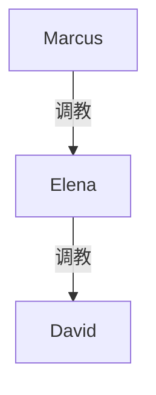
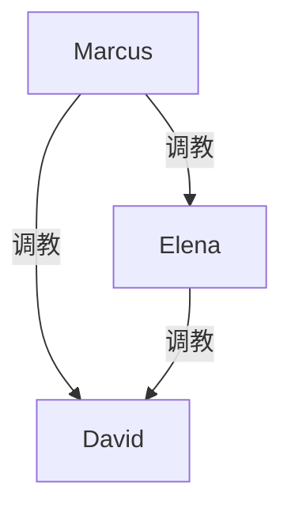

# 路线 E 细规 · David 发现与处置

**隶属**：`bulls-dominant-pickup-elena-hotel-continuation-plan.md` §六  
**对应转录**：`bulls-dominant-pickup-elena-hotel-grok.md`  
**性质**：E 线专项规划（未定稿）。写前先在本文件拍板「触发档 + 终局档」，再动笔。

---

## 〇、E 线是什么 / 不是什么

| 是 | 不是 |
|----|------|
| **丈夫知情事件**及其善后：发现 → 反应 → 处置 → 新稳态 | A 线的「妻子异变滑坡」（那是蒙在鼓里阶段） |
| 把 David 从「被代行支配的不知情者」变成叙事主体之一 | 必须立刻写成 Jake 式殴服（可参考，人设不同） |
| 决定绿帽结构能否成立的**阀门章** | 越早越好——过早会吃掉远程诡异感 |

**一句话**：E = 捅破窗户纸之后，这个婚姻往哪边倒。

---

## 一、启动前提（写 E 之前必须满足）

### 1.1 最低库存（建议全勾）

- [ ] Elena 已被 Marcus 当面收编（转录已满足）
- [ ] 旅行中 Elena→David 的服从惯性已建立（转录已满足：禁射、喂食、车上气味、公开小羞辱）
- [ ] David **至少有一次**对「新妻子」表示兴奋而非纯抗拒（转录：*hottest thing / I didn’t know I liked that*）
- [ ] 读者见过 Marcus 处理「愤怒男友」的样板（Jake 线）——便于对照懦夫版

### 1.2 时机光谱（何时捅破）

| 档 | 时机 | 收益 | 代价 |
|----|------|------|------|
| **T0 当晚** | Elena 回 Marcus 房未归，David 上楼找人 | 冲击最大；可接 D→E | 丢失「回家后异变」整段 A2 |
| **T1 回家 3–7 日** | 滑坡后软发现 | 异变戏充分；发现更合理 | 爆点略缓 |
| **T2 第二次酒店夜** | 纪念日/「加班」再约 | 闭环开场吧台；仪式感强 | 需先写过渡 |
| **T3 长期后** | 数周规则已稳，偶然曝光 | 适合写实 tonality | 中段易水 |

**建议**：主包若含 A2，用 **T1**；若只要一夜爆章，用 **T0**；若走仪式感牛头，用 **T2**。

### 1.3 与 A3 / D 的关系（避免重复发明）

```
A2 蒙在鼓里滑坡
   ├─ A3a 温柔揭底  ──┐
   ├─ A3b 当众揭底  ──┼─→ 进入 E 的「反应段」（E 不重复写发现，只写发现之后）
   ├─ A3c 暴力揭底  ──┘
   └─ D→E 撞破会师  ──→ 直接视为 E2 触发，跳过圆谎
```

**分工**：

- **A3 / D**：负责「怎么被知道」（触发器）。
- **E**：负责「知道了之后怎么办」（反应弧 + 处置 + 终局权级）。

若触发已在 A3/D 写完，E 章从 David 的第一句实质反应起笔。

---

## 二、David 人设锚点（写反应前先钉死）

### 2.1 转录已给出的性格零件

| 零件 | 文本依据 | 写作用途 |
|------|----------|----------|
| **忽视型丈夫** | 开场吧台刷手机、大笑 | 原罪：他先把妻子推出轨道 |
| **冲突回避** | 旅行中几乎不顶嘴，被点餐/喂食仍跟 | 发现后第一反应更像僵住，不是挥拳 |
| **性上被带跑** | 承认喜欢被支配、觉得最热 | 知情后可滑向兴奋/屈辱并存 |
| **信息差巨大** | 回酒店仍不知 Marcus | 发现时世界观崩塌幅度大 |
| **无暴力史** | 对比 Jake | **禁止**写成第二个 Jake；硬刚最多推搡/打电话，打不过且打不久 |

### 2.2 David 的「发现瞬间」内在公式

```
自尊受伤（妻子有别人）
  + 身体记忆（这些天被她骑着脸/禁止射精的快感）
  + 恐惧（婚姻/面子/ compar 自己不如人）
  = 混乱；方向由「触发强度 + Marcus 在场与否」决定滑向 E3 或 E4
```

### 2.3 反应四拍（所有分支共用骨架）

无论 E1–E4，David 知情后建议都走这四拍，只是**每拍时长与烈度**不同：

1. **空白**（数秒～数分钟）：说不出完整句子；重复「什么」「你认真的」。
2. **道德/所有权语言**：「你怎么能」「我们是夫妻」「那个人是谁」。
3. **对照崩溃**：想起旅行里自己舔手指、吸气味、叫她决定性生活——意识到自己早已在表演绿帽。
4. **择路**：求解释 / 求加入 / 求毁灭（离婚、报警、自暴自弃）——此处接入终局分叉。

---

## 三、触发器细谱（E1–E4 = 入口，不是结局）

> 旧表把 E1–E4 写成「强度+结局」混在一起。细规里拆开：  
> **入口**（怎么发现）× **终局**（婚姻去向）矩阵见 §五。

### E1 · 软发现（信息泄漏）

**适用时机**：T1 / T2  
**Marcus 在场**：通常不在  
**爆点等级**：★☆☆☆☆ → 若圆谎失败可升到 ★★★

| 子触发 | 具体节拍 | 圆谎难度 |
|--------|----------|----------|
| E1a 锁屏 | 通知横幅：`Sir` / 位置共享 / 「回房脱掉」；David 眼角瞥见 | 中：可说工作群/恶搞 |
| E1b 气味 | 亲吻/同床时闻到陌生体味或精液味残留；旅行后已有伏笔可回收 | 高：越描越黑 |
| E1c 口述泄漏 | Elena 睡梦/高潮口误「Marcus」「主人」 | 中 |
| E1d 物证 | 酒店房卡第二张、陌生内裤、聊天截图进最近删除 | 极高 |
| E1e 行为反证 | David 问「你为什么突然变成这样」；Elena 笑太满或回避太硬 | 低→中 |

**软发现标准流程**：

1. 泄漏发生。  
2. Elena 圆谎 1～2 次（Marcus 短信同时施压：不许完全说实话 / 或相反：逼她说实话）。  
3. David 抓住矛盾 → 进入反应四拍。  
4. **分支**：  
   - 仍想信 → 延迟发现（可再埋一次 E1）。  
   - 不信 → 升格为「对质夜」→ 等同 A3a，再进 §四处置。

**软发现忌**：一次锁屏就立刻跪称主——跳拍会毁人物。至少留一轮否认/讨价还价。

### E2 · 硬发现（目击现场）

**适用时机**：T0（最佳）、T2  
**Marcus 在场**：是  
**爆点等级**：★★★★☆～★★★★★

| 子触发 | 场景 | 视觉羞辱核 |
|--------|------|------------|
| E2a 房门 | David 敲错/找妻子，Marcus 房门开一条缝或全开 | Elena 跪姿/被使用中 |
| E2b 会师溢出 | D 线拖太久，David 下楼/上楼寻找 | 多女+Sophie 同框（极强） |
| E2c 吧台复刻 | 开场吧台位置，Elena 坐 Marcus 腿上，David 从电梯口看见 | 公众空间、可撤回性低 |
| E2d 隔墙 | 听见妻子叫声+男人声，撞开同层房间 | 听觉先于视觉，崩得更慢更虐 |

**硬发现标准流程**：

1. 目击（或听觉确认）。  
2. **空白拍加长**——身体先动：后退、扶墙、开门僵住。  
3. 道德语言冲口而出；可能掏手机要报警/录视频。  
4. Marcus 处置介入（§四.2）——**此处决定滑向纳入还是驱逐**。  
5. Elena 的站队必须在 3 分钟内表现出来（护夫 / 护主 / 哭求两边）——这是人物试金石。

**硬发现忌**：

- David 突然变成格斗高手。  
- Elena 秒变冷血旁白机器——她应有羞耻峰值，服从来自结构而非天生无痛感。  
- 立刻群P处刑到射完——先完成「承认三角关系」再加重。

### E3 · 主动献妻（性癖开门）

**注意**：E3 不是「发现方式」，而是**发现后的择路结果**之一；也可写成「软发现后，David 自己走向献妻」。

**成立条件**（建议至少满足 2 条）：

- 旅行中已有明确快感承认。  
- 发现现场不是极端暴力（避免纯粹创伤反应掩盖性癖）。  
- Marcus 给出「台阶」：不是「滚」，而是「跪下或滚」。  
- Elena 有一句承认：「我喜欢他管我——也喜欢管你。」

**献妻三阶**（不要一章爬完）：

| 阶 | David 做到 | 尚未做到 |
|----|------------|----------|
| S1 承认 | 承认妻子与 Marcus 发生关系；承认自己硬了/在看 | 未自称绿帽/奴隶 |
| S2 请求 | 请求被允许留下、被允许看、被允许清理 | 未接受规则惩罚 |
| S3 契约 | 接受书面/口头规则：禁射、汇报、称呼、钥匙 | 进入 A4 稳态 |

**E3 的文眼**：不是「他突然爱绿帽」，而是「他发现自己早就在绿帽剧本里演了两天，知情只是补票」。

### E4 · 驱逐（破裂结局入口）

同样是**择路结果**，不是触发器。标志句类似：

- 「我要离婚。」  
- 「我要报警。」  
- 「你们等着收律师函。」  
- 或沉默收拾行李离开。

E4 仍有子终局（§五），不一定「真离成功」。

---

## 四、处置手册（发现现场的权力操作）

### 4.1 Elena 的站队（必写，且只能选清）

| 站队 | 行为 | 对终局的推力 |
|------|------|--------------|
| **护主** | 挡在 Marcus 前 / 按住 David 的手 / 「别闹，听他说」 | → 纳入或驱逐都更快 |
| **护夫** | 求 Marcus 别过分 / 想先和 David 单独谈 | 延长混乱；Marcus 可能罚她 |
| **崩溃中立** | 哭、捂脸、说不出站边 | 真实，但需 Marcus 强行定调，否则章散 |

**建议默认**：先崩溃半拍 → 被 Marcus 一句点名 → **护主**（与旅行中已养成的服从一致）。若写「护夫成功带走」，接近 E4 真离支线。

### 4.2 Marcus 的现场工具箱（按烈度）

| 工具 | 做法 | 适用 |
|------|------|------|
| **空间控制** | 关上门、让 David 坐下/站住、收手机 | 所有硬发现 |
| **语言降维** | 不解释奸情，先点破旅行服从：「她叫你吸手指时你不是很听话吗？」 | 懦夫型特效药 |
| **证据甩脸** | 读出短信、放出旅行夜录音、出示照片 | 软→硬升级 |
| **对比羞辱** | 与 Jake 叙事对位时可用，但对 David 更宜用「忽视原罪」而非拳脚 | E2 |
| **台阶** | 「你可以走；走了她今晚仍是我的。留下，就跪下听规则。」 | 导向 E3 |
| **武力** | 仅当 David 先动手或报警在即；以控制为主，不走 Jake 重殴拷贝 | E2 恶化时 |
| **代理** | 令 Elena 亲手对 David 说明/下命令 | 强化纵链 Elena→David |

### 4.3 「报警/曝光」威胁的化解（写实压力阀）

David 若喊报警，可用组合拳（选 1～2，勿堆满）：

1. **耻感**：聊天/照片发出去两败俱伤；公司群、父母群。  
2. **合法灰区**：通奸在当地未必刑案；家暴/私闯反而可能落到 David（若他撞门）。  
3. **Elena 证词**：她说自愿——报警变「干扰配偶」。  
4. **结构收编**：把「报警」变成可惩罚的违抗项，写入后来规则。

E4 真离则反向：让律师/分居真的推进一截，再决定是否被拉回。

### 4.4 现场禁止清单

- 不要求 David 第一次目击就口交 Marcus（可作 S3 之后的课，不作开场）。  
- 不把 David 写成瞬间爱上被戴绿帽的卡通。  
- 不让 Marcus 长篇哲学演讲；点破旅行记忆两三项足够。  
- 不引入警察真正进房（除非专写惊险支线）；威胁点到为止。

---

## 五、终局矩阵（入口 × 去向）

横轴 = 主要入口；纵轴 = 婚姻去向。格内为「推荐写法」。

|  | **纳入绿帽（稳）** | **纳入但恨（虐）** | **真离/驱逐** | **假离实囚** |
|--|-------------------|-------------------|---------------|--------------|
| **E1 软** | 对质夜→S1–S3 慢爬（最稳） | 承认却整夜咒骂仍勃起 | 冷处理分居 | Elena 以「冷静期」把 David 关规则里 |
| **E2 硬** | 台阶+旅行点破→当夜 S1、次日 S2 | 武力控制后强迫观看 | 撞破后报案/逃回父母家 | 扣证件/手机家长控制（偏黑，慎） |
| **献妻倾向** | 标准 E3 三阶 | 「我恨我自己」仍求看 | 少见 | — |
| **驱逐宣言** | 反转：离开当晚又回（耻+瘾） | 离婚谈判桌下跪 | 标准 E4a | E4b |

### 5.1 终局定义

#### 终局 α · 知情绿帽稳态（经典，主推）



- Marcus **当面**只调教 Elena；对 David 的指令优先经 Elena 下达。  
- 仅当 Marcus 单独验收（如禁射检查、清理口）时，才加画 `marcus -->|调教| david`——且应是例外课，不是日常。  
- 规则包见 §六。

#### 终局 β · 双头当面（更黑、权级更平铺）



- 适用：硬发现当夜 Marcus 直接拿下 David。  
- 风险：Elena 的「女主人」戏被分走——若主线要 F（女牛），慎选 β。

#### 终局 γ · 驱逐成功（破裂）

- David 离开；Elena 成公开/半公开情妇。  
- 可接 F/G：无婚姻壳的猎场故事。  
- 仓库若要「夫妻结构」长线，此终局当支线或假动作。

#### 终局 δ · 假离实囚

- 法律分居或回父母家，但性/数字枷锁仍在。  
- 家长控制、合照把柄、Elena 探视规则。  
- 调性近 Sophie 线技术；注意与 Jake 家暴线区分（David 是耻感囚，不是拳拳相向）。

---

## 六、纳入后的规则包（终局 α 用）

发现当夜只立 **3 条**，其余下周加——避免契约章变说明书。

**当夜三条（推荐）**：

1. **真相权**：不许再装不知道；不许向外人曝光。  
2. **观看权**：Elena 与 Marcus 的性，David 是否在场由 Marcus 决定。  
3. **称呼权**：当场定一个对 Elena 的服从称呼（或对 Marcus 的）；未定前禁止叫「宝贝」糊弄过去。

**七日规则（A4 对接）**：

- 禁射/汇报性状态。  
- 夫妻性行为须请示。  
- 旅行清单镜像：Elena 可对 David 使用已学支配；Marcus 可对 Elena 复核。  
- 纪念日酒店复刻（回收开场）。

**明确延后（不要当夜做）**：

- 家长控制全家账号（可学 Sophie 线，但放第二天）。  
- 重口味排泄类（若要用，与 Jake 线错开，避免同质）。  
- 公开社交圈当面戴绿帽（放 T2 或更晚）。

---

## 七、分章节拍建议（可执行大纲）

### 方案 E-α「慢知情」（匹配主包 α：T1 + E1 + 终局 α）

| 章 | 内容 | 退出条件 |
|----|------|----------|
| E-α1 | 回家第 N 日，E1a/b 泄漏；Elena 圆谎；David 失眠 | 他提出「明天我们谈清楚」 |
| E-α2 | 对质夜：聊天记录/录音；反应四拍；Elena 护主 | David 说出「他是谁」并听到名字 |
| E-α3 | Marcus 上门或视频验收；台阶句；S1 | David 留下观看或清理一次 |
| E-α4 | S2–S3；当夜三条规则；章末钩子指向日常圈养 | 称呼+禁射落地 |

### 方案 E-β「撞破当夜」（匹配 T0/D→E + 硬发现）

| 场 | 内容 | 时长感 |
|----|------|--------|
| 1 | David 寻找 → E2a/b 目击 → 空白+道德语言 | 短、碎句 |
| 2 | Marcus 空间控制+旅行点破；Elena 站队 | 中 |
| 3 | 报警威胁化解；台阶 | 中 |
| 4 | S1 勉强成立（观看/跪）或导向驱逐拉锯 | 中 |
| 5 | 若纳入：当夜三条；若驱逐：收拾行李+Elena 选择 | 收束 |

### 方案 E-γ「献妻补票」（软发现后偏性癖）

| 章 | 内容 |
|----|------|
| 1 | E1 后 David 自己翻聊天，越看越硬，羞耻爆发 |
| 2 | 他要求见 Marcus「谈一次」——试图夺回男人谈判，失败 |
| 3 | 谈判桌变规则桌；S1–S2 |
| 4 | Elena 奉命演示旅行中某一条指令；S3 |

### 方案 E-δ「破裂」

| 章 | 内容 |
|----|------|
| 1 | E2 或 E1 后强硬要离 |
| 2 | 律师/分居现实压力；Marcus 冷处理（不挽留话术） |
| 3 | Elena 的选择夜：跟车离开 vs 留下 |
| 4a | 真离 → 情妇线；或 4b 假离实囚 → δ |

---

## 八、与 Jake 线对位表（写时防撞车）

| 维度 | Jake | David |
|------|------|-------|
| 发现前关系 | 家暴、控制 Sophie | 忽视、讨好、性上服从妻子 |
| 发现场景 | 厕出门撞破 | 软泄漏或找妻撞破 |
| Marcus 手段 | 殴服、男厕、重口味 | 点破记忆、台阶、耻感 |
| 中间层 | Sophie 被封当家 | Elena 本就是学成的女支配 |
| 纳入语法 | 暴力→恐惧→服从 | 快感→耻感→自愿化服从 |
| 若写双线 | Sophie 教 Elena「怎么管狗」 | Elena 教 Sophie「怎么玩冷暴力」——可会师，勿同一套拳法 |

---

## 九、推荐拍板（可改）

| 项 | 推荐 | 理由 |
|----|------|------|
| 时机 | **T1**（回家数日后） | 保住 A2 异变戏 |
| 入口 | **E1 → 对质夜** | 更贴懦夫人设 |
| 站队 | 崩溃半拍后 **护主** | 与旅行服从连续 |
| 终局 | **α 知情绿帽纵链** | 利后续 F/G；不抢 Elena 女主人戏 |
| 当夜底线 | 看到 S1；S3 可次日 | 防跳拍 |
| 武力 | 仅 David 先动手时控制级 | 与 Jake 差异化 |
| 若想一夜爆章 | 改用 **E-β + 终局 α/β** | 牺牲 A2 |

### 待你拍板的问题

1. 时机 T0 / T1 / T2？  
2. 终局 α / β / γ / δ？  
3. 发现当夜 David 的「第一件被迫动作」是什么：只看 / 清理口 / 叫称呼 / 被 Elena 下令？  
4. 是否允许 David 第一次硬发现就见到 Sophie/三女（D→E），还是单独三人局？  
5. 报警威胁要不要写成真实警察敲门的惊险支线？

---

## 十、最小可写单元（拍板前也能用的一节）

若暂不定整包，可先写 **「对质夜前 800～1500 字」** 不锁终局：

1. 回家第五夜，David 看见 Elena 手机亮起 `Don't be late.`  
2. 他问出口；Elena 按 Marcus 预颁脚本圆谎失败。  
3. 四拍走到「对照崩溃」：他想起悬崖餐厅吸手指。  
4. **停在**：门铃响 / 或 Elena 说「你要听真话还是继续装」——下节再接 Marcus 或录音。

此单元不消耗 Jake/三女，不预定离婚，可接任何终局。
