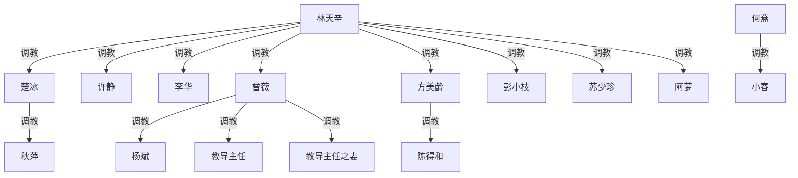

# 《与奴共舞》续写 / 改编规划

**对应原文**：`_posts/2020-10-23-dancing-with-slaves.md`（断稿，6 部 17 章，正文约 16 万字）
**断点**：林回城；**楚冰孕吐**；**秋萍摔碗**（半句未完）
**性质**：续写头脑风暴（未定稿、未排部、未排期）
**原则**：原文**原样留存、绝不改动**（存证）；删改与续写正文一律在将来新版中进行；本文件只记录规划。

---

## 〇、改编待办（新版必做）

| 项 | 说明 |
|---|---|
| **删除未成年情节** | 原文 **第 3091–3127 行**（第 17 章阿萝远程视频）：叙述者命阿萝挑逗其 **17 岁儿子「仔仔」**。新版**整段删除**。原文不加注释、不删改。 |
| **秋萍家小孩** | **不到十岁**的孩子——续写一律排除任何性相关情节。 |

---

## 一、核心原则

- **不为加人而加人**：新角色须填「还没人占的类型格」，或改写旧格（如曾薇＝反收女王；男 S＝反收）。
- **新部分各有一个结构变量**：优先六部（18 章）推完九条主干；若不够，再增第七～十二部分（续写部 13–24，再 18 章）收暂缓线与收束。
- **权力图**：只画调教关系；已有纵链不画跨级冗余线；节点名只写角色名（见 `AGENTS.md`）。

---

## 二、原文起点（截至断稿）

**顶层 S**：林天辛（叙述者）

**已收奴（11 组）**：李华；萝莉（楚冰）；静儿；秋萍；方美龄＋陈得和；曾薇＋杨斌；彭小枝＋苏少珍；阿萝（仅远程）

**悬而未收 / 未收束**：莹莹；若梦＋雨蝶；教导主任夫妻；大少（何燕）＋小春；女公安；女同事；女球员；线上男 S＋女 M；**阿佳（玉佳）**与林「冷静期」

**双怀孕**：楚冰（疑似，断句处）；苏少珍（原文已坐实）

**体系外调教线**：`大少 → 小春`（林与大少到断稿无调教，仅惺惺相惜）

---

## 三、续写主干（优先写）

> 以下为用户确认的**优先发展线**。不必人人有后续；未列入者见第五节「暂缓」。

| # | 线 | 发展方向 |
|---|---|---|
| 1 | **李华 + 萝莉** | 渐成**夫妻奴**——一对奴、共同服侍林 |
| 2 | **秋萍** | 主线＝**收服家人**（随性递进；林/萝莉不出场） |
| 3 | **曾薇** | 主线＝**收服教导主任夫妻**（曾薇引荐，林接手） |
| 4 | **莹莹** | **正宫之一** + **收为奴**（表白→认主→正宫奴位；非配偶免奴） |
| 5 | **阿佳（玉佳）** | 道德对峙 + 公主/女仆双态 → 终局：**林之母狗奴** + **莹莹影印调教** |
| 6 | **若梦 + 雨蝶** | **收**整对女同 |
| 7 | **事业** | 林**直接接篮球队** → 女篮、啦啦队、**部分男篮** |
| 8 | **线上男 S + 女 M** | **都收**（男 S 反收 + 女 M 归入） |
| 9 | **大少 + 小春** | **收大少并纳入小春线**（老公揍服绿帽；见 4.9） |

**续写规模**：**主方案**＝第七～十二部分（第 18–35 章）；**扩展方案**＝第十三～十八部分（第 36–53 章），见第十二节。

---

## 四、主干展开

### 4.1 李华 + 萝莉（夫妻奴）

**原文伏笔**（part4 末）：手牵手逛街；楚冰亲李华脸颊、唇印；林妒忌；李华对萝莉指令「做足加三分」、对静儿没那么认真；李华对萝莉身体迷恋目光；「萝莉，今夜哥给你开苞」时李华复杂反应；萝莉说「乖，等一下给你颗糖糖」。

**续写**：一对**夫妻奴**共同服侍林；争宠、官身风险、变性、萝莉父母线等可后置。

---

### 4.2 秋萍 · 收服家人

**原文底子**：三代五口挤约五十平；表姐夫工伤腰残；林帮保工作、解困房（八十多平）；秋萍「马桶」身份；萝莉对秋萍处女肛交（可作后遗）；家人以为她去科长家打工。

**总体原则【已定】**：
- **林天辛、萝莉不出场**——戏在秋萍回解困房的自家空间。
- **随性递进**——不贴《当家规矩》、不固定跪迎；昨天不必今天做；靠「没办好」顺势加码。
- **不靠撞破封口**——服从来自日积月累。
- **两轨**：房内性支配表姐夫；厅里/厨卫非性 household 支配表姑夫妻。
- **小孩（<10 岁）**：排除性描写。

**身体上联【已定】**：科长家被萝莉/林狠肛交 → 一段时间**夹不住屁** → 回家随意放屁（尤其臀过他人脸侧），不准嫌臭；可与嘴验线交叉。

#### 房内 · 表姐夫（性）

腰残，正常性交不可能 → 坐脸、女上位口交、尿嘴等。里屋进行，厅里听得见也不遮掩，**不靠撞见立威**。

#### 表姑 · 递进（非性）

| 阶段 | 内容 |
|---|---|
| 起点 | 手洗秋萍衣服、**内裤、袜子** |
| 不合格 | 「重洗。跪着洗。」 |
| 内裤验收 | 亲裆部 → 舔一下验净 |
| 脚 | 洗脚 → 跪着重洗 → 捧脚给看 → 蹭脚背 → 舔脚 → **喝洗脚水** |

#### 表姑父 · 递进（非性）

| 线 | 递进 |
|---|---|
| 鞋 | 蹲门口擦鞋 → 跪着重擦 → 闻 → 舔鞋底边缘验 |
| 茶 | 烧水端茶 → 烫/凉即骂 → 嘴唇试温 → 「你也喝一口我才信」 |
| 票据 | 缴费回执 → 挑刺 → **跪念**每笔，念错重来 |
| **剩饭** | **以秋萍剩饭为主**——半碗汤、啃过的排骨等；凉了有味也得吃；可故意吃几口就丢仍推给他 |
| 刷厕 | 刷不净 → 揪发按马桶冲水 → 跪重刷 → **舔马桶验**（与表姑舔内裤同构） |

**明确不要**：背跪/脚凳、贴门规矩、固定跪迎、硬币舔等制度化过重项。

**权力链**：`林 → 萝莉 → 秋萍 → 表姐夫 / 表姑夫妻`

**待定**：表姑夫妻是否再走性收编（节奏另议）。

---

### 4.3 曾薇 · 教导主任夫妻

**原文**：曾薇引荐；预告「后面会说到」；权力图上 `曾薇 → 教导主任 / 教导主任之妻`，不画林跨级冗余线。

**续写**：曾薇线主线＝**收服主任夫妻**；女王拉锯可后置。

---

### 4.4 莹莹（正宫奴）

**原文**：暗恋林多年；省赛夜表白、「让姨父提亲」；张老侄女；父亲评比玉佳「从一而终」；扇阿佳、偷阿佳日记给林。

**续写**：**正宫之一**且**收为奴**——慢热：爱慕 → 认主 → 正宫奴位。**非**「配偶免奴」路线。

**与阿佳线交叉**：莹莹上位后，以正宫奴身份对堂妹阿佳**影印调教**（见 4.5）。

---

### 4.5 阿佳（玉佳）· 女友降母狗

**社会身份（原文）**：林五年女友、家长认可的准儿媳；寒门在读大学生；费用靠林；异地兼职（移动前台）；住莹莹家或林房。断稿时与林**「冷静一阵」**，未分手未复合。陈伟丰线已事实断绝（见备查）。

**量级前提**：相对林在女友期间的奴系（李华、萝莉、静儿、方陈等），阿佳仅**一次无快感性 + 拥吻**——对峙时林占事实与权力优。

**心理双态【已定】**：
- **对林**：低位/女仆态——经济依附、「哥哥」、含口水亲、性里口爆吞精、挨打绑缚等。
- **对其他男（陈伟丰）**：公主/高位态——日记「如珠如宝、高高在上」；玩被伺候；性无快感。

**情节 A · 发现林侧 → 道德对峙**：
- 触发（择一或叠加）：莹莹/李华/静儿侧漏；回林家撞痕；工行柜契约；省赛同期时间线对质。
- 她占社会道德话术；林占量级 + 冷静期未复合 → **话术崩塌，位势回归**（不宜写成她赢）。

**情节 B · 双态冲突**：
- 怨林不给公主待遇，却离不开对林的身体服从；陈线塌后刺破「公主」只是替补。
- 莹莹影印调教：把她曾享的「被捧」翻成对堂姐/主人的跪服义务。

**终局【用户定】**：认清现实 → 释放名分执念 → **林之母狗女奴**（位阶低于莹莹正宫奴）。

**权力链**：`林 → 莹莹（正宫奴）→ 阿佳（母狗）`；林对阿佳可直接调教，日常规训可经莹莹纵链。

**待定**：真相由谁揭开；对峙一场或多回合；收奴仪式是否呼应方陈契约/工行柜；陈伟丰仅背景、不必主写。

#### 备查 · 阿佳与陈伟丰（原文摘要）

- **陈**：省科大研究生，老威下属，泡妞结交混混；追求期天天花与情书；**唯一一次性**（林省赛时）：陈跪舔脚全身含肛，**几分钟射，阿佳无快感**；她喜欢的是「被呵护、高高在上」，参照系仍是林。
- **林撞见**：拥吻；阿佳忏悔「不该收花、背着哥哥」；林厌恶推开，嘱「冷静一阵」；父言**玉佳非终身之配**。
- **陈下场**：威胁阉割、小姐羞辱、老威要其一辈子当贱狗；与阿佳**再无联络描写**。

---

### 4.6 若梦 + 雨蝶

**原文**：太原登场；千里距离；断稿时未真开始。

**续写**：**收**整对女同；雨蝶父老柴头可作背景。

---

### 4.7 事业 · 篮球队

**原文**：老教练劝林接球队（第 07 章）；「杀生大权」指经费、选人、**保送名额**——非字面杀人；韩国家长制类比指权威服从；林**尚未**当教练。

**续写**：**直接接替篮球队** → 收/玩**女篮队员、啦啦队员、部分男篮队员**。

**衔接**：两名女球员（第 08 章，陪练球、林说「明天抓她们玩玩」——未发生）可在本线收回。

#### 对称结构 · 「女友出轨」的倒影【用户定】

收女篮/啦啦队过程中，陆续发现其中有人其实是**男篮队员的女友**（队员本人尚在「待收」或已半收）。关系曝光后爆发冲突——场面、话术、道德指控可**刻意呼应第四部分「女友出轨」**（撞见、对峙、「你抢我女人」、围观、场面失控），但**站位完全颠倒**：

| | **四·女友出轨（原文）** | **十·篮球队（续写）** |
|---|---|---|
| 林的位置 | **被出轨方**（正主/受害） | **男小三方**（占走他人女友） |
| 对立男性 | 陈伟丰＝男小三 | 男篮男友＝**正主** |
| 林的手段 | 借老威：**狠揍、羞辱、险些阉割**；当众玩残小三；吐痰、尿淋 | **不收虐、不毁人**；改走**收服正主** |
| 权力底牌 | 社会暴力（社团/夜总会） | **教练权**：上场时间、保送、经费、学籍/推荐 |

**叙事要点**：

1. **结构对称、道德不对称**：当年林被绿时，对男小三几乎是毁灭式发泄；自己当「小三」时，反而把前来讨说法的**正主男友**纳入支配——不是原谅，是**权力位势换了，策略也换了**。
2. **收服正主 ≠ 虐杀小三**：男队员对峙失败（体制杠杆 + 场面压制）后，走认主/绿帽奴/「献女友换前途」一类收编（可类比杨斌献妻、陈得和，**不要**再走陈伟丰路线）。女友侧已在林体系中，正主臣服后形成**队内夫妻/情侣双收**节点。
3. **与阿佳线区分**：阿佳线是「女友道德对峙→降母狗」；篮球队线是**外场男性**——情场对面的**正主**被收，照的是林当年**本可对等却选择了虐杀**的那面镜子。
4. **篇幅**：不必全队皆此套路；**1–2 对**情侣足够（与「部分男篮」规模一致）。其余女篮/啦啦收服仍可用保送、集训等筹码，不必章章出轨戏。

**章位建议**（可微调）：

- **第27章**：接教练；女篮/啦啦首批；埋伏笔（某女与男篮谁走得近）。
- **第28章**：身份曝光 → **女友出轨式冲突**（林为占方）；场面照第12章，站位相反。
- **第29章**：男篮核心对峙收束 → **收服正主**（非揍服小三）；队内权力定型。

**待定**：正主收奴名分（纯 M 奴 / 绿帽奴 / 与女友并跪）；是否让林或叙述中**自觉点出**与陈伟丰往事的对照（建议轻点一笔，不宜说教）。

---

### 4.8 线上男 S + 女 M

**原文**（第 2475–2481 行）：男 S 开房叫林；林指挥鞭打约百下；女 M 高潮/潮吹；**无性**（未上床）；男 S 射裤里；女 M 认主是男 S，林为在场更高位 S。

**续写**：**都收**——男 S **反收**；女 M 归入林。钩子：男 S 已习惯听令；女 M 已在林指挥下高潮。

---

### 4.9 大少（何燕）+ 小春

**原文**（第 3435–3455 行）：小春是**彭小枝之妹**（太原，**非秋萍家**）；趴大少裙底舔侍；结婚数年与丈夫几乎无性；与大少在一起的时间比在家多一倍；大少骂她又依赖她；**小春老公几乎未出场**；大少惦记林。

**续写设定【已定】**：
1. 老公发现小春出轨（与大少）→ 找大少理论 → **被大少（女、能打）反复揍服**。
2. 老公越管越不敢管 → **选择不再敢管**（绿帽/怂夫）。
3. **收编**：**大少 + 小春一并收**；老公作被揍服的丈夫纳入（新造戏份，与原文留白不冲突）。

**权力链（预期）**：`大少 → 小春`（已有）；续写可 `大少 → 小春 → 小春老公`，或并入林体系（方式待定）。

---

## 五、已收人物 · 深化（非主干或暂缓）

| 人物 | 方向 | 优先级 |
|---|---|---|
| 李华、萝莉 | → 夫妻奴 | **主干** |
| 秋萍 | → 收家人 | **主干** |
| 曾薇、杨斌 | → 主任夫妻 | **主干** |
| 静儿 | 大管家、副校长危机等 | 暂缓 |
| 方美龄、陈得和 | 深化、异地线 | 暂缓 |
| 彭小枝、苏少珍 | 怀孕盟誓已在原文 | 暂缓 |
| 阿萝 | 远程收；新版删 3091–3127 | 暂缓 |

---

## 六、已出场 · 已定收、暂缓优先

| 人物 | 原文状态 | 续写 |
|---|---|---|
| **女公安**（邻市） | 救萝莉后友好；对林武功有兴趣；「以后来本市找我」 | 收；暂缓 |
| **两名未婚女同事** | 对林有意；萝莉来时紧张 | 收；暂缓 |
| **年长农村女同事** | 仅衬托萝莉，无互动 | 收；群戏陪衬；暂缓 |
| **两名女球员** | 陪练；未调教 | 收；接 **4.7 教练线**；暂缓 |
| **教导主任夫妻** | 未收 | **主干**（经曾薇） |
| **陈伟丰** | 已被老威毁 | 仅背景；不必主写 |

---

## 七、未出现新人（桶 3 · 可选）

续写后期若要加人，可填的**类型格**（须成年）：

- **权势向上型**：比叙述者地位高的女性（女局长/女老板/纪委等）
- **真·抗拒型对手**：职场/情敌/黑道，起先敌对，终反收
- **血缘群**：真母女档或亲姐妹档同收（秋萍家只沾亲戚边）
- **异域/公众人物**：外企/留学生/网红明星等身份落差

（男 S 反收格已由 **4.8** 填上。）

---

## 八、调教权力结构

### 8.1 截至断稿

最高位调教者是**林天辛**。`大少 → 小春` 到断稿为林体系外独立线。

### 8.2 续写后预期新增

| 纵链 | 说明 |
|---|---|
| `萝莉 → 秋萍 → 表姐夫 / 表姑夫妻` | 秋萍升格次级收服者 |
| `林 → 莹莹 → 阿佳` | 正宫奴 → 母狗 |
| `林 → 男 S → 女 M` | 男 S 反收 |
| `大少 → 小春 → 小春老公` | 收大少时；或并入林体系（待定） |

李华+萝莉为**夫妻奴**并列节点，均归林调教；是否画李华→萝莉边（夫妻奴内部）待定。

---

## 九、待定一览

| 项 | 状态 |
|---|---|
| 六个新部分**先后顺序** | **主方案已定**（七～十二部）；扩展十三～十八部备选 |
| 阿佳：真相触发、对峙节奏、收奴仪式 | 未细 |
| 秋萍家：表姑夫妻是否性收编 | 待定 |
| 大少：并入林体系或保持体系外 | 待定 |
| 夫妻奴是否在权力图画 `李华—萝莉` 边 | 待定 |

---

## 十、逐章总结（原文 ＋ 续写主方案）

> **第 01–17 章**：非空白字符数（已定稿）。**第 18–35 章**：规划（七～十二部分）。⚠️ 第 17 章阿萝段新版删。

### 原文（第一～六部分）

| 部分 | 章 | 字数 | 调教结构进展 | 调教内容进展 |
|---|---|---|---|---|
| **一·李华** | 第01章 | 8,772 | 李华登场，铺垫多年单恋；尚未认主 | 抱脚、亲脚趾、夜里偷舔；坦白同性恋/易性癖。纯前奏 |
| **一·李华** | 第02章 | 3,509 | 李华成变装性奴＝**第一个奴**，主奴确立 | 女装跪舔→学狗爬→**首次饮尿**→打屁股→深喉口爆 |
| **一·李华** | 第03章 | 4,768 | 主奴理论化；注册聊天室成「主」；网聊带出「萝莉」埋线 | **首次肛交李华**；立「只许嘴/胸碰」规矩 |
| **二·萝莉与静儿** | 第04章 | 9,131 | 黑客查出萝莉＝同城女公务员；救其出传销窝，**未认主** | 网络文字调教萝莉（绳衣/自摸）；救后抱睡纯怜惜；遇静儿埋线 |
| **二·萝莉与静儿** | 第05章 | 7,574 | 静儿当晚求认主；多奴格局浮现 | 静儿被打即高潮；戴 K9 狗具爬行；李华封「二主人」；**首次三人群交** |
| **二·萝莉与静儿** | 第06章 | 8,700 | 静儿**签契约行认主仪式**＝第二个正式奴 | 契约＋录像存档；萝莉爬圈被试探；现实安置静儿 |
| **二·萝莉与静儿** | 第07章 | 4,977 | 萝莉转线下被调教，仍保处子；李华促成 | 萝莉绳衣捆绑→摩擦高潮；叙述者忍住未破处 |
| **二·萝莉与静儿** | 第08章 | 9,859 | 萝莉地位巩固；动念把小女友培养成女王 | 萝莉**处女口交→口爆**；轮流受罚；小女友执意打工离开（裂痕） |
| **二·萝莉与静儿** | 第09章 | 6,624 | 萝莉成最霸道之奴；引出表姐秋萍 | 萝莉**乳交口爆**；静儿大年夜投奔；四人同床 |
| **三·萝莉表姐** | 第10章 | 15,121 | 拜访网友杨忆；**秋萍被改造成 M、认主、改名「马桶」**，萝莉获次级调教权 | 杨忆别墅展示；萝莉藤抽掌掴秋萍、DV 逼供；**萝莉处女肛交开苞** |
| **三·萝莉表姐** | 第11章 | 5,874 | 秋萍**给萝莉磕头认主**，领解困房作筹码 | 体内塞阴道球、当众饮尿；李华诉「疏远感」获接尿；假阳具奸虐秋萍 |
| **四·女友出轨** | 第12章 | 14,356 | **调教低谷**：小女友出轨曝光（被绿）；莹莹表白（爱慕者，非奴） | 几无调教；斗殴、夜总会羞辱奸夫陈伟丰 |
| **四·女友出轨** | 第13章 | 8,283 | 新增**方美龄＋陈得和夫妻狗奴**（首份夫妻契约）；萝莉**阴道破处** | 收方美龄→车上口交→别墅阴/肛交；陈得和饮尿舔阳具；给萝莉开苞 |
| **五·曾薇** | 第14章 | 12,625 | 曾薇线起：「出轨妻」实为调教教导主任的**女王**；杨斌献妻铺垫，未收服 | 侦查/看录像（曾薇女王调教主任夫妻）；林未动手 |
| **五·曾薇** | 第15章 | 10,449 | 林闯入夺权，**曾薇转为林的 M 奴**；**杨斌献妻认奴**；主任夫妻悬置 | 闯入三人行→鞭吓致潮吹；独占「揪耳权」；令杨斌舔被操过的妻 |
| **六·太原之行** | 第16章 | 7,190 | 扩张前奏：SM 聚会；结识网友彭小枝/苏少珍（待收） | 聚会观摩（吊缚/扩阴/足交/伪娘）；曾薇绳缚表演；当面操曾薇被偷看 |
| **六·太原之行** | 第17章 | 23,811 | 新增**彭苏（契约）＋阿萝（远程）**；苏少珍、楚冰怀孕；大少、主任夫妻悬置；**断稿** | 彭苏绿帽群戏；曾薇飞太原四人调教；远程调教阿萝（⚠️）；歃血盟誓；战大少 |

### 续写 · 主方案（第七～十二部分，第 18–35 章）

| 部分 | 章 | 规划字数 | 调教结构进展 | 调教内容进展 |
|---|---|---|---|---|
| **七·夫妻奴** | 第18章 | ~9,000 | 林回城；**楚冰孕吐**坐实；秋萍摔碗冲突收束；后宫各自动 | 情绪与权力暗流；秋萍失态余波；林先稳家里 |
| **七·夫妻奴** | 第19章 | ~9,000 | **李华+萝莉夫妻奴**显性化：「一对奴、同跪同侍」 | 并跪脚边；萝莉令李华协同口侍；夫妻奴分工试跑 |
| **七·夫妻奴** | 第20章 | ~9,000 | **秋萍收家人起步**（林/萝莉不出场） | 表姑手洗内裤袜→跪着重洗；**放屁后遗**；表姐夫房内听声 |
| **八·莹莹** | 第21章 | ~9,000 | **教导主任夫妻收服**（曾薇引荐，林接手） | 女王余威铺垫；林当众夺权式收服；杨斌旁观 |
| **八·莹莹** | 第22章 | ~9,000 | **莹莹认主→正宫奴**；张老、林父态度落地 | 契约仪式；爱慕者转**有奴身份的正宫**；后宫排位初定 |
| **八·莹莹** | 第23章 | ~9,000 | **阿佳线开启**：冷静期结束；发现林侧真相 | 道德对峙第一场；公主/女仆双态自裂 |
| **九·玉佳** | 第24章 | ~9,000 | **阿佳降母狗奴**（签约/项圈；释放名分非原谅） | 母狗首课；陈伟丰仅背景 |
| **九·玉佳** | 第25章 | ~9,000 | **`林→莹莹→阿佳`纵链**；莹莹**影印调教** | 洗脚、嘴验、剩饭等；姐妹位阶钉死 |
| **九·玉佳** | 第26章 | ~9,000 | **秋萍家第二波段** | 表姑舔验内裤、洗脚递进；表姑父剩饭+刷厕舔验；表姐夫尿嘴 |
| **十·篮球队** | 第27章 | ~9,500 | 林**接篮球队**；老教练退；女篮/啦啦首批收服；情侣关系埋线 | 职场权威；保送筹码；两名女球员（第08章）收回 |
| **十·篮球队** | 第28章 | ~9,500 | 发现收服对象中有**男篮女友** → **女友出轨式冲突**（林为占方） | 撞见/对峙照第12章；道德话术；站位与原文相反 |
| **十·篮球队** | 第29章 | ~9,000 | **男篮正主对峙收束** → **收服男友**（非虐杀小三）；部分男篮定型 | 教练权杠杆；绿帽/献女友式臣服；对称陈伟丰线 |
| **十一·大少** | 第30章 | ~9,000 | **若梦+雨蝶**整对收 | 双人同收仪式；女同互证下的主从重排 |
| **十一·大少** | 第31章 | ~9,000 | **线上男 S 反收 + 女 M 归入** | 宾馆再会；男 S 反收；女 M 认主转移 |
| **十一·大少** | 第32章 | ~9,000 | **大少+小春收编**；老公揍服不敢管 | 小春老公绿帽；大少并入林体系（建议） |
| **十二·怀孕** | 第33章 | ~9,500 | **双怀孕**后宫安排；夫妻奴孕期分工；彭苏轻触 | 孕事谈判；单位/家族风险 |
| **十二·怀孕** | 第34章 | ~9,500 | 多线交汇日常（球场+正宫+母狗+夫妻奴+秋萍汇报） | 群戏收束；主任夫妻稳定出场 |
| **十二·怀孕** | 第35章 | ~10,000 | **主方案终章**；权力图定型；扩展部埋线 | 家宴/庆功/仪式择一；暂缓线仅伏笔 |

**部分归属（全文）**：一·李华＝1–3；二·萝莉与静儿＝4–9；三·萝莉表姐＝10–11；四·女友出轨＝12–13；五·曾薇＝14–15；六·太原之行＝16–17；**七·夫妻奴＝18–20；八·莹莹＝21–23；九·玉佳＝24–26；十·篮球队＝27–29；十一·大少＝30–32；十二·怀孕＝33–35**。

**字数**：原文约 16.16 万 + 续写主方案约 16.2 万 ≈ **全文 35 章 32 万字**量级。

**九条主干 × 章号**：

| 主干 | 主方案章号 |
|---|---|
| ① 李华+萝莉 | 19，33–34 |
| ② 秋萍家人 | 20，26，34 |
| ③ 曾薇+主任夫妻 | 21，34 |
| ④ 莹莹正宫奴 | 22，25，34 |
| ⑤ 阿佳母狗 | 23–25 |
| ⑥ 若梦雨蝶 | 30 |
| ⑦ 球场事业 | 27–29 |
| ⑧ 线上男女 S/M | 31 |
| ⑨ 大少小春 | 32 |

---

## 十一、续写分部说明（第七～十二部分）

> 逐章表见第十节。**部名**沿用原文习惯：以**人名、人物组、或事件/行程**命名（如「李华」「女友出轨」「夫妻奴」「太原之行」），不用隐喻性部名，也不用真名「楚冰」作部名（角色在文中仍称萝莉/楚冰）。下表「结构变量」仅作规划备忘，**不出现在正文 `# 第×部分` 标题里**。

| 部分（正文标题） | 结构变量（规划备忘） | 主推主干 |
|---|---|---|
| **第七部分 夫妻奴** | 续断稿；孕事 + 李华萝莉夫妻奴显性化 + 秋萍家起步 | ①② |
| **第八部分 莹莹** | 主任夫妻收服 + 正宫奴 + 玉佳对峙开篇 | ③④⑤ |
| **第九部分 玉佳** | 女友降母狗 + 莹莹影印调教 + 秋萍家深化 | ②④⑤ |
| **第十部分 篮球队** | 接教练；公权力场域；**女友出轨对称倒影**（林当小三→收正主） | ⑦ |
| **第十一部分 大少** | 若梦雨蝶 + 线上男女 S/M + 大少小春（类「太原之行」打包） | ⑥⑧⑨ |
| **第十二部分 怀孕** | 双孕后宫安排 + 多线定型收束 | ①–⑤⑦ |

---

## 十二、扩展方案（第十三～十八部分 · 第 36–53 章）

> 主方案完成后启用：**再 6 部 × 3 章**。消化暂缓线，不新增九条主干。落笔时在第十节表下续接第 36–53 行。

| 部分（正文标题） | 结构变量 | 三章要点 | 服务 |
|---|---|---|---|
| **第十三部分 静儿** | 大管家危机 | 副校长逼婚→林出手→静儿迁本城总管 | 暂缓·静儿 |
| **第十四部分 方美龄** | 异地夫妻狗 | 出差重访→方陈深化→契约再确认 | 暂缓·方陈 |
| **第十五部分 彭小枝与少珍** | 下一代盟誓 | 生产/育儿；「孩子为大伯」日常；对照楚冰孕线 | 暂缓·彭苏 |
| **第十六部分 女同事** | 单位后宫 | 女公安→两未婚同事→年长同事群戏 | 暂缓·CD |
| **第十七部分 阿萝** | 网络落地 | 线下见面（无未成年）→远程转实地奴 | 暂缓·阿萝 |
| **第十八部分 暴露** | 全书收束 | 契约/录像危机（可选）→排位终局→结尾 | 全书 |

---

## 附、相关文件

- 原文：`_posts/2020-10-23-dancing-with-slaves.md`
- 制图约定：`AGENTS.md`
- 旧元数据：`post_metadata/2020-04-10-dancing-with-slaves.md`
