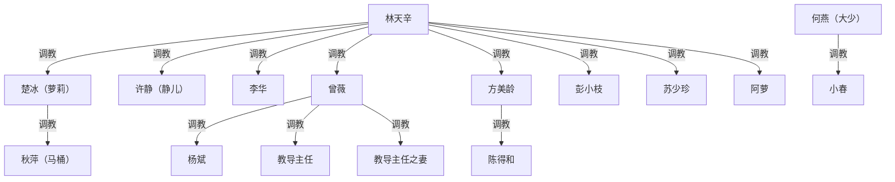

# 《与奴共舞》续写 / 改编规划 · 素材池

**对应原文**：`_posts/2020-10-23-dancing-with-slaves.md`（断稿，6 部 17 章，正文约 16 万字，结尾停在「楚冰孕吐 + 秋萍摔碗」的半句处）
**性质**：续写 / 改编头脑风暴（未定稿、未排期）。
**原则**：原文不是我们写的，**原样留存、绝不改动**（作为存证）；本文件只记录续写方向与改编待办，删改一律放到将来的新版里做。

---

## 〇、改编待办（务必处理）

- ⚠️ **删除未成年情节**：原文 **第 3091–3127 行**（第 17 章「太原之行」、阿萝远程视频那段）写叙述者命网友阿萝**挑逗自己 17 岁的儿子「仔仔」**（半透明睡裙不戴胸罩去抱、把蕾丝内衣挂浴室让其碰到、餐桌俯身挑逗，三人在视频这头围观）。**任何新版 / 改编必须整段删除**。原文保持原样，不在原文里加注释或删改。
- **其他未成年**：秋萍家**不到十岁的小孩**——续写一律排除任何性相关情节。

---

## 一、核心原则（讨论结论）

- 加人 OK，但**不为加而加**：新对象要么**填一个还没人占的"类型格子"**，要么**改写旧格子**（如曾薇＝反收女王）。
- 六个新部分应是**六个新变量**，而不是第八、九次重复"认主"。

---

## 二、已收服人物 ＝ 已占的"格子"（用于判重）

| 人物 | 占的独一份格子 |
|---|---|
| 李华 | 男·变装 CD·自认女人·邻居·第一个 |
| 萝莉（楚冰） | 年轻·处女待开发·白富美却受虐·自带亲戚网 |
| 静儿（许静） | 寡妇·年长·纯痛感型·外地迁来 |
| 秋萍 | 中年贫妇·本无 M 性被硬改造·转交萝莉 |
| 方美龄＋陈得和 | 夫妻·贵妇＋残废夫·献妻型绿帽 |
| 曾薇 | 原本是女王(S)→被反收·初恋·冷美人 |
| 杨斌 | 男·崇拜型献妻奴·自己只用嘴/手 |
| 彭小枝＋苏少珍 | 夫妻·原生家庭训出来的奴性型·绿帽参与·怀孕 |
| 阿萝 | 纯网络远程·人妻欲求不满 |

---

## 三、续写三桶

### 桶 1 · 已有人物：深化（不重复认主）

| 人物 | 方向 |
|---|---|
| 李华 | part4 埋的"妒忌萝莉"→后宫内部排位/争宠；官身既是资源也是暴露风险；变性念头逼出身份危机 |
| 萝莉（楚冰） | 怀孕续写→"下一代"母题；从 M 长成"萝莉式女王助手"（已管秋萍）；冷淡母亲/疼她的父亲介入＝外部风险 |
| 静儿 | 归属未定（副校长在追）→"差点被夺走"危机让她坚定；定位后宫"大管家" |
| 秋萍 | 阶层反差羞辱；作为萝莉的"练手对象"反推萝莉成长 |
| 方美龄＋陈得和 | 借出差重访维系；成熟贵妇与本城年轻奴互相碰撞 |
| 曾薇＋杨斌 | 女王本性 vs M 身份的拉锯；其旧奴（教导主任夫妻）的处置→接桶 2 |
| 彭小枝＋苏少珍 | 怀孕＋"孩子视为主人、尘封"设定；嘻皮（小舅子）麻烦线 |
| 阿萝 | 从远程走到线下（落差）；做成多城远程网络雏形（**注意：删去 17 岁儿子线**） |

### 桶 2 · 已出现但未收服 → 收服（含已定决策）

- **秋萍家人（A）【已定】**：收服其中的**成年人**，**甚至让秋萍亲自来收服自己的家人**（秋萍升格为次级收服者）。
  - **表姐夫（秋萍丈夫）**：工伤腰残，被叙述者帮忙保住工作；目前是被蒙在鼓里的绿帽。**可发展为知情→参与的绿帽奴**。
  - 表姑夫妻（老两口）：成年家庭成员，按"秋萍来收"的思路处理。
- **小春（B）【已定】**：收（**连同大少一并带入**——小春本就是大少的女同被调教者）。小春**已婚**→**她老公也作绿帽收编对象**（未出场，需新造）。
- **女公安、女同事（CD）【已定】：都收。**
  - 邻市女公安（解救萝莉那晚同宿舍、对叙述者武功有兴趣）：执法者身份反差。
  - 单位两名未婚女同事（对叙述者有意、近水楼台）。
  - 年长几岁的未婚女同事（农村出身）。
  - 两名女球员（老教练说"都很崇拜你"，叙述者已起意调侃）。
- **线上的女 M ＋ 男 S（F）【已定】：都收。** 原文里那对网友（男 S 每隔一两月带女 M 来、叙述者负责"指挥"抽打、两人至今没上床）——**连男 S 一起反收**，正好填"男 S 被反收"这个空格子；女 M 一并归入。
- **复习（之前已列）**：
  - 莹莹：暗恋 5–6 年的爱慕者（张老侄女、留校助教）→"爱慕→臣服"的转化课题。
  - 小女友阿佳：出轨后悬置→可正可反（彻底失去 / 回归后降位为奴）。
  - 大少（何燕）：武力征服＋情感＋处女悬念，烈性/武力型；自带小春。
  - 拉拉若梦＋雨蝶：女同伴侣，登场未收；雨蝶父"老柴头"是考察过叙述者的权势人物。
  - 教导主任夫妻：曾薇旧奴，原文预告"后面会说到"，由曾薇引荐、叙述者接手。

### 桶 3 · 未出现的新人物（专填空格子）

- **权势向上型**：地位比叙述者高的女性（女局长/女老板/纪委）——全书所有奴都是平级或下位，缺这一维。
- **真·抗拒型对手**：一开始与叙述者为敌（职场对手/情敌/黑道），最终被反收。
- **血缘群**：真正的母女档或亲姐妹档同收（秋萍只沾了"亲戚"的边）。
- **异域/公众人物**：老外女（外企/留学生）或网红/明星，身份落差。
- （男 S 被反收这一格已由桶 2「线上男 S」填上。）
- **底线**：新人物一律锁定**成年**，不再往未成年方向叠。

---

## 四、调教权力结构图（截至断稿）

> 约定：箭头 `A -->|调教| B` 表示 A 调教 B；只画调教，已有纵链则不画跨级冗余线；节点名只写角色名。

最高位调教者是**林天辛**；`大少→小春` 是一条游离在林体系之外的独立调教线（大少与林之间到断稿仅"惺惺相惜"，无调教事实）。

---

## 五、待定问题

- 秋萍亲自收家人这条，秋萍的次级权限给到多大？（只管自家，还是升为"小女王"？）
- 表姐夫、小春老公这两个绿帽夫，走"被蒙在鼓里"还是"知情参与"？
- 大少收编走"武力压服后归顺"还是"情感线落地"？她对林算 M 还是平起平坐的盟友？
- 小女友阿佳：彻底写走（留缺口）还是回归降位？
- 六个新部分的排序与各自主变量（参考桶 3）。

---

## 附：相关文件

- 原文：`_posts/2020-10-23-dancing-with-slaves.md`
- 旧元数据：`post_metadata/2020-04-10-dancing-with-slaves.md`
