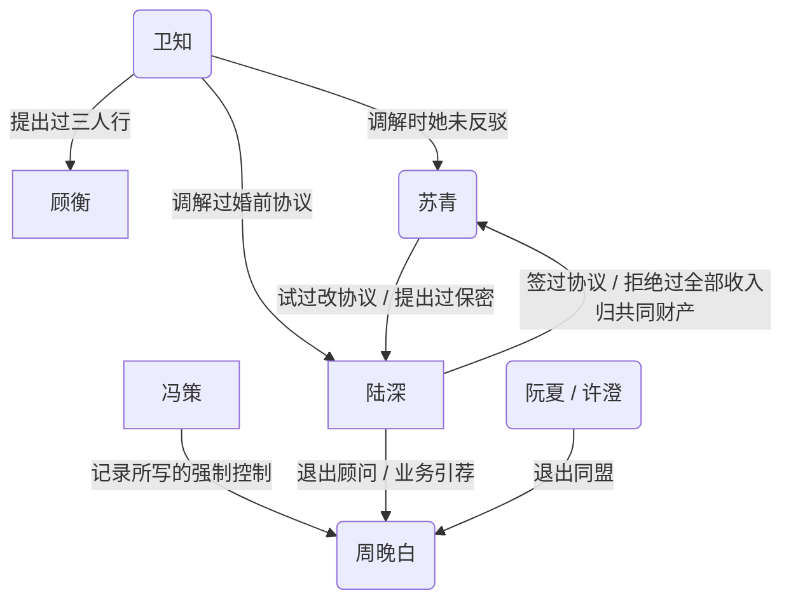
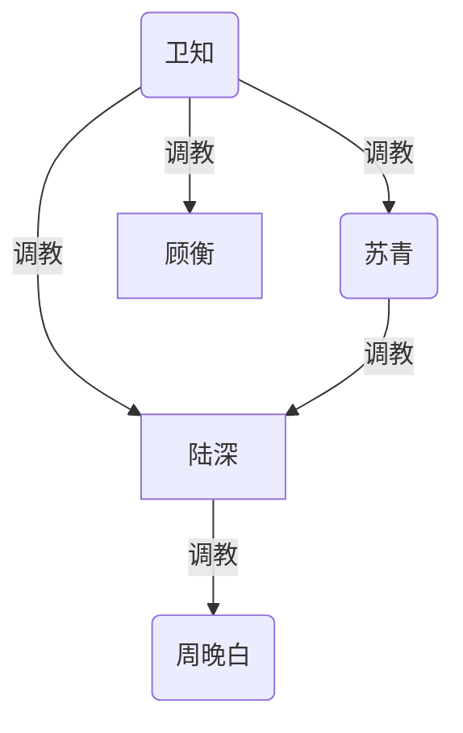

# 陆深与苏青

图例：矩形为男、圆角为女。已去掉尚未发生的安排。

## 人物

- **陆深**：主收入。工作日住城内酒店、周末回南湾。自称偏 S 的 switch。
- **苏青**：在一起前告诉过陆深自己很强势。记录里有四爱倾向。目前没有工作。南湾有朋友和舞蹈网。
- **周晚白**：学妹。记录写她在离开一段强制控制关系。分手谈话尚未开始。
- **冯策**：周晚白现任。异地，会来这个城市。周晚白说过仍感激他的职业指导，也说过他的气场让她有点怕。
- **阮夏**：刚结束一段婚姻，记录写她过得更好。
- **许澄**：同一退出同盟。
- **卫知**：陆深核心朋友之一。做过婚前协议调解。为顾衡提出过三人行。自己也在结婚。
- **顾衡**：卫知的丈夫。记录写性上不满意，有一点双。是否知情具体计划，未确认。
- **乔北**：圈子里对外谈开放关系最多的人。苏青对他戒心很强。
- 苏青的朋友里，当时至少两人知道婚前协议，并表示只接受陆深撤回。
- 陆深的朋友里，当时至少四人知道协议。
- 周晚白前任、苏青前任：人不在当前局里。

## 婚姻里已发生的事

- 2018–2020：床上是苏青在下、陆深在上。之后下降；重病期间约一年一次；现在约一年两三次。目前没有进行中的床上 D/s。
- 苏青对前任：生活里一切听她的，有过罚站。
- 陆深设计过先工作一年再结婚的观察窗，后来因身份时限未执行。
- 每次提出结婚的是苏青。陆深没有求过婚。
- 2026 年 3–4 月签婚前协议，4 月结婚。两边都有独立律师。苏青提出保密条款，基本上不和朋友谈这份协议。她后来试过修改，陆深未改。
- 同一套贡献/量化问题：陆深单独提出时，苏青以亲密关系不应 1:1 计价为由拒绝；卫知在场提出时，她未反驳，三人推出框架，此后基本按该框架执行。
- 卫知对苏青的求职指导：未执行。
- 陆深对苏青的求职指导：她口头表示认同，未执行，并说这让她走了弯路。她拒绝他的细管。
- 开放：双方同意婚姻开放。陆深表述的现行条款是：仅短期；年度预算有上限；她通常不问细节但保留知情权；她保留对具体对象的否决。陆深说自己先按她的条款执行。2019 年苏青要求立刻开放；近年她把开放列为不能让步的不满之一。
- 开放之争中，苏青说过：她同意开放极罕见，他们这个阶层/文化没人会同意，她的朋友也不会；陆深举出周围会同意的人后，她称那些人有问题，并提到卫知。
- 孩子：陆深要多个。苏青化疗后完全不育。她说过“不想要吧”，不愿当成自己的孩子养，可给一些必要照料和家庭环境，不愿出钱出力。双方粗略路线是捐卵加代孕，费用和大部分精力由陆深承担。亲权写不进婚前协议。陆深的设计是他为唯一意向父母。协议相关条款只分配费用，不写亲权。
- 游戏：苏青的 MOBA 强于陆深；陆深的 RTS 强于苏青。她会因他单独超前玩共同的单机而生气。
- 居住：工作日酒店、周末南湾。苏青要求搬来他所在的城市。两地期间，记录写几乎每个周末都吵架。
- 一次旅行中，苏青给出二选一：维持现状则继续吵、大概会离；或者他考虑收入全部进入共同财产。
- 婚前协议之前：苏青提出每月给她一笔固定金额，陆深拒绝。随后发生大额花费与这笔月费的对撞，以及“以后是共同财产”的表述。协议在此之后签署。
- 金钱冲突的具体记录包括：清洁服务该不该由她分担；保险期限过后仍被提起的旧账；一笔他加价、她收下、事后道歉但不退还的卧室付款；共同支票账户在失业期透支；她在账户透支当天说“没有爱情，没有面包”。
- 她禁止他问贡献，同时审计他的支出和供给。
- 他收入下降约九成之后，她开始存钱、做饭。
- 四人谈话（陆深、苏青、周晚白、周晚白当时的男友）由苏青开头。陆深问过周晚白能否做 M，她说可以。苏青当时“不是特别抗拒”，并判断“隔着周晚白没可能，和她当时的男朋友有点可能”。后来订过调教室，未发生。前任现有稳定女友且双方 switch。陆深目前没有主动往亲密推进。

## 周晚白线已发生的事

- 前任是四爱、男 M。周晚白被要求做女 S，她不喜欢四爱、不喜欢做 S，性“像打工”。她不能接受被自己插入过的男人插入。两人在性以外相处合得来。分手主要由她提出，原因是性生活无法继续。前任现有稳定女友，两人 switch。
- 现任冯策：记录写为强制控制、抽取型。周晚白说过，在一起前就能感到他的沉默和气场让她害怕，仍开始了这段关系。她说过冯策“还能改”，也说过自己“又失败了”“其实还没有开始谈”。
- 她仍表示感激冯策的职业指导。
- 陆深指导过她向所在公司内部推动一项与他这边的合作。

## 卫知线已发生的事

- 苏青在陆深的朋友中选定卫知做调解人。陆深曾提议用苏青的一位朋友，苏青未选。
- 苏青背后评过卫知“有毒”、创业圈的人都有毒、卫知相对正常但仍有毒，以及近一两年不如以前成功。
- 卫知因顾衡性上不满意，提出三人行；她认为陆深的开放经验可用。陆深的猜测是：她把自己加进去是为了提高方案对陆深的吸引力。顾衡是否知情，未确认。
- 卫知参与过陆深的婚前协议谈判，也做过他职业决策的反方和财务现实讨论。

## 时间顺序（这段关系内）

- 在一起前：苏青自称很强势；当时互动里看不出来。大约两年后她说自己对前任很强势，更多细节后来在争吵里出现。
- 前两年：床上互补，苏青在下。
- 重病和照料期间：支配轴未运行。生育力未保存。
- 身份时限下结婚，观察窗未执行。
- 大额花费与月度津贴对撞后，签署婚前协议。
- 结婚后数月：旅行中的二选一；连串金钱和供给冲突；失业期婚前流动资金耗尽至透支。开放条款与协议缠在一起。

## BDSM 人设（设计，不是已发生记录）

图例仍是矩形为男、圆角为女。下面这张只画设计里可能落实的调教，不画金钱、否决、引荐、强制控制。

最高位按设计是卫知：她习惯先写规则再执行，三人行是她要主持的局，不是外包。苏青对陆深是生活支配，床上曾是下；若她把四爱重新做起来，才构成对陆深的调教。陆深对周晚白是唯一一条他已经试探过、对方也答过“可以”的 M 线。冯策不进入此图：强制控制不是可协商的 D/s。乔北、阮夏、许澄不进入此图。

- **陆深**：偏 S 的 switch。能上，也能在被点名时做下，但不靠做下来维持婚姻。对苏青，前两年床上是上；生活里长期被审计、被否决、被禁止问贡献，他没有把这些认成主奴。对周晚白，已经问过能否做 M，得到过“可以”，之后停住，是他按苏青条款在走，不是他对做 S 没兴趣。对卫知的三人行，他会被当成有开放经验的可用项；他自己更想做周晚白的 S，而不是给卫知当中间道具。安全词、时限、对象否决，他习惯先按苏青的现行条款执行。

- **苏青**：生活支配，床上曾是下。对前任是女 S：一切听她、有过罚站。四爱是她对男性身体的支配口，不是欲望不足的替代。当前婚姻里没有进行中的床上 D/s，支配改走钱、信息、否决、旅行中的二选一。她同意开放，又把开放写成不能让步的不满，要的是定义权和否决，不是对称的性自由。乔北和卫知最触她的点：这两人会把“开放”说成可执行的局，削弱她的定义权。

- **周晚白**：不是女 S。四爱和做 S 都会让性变成打工。口头可做 M，对象要她信，且不能把她当抽取对象。冯策的气场让她怕，那是强制控制，不是她选的 Dom。从冯策里出来之后，“可以做 M”才可能从一句回答变成可谈的协议。硬边界：不能接受被自己插入过的男人再插入她。三人局里若出现四爱交叉，这条会直接翻车。

- **冯策**：不做人设上的 Dom。强制控制、抽取、职业指导绑在一起。情节功能是她必须先离开的人，也是她容易把“指导”和“支配”缠在一起的来源。陆深也指导过她业务，这条线必须和冯策切开，否则她会滑回同一结构。

- **卫知**：偏女 S / 组织者的 switch。调解婚前协议、拆职业反方、写出贡献框架，和她上床前先写规则是同一套做法。提出三人行，是因为顾衡性上饿、有一点双；她要自己主持，不把丈夫单独外派；她对陆深有兴趣，也知道完整方案、自己在场，对陆深更有效。苏青背后说她有毒，正因为她会把关系写成条款。

- **顾衡**：偏 M，有一点双。性上不满意是饿着，不是退场。习惯卫知开口。是否知情是情节开关：不知情，他是被安排的下；知情，他是自愿的男 M，可能点名要男人。

- **乔北**：开放关系的对外样本，不进本局调教链。苏青要他当反面教材。

- **阮夏 / 许澄**：退出同盟，只处理离开控制关系，不进入调教图。

## 权力关系发展（设计）

- **现在（已发生）**：苏青握生活定义权、对象否决、供给审计；陆深握主收入和婚前协议，但床上轴停着。卫知对苏青、陆深都有过调解权，贡献框架因她在场才推得动。冯策对周晚白的强制控制还在；分手谈话尚未开始。陆深对周晚白有退出顾问和业务引荐，没有往亲密推进。

- **近：周晚白退出**：分手谈话开始。阮夏、许澄托住她离开，不把她送进下一张床。陆深的顾问/引荐继续淡出，避免“又一个指导她的男人”。冯策若来这个城市，是她必须当面结束的压力，不是复合窗口。她若在离开之后才重新回答“我可以做 M”，这条才算她自己的，而不是四人谈话里被问到的一句。

- **中：开放对象要落地**：陆深仍先报苏青条款。周晚白是唯一已试探过的 M；苏青当年“不是特别抗拒”，判断却是隔着她没可能。卫知会把三人行写成可执行规则（谁碰谁、顾衡知情与否、时限、事后汇报给谁）。苏青对乔北是否决样板，对卫知是高风险否决：她已经当众把卫知说成“有问题的人”。陆深若同时追周晚白的 M 和卫知的三人行，苏青会认为定义权被两头掏空。

- **中后：苏青收权**：她更可能先收生活权，而不是重新给他做床下。手段已经有现成的：否决具体对象、把开放重新写成不满、重提全部收入归共同财产、审计供给。若她要自己的性出口，走四爱或生活罚，对象不一定是陆深；陆深若在外面做 S，她会把“你在外面有局、我在家里无权”收成同一条控诉。

- **远：两条调教链会不会交叉**：卫知在上、陆深在中间、周晚白在下，是设计里最干净的纵链，但苏青否决卫知时，这条链先断在陆深身上。苏青若对陆深落实四爱，陆深会同时是苏青的下、周晚白的上；周晚白的硬边界要求这两件事不能做成同一张床。顾衡只留在卫知手里，不进周晚白线。

## 情节（设计）

1. **分手谈话**：周晚白约冯策。她先谢职业指导，再把“怕”说成不能继续的理由。冯策用沉默和气场压她；她事先和阮夏或许澄说过结束句，避免当场改口。陆深不在场，也不远程指导这场谈话。

2. **同盟后的空白**：离开后她会把“又失败了”说成自己的错。阮夏用自己刚结束的婚姻托她：离开之后可以过得更好。许澄只守退出，不介绍下一个人。陆深若出现，只处理已退出的业务线，不谈四人谈话里那句“可以做 M”。

3. **苏青重申条款**：周末回南湾。她把开放再次列为不满，同时重申否决和知情权。点名乔北作反面，带出卫知。陆深不在这一场里推进任何人。旅行中的二选一还在桌上：继续吵、大概会离，或者全部收入归共同财产。

4. **卫知交规则，不是交邀请**：卫知把三人行写成一页规则：顾衡偏 M、可以有男；她在场主持；陆深的开放经验用在执行，不由他改规则；时限、安全词、事后谁知道。顾衡知情与否在这里必须选边。陆深的猜测（她把自己加进去是为了提高对他的吸引力）被她当面承认或改写：承认则她对陆深有欲；改写则她要的是主持权，不把丈夫单独交出去。

5. **苏青否决卫知**：陆深按条款报对象。苏青否决卫知，理由已经说过：那些同意开放的人有问题。她不否决“开放”这个词，只否决能把开放做成局的人。这一场巩固她的定义权，也把卫知线推成地下或搁置。

6. **周晚白自己重提 M**：在冯策结束后、顾问线足够冷之后，由她提起四人谈话里的那句，而不是陆深来问第二次。苏青当年不是特别抗拒，但“隔着周晚白没可能”还在。陆深必须先报苏青。苏青若放行，会附加知情权和短期、预算上限；若否决，会与否决卫知用同一套话：对象有问题，不是她不同意开放。

7. **调教室第二次**：当年订过、未发生。若再订，只能在苏青知情、冯策已结束、周晚白自己要做 M 之后。不做四爱，不把她放进女 S。陆深做 S，短时、可停。若苏青要在场，她是持否决的妻子，不是这场的女 S。

8. **苏青的四爱口**：她若要重新做上，对象先不要设成周晚白线里的任何男人。对陆深可以是生活罚加四爱，用来收回他在外面做 S 的开口。这一场和上一场必须分开：周晚白不能接受被自己插入过的男人再插入她；陆深也不能同一周期里既做她的 S，又做苏青四爱的下。

9. **顾衡知情分叉**：知情，他向卫知要男人，三人行变成卫知主持的男 M 局；陆深若被苏青否决，卫知可能另找人，顾衡的饿还在。不知情，陆深一旦进门，顾衡面对的是既成安排，事后会问卫知要解释，也可能问陆深要位置。两种都不要写成顾衡自己没欲。

10. **钱和权收束**：他收入已降约九成，她开始存钱、做饭，但共同财产的二选一并没有从桌上拿掉。若周晚白或卫知任一线被她发现“先做后报”，她会把开放不满、对象否决、全部收入归共同财产叠成同一场。陆深要么按条款停，要么接受协议被重写。床上的 D/s 仍然可以继续没有；生活支配会先加码。
