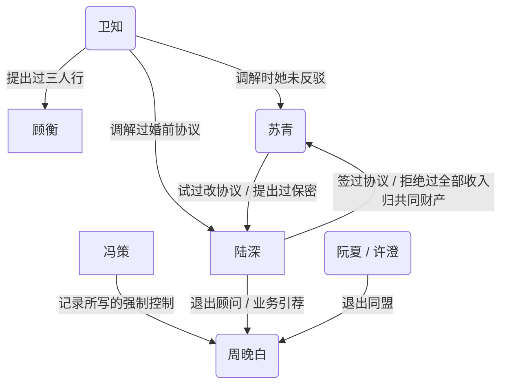

# 陆深与苏青

图例：矩形为男、圆角为女。不含长辈、专业服务人员，也不含陆深的提问。只列已记录的事实，不含尚未发生的安排。

## 人物

- **陆深**：主收入。工作日住城内酒店，周末回南湾。自称偏S的switch。
- **苏青**：在一起前告诉过陆深自己很强势。记录里有四爱倾向。目前没有工作。南湾有朋友和舞蹈网。
- **周晚白**：学妹。记录写她在离开一段强制控制关系。分手谈话尚未开始。
- **冯策**：周晚白现任。异地，会来这个城市。周晚白说过仍感激他的职业指导，也说过他的气场让她有点怕。
- **阮夏**：刚结束一段婚姻，记录写她过得更好。
- **许澄**：同一退出同盟。
- **卫知**：陆深核心朋友之一。做过婚前协议调解。自称低欲。为顾衡提出过三人行。自己也在结婚。
- **顾衡**：卫知的丈夫。记录写性上不满意，有一点双。是否知情具体计划，未确认。
- **乔北**：圈子里对外谈开放关系最多的人。苏青对他戒心很强。
- 苏青的朋友里，当时至少两人知道婚前协议，并表示只接受陆深撤回。
- 陆深的朋友里，当时至少四人知道协议。
- 周晚白前任、苏青前任：人不在当前局里。

## 婚姻里已发生的事

- 2018–2020：床上是苏青在下、陆深在上。之后下降；重病期间约一年一次；现在约一年两三次。目前没有进行中的床上D/s。
- 苏青对前任：生活里一切听她的，有过罚站。
- 陆深设计过先工作一年再结婚的观察窗，后来因身份时限未执行。
- 每次提出结婚的是苏青。陆深没有求过婚。
- 2026年3–4月签婚前协议，4月结婚。两边都有独立律师。苏青提出保密条款，基本上不和朋友谈这份协议。她后来试过修改，陆深未改。
- 同一套贡献、量化问题：陆深单独提出时，苏青以亲密关系不应1:1计价为由拒绝；卫知在场提出时，她未反驳，三人推出框架，此后基本按该框架执行。
- 卫知对苏青的求职指导：未执行。
- 陆深对苏青的求职指导：她口头表示认同，未执行，并说这让她走了弯路。她拒绝他的细管。
- 开放：双方同意婚姻开放。陆深表述的现行条款是：仅短期；年度预算有上限；她通常不问细节但保留知情权；她保留对具体对象的否决。陆深说自己先按她的条款执行。2019年苏青要求立刻开放；近年她把开放列为不能让步的不满之一。
- 开放之争中，苏青说过：她同意开放极罕见，他们这个阶层、文化没人会同意，她的朋友也不会；陆深举出周围会同意的人后，她称那些人有问题，并提到卫知。
- 孩子：陆深要多个。苏青化疗后完全不育。她说过“不想要吧”，不愿当成自己的孩子养，可给一些必要照料和家庭环境，不愿出钱出力。双方粗略路线是捐卵加代孕，费用和大部分精力由陆深承担。亲权写不进婚前协议。陆深的设计是他为唯一意向父母。协议相关条款只分配费用，不写亲权。
- 游戏：苏青的MOBA强于陆深；陆深的RTS强于苏青。她会因他单独超前玩共同的单机而生气。
- 居住：工作日酒店、周末南湾。苏青要求搬来他所在的城市。两地期间，记录写几乎每个周末都吵架。
- 一次旅行中，苏青给出二选一：维持现状则继续吵、大概会离；或者他考虑收入全部进入共同财产。
- 婚前协议之前：苏青提出每月给她一笔固定金额，陆深拒绝。随后发生大额花费与这笔月费的对撞，以及“以后是共同财产”的表述。协议在此之后签署。
- 金钱冲突的具体记录包括：清洁服务该不该由她分担；保险期限过后仍被提起的旧账；一笔他加价、她收下、事后道歉但不退还的卧室付款；共同支票账户在失业期透支；她在账户透支当天说“没有爱情，没有面包”。
- 她禁止他问贡献，同时审计他的支出和供给。
- 他收入下降约九成之后，她开始存钱、做饭。
- 四人谈话（陆深、苏青、周晚白、周晚白当时的男友）由苏青开头。陆深问过周晚白能否做M，她说可以。苏青当时“不是特别抗拒”，并判断“隔着周晚白没可能，和她当时的男朋友有点可能”。后来订过调教室，未发生。前任现有稳定女友且双方switch。陆深目前没有主动往亲密推进。

## 周晚白线已发生的事

- 前任是四爱、男M。周晚白被要求做女S，她不喜欢四爱、不喜欢做S，性“像打工”。她不能接受被自己插入过的男人插入。两人在性以外相处合得来。分手主要由她提出，原因是性生活无法继续。前任现有稳定女友，两人switch。
- 现任冯策：记录写为强制控制、抽取型。周晚白说过，在一起前就能感到他的沉默和气场让她害怕，仍开始了这段关系。她说过冯策“还能改”，也说过自己“又失败了”“其实还没有开始谈”。
- 她仍表示感激冯策的职业指导。
- 陆深指导过她向所在公司内部推动一项与他这边的合作。

## 卫知线已发生的事

- 苏青在陆深的朋友中选定卫知做调解人。陆深曾提议用苏青的一位朋友，苏青未选。
- 苏青背后评过卫知“有毒”、创业圈的人都有毒、卫知相对正常但仍有毒，以及近一两年不如以前成功。
- 卫知因顾衡性上不满意、自己低欲，提出三人行；她认为陆深的开放经验可用。陆深的猜测是：她把自己加进去是为了提高方案对陆深的吸引力。顾衡是否知情，未确认。
- 卫知参与过陆深的婚前协议谈判，也做过他职业决策的反方和财务现实讨论。

## 时间顺序（这段关系内）

- 在一起前：苏青自称很强势；当时互动里看不出来。大约两年后她说自己对前任很强势，更多细节后来在争吵里出现。
- 前两年：床上互补，苏青在下。
- 重病和照料期间：支配轴未运行。生育力未保存。
- 身份时限下结婚，观察窗未执行。
- 大额花费与月度津贴对撞后，签署婚前协议。
- 结婚后数月：旅行中的二选一；连串金钱和供给冲突；失业期婚前流动资金耗尽至透支。开放条款与协议缠在一起。
