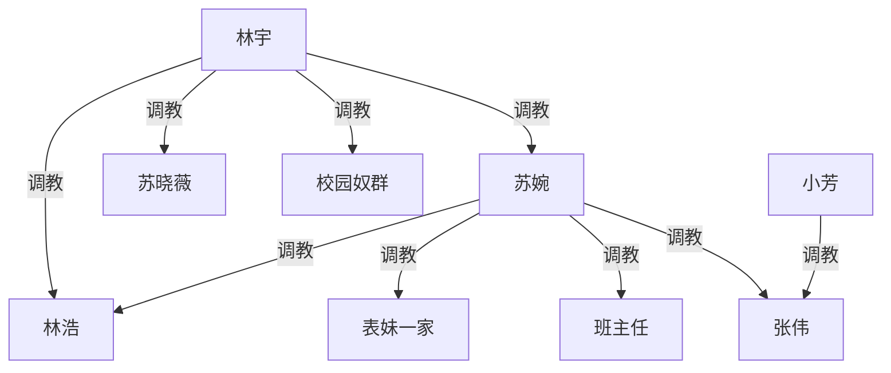
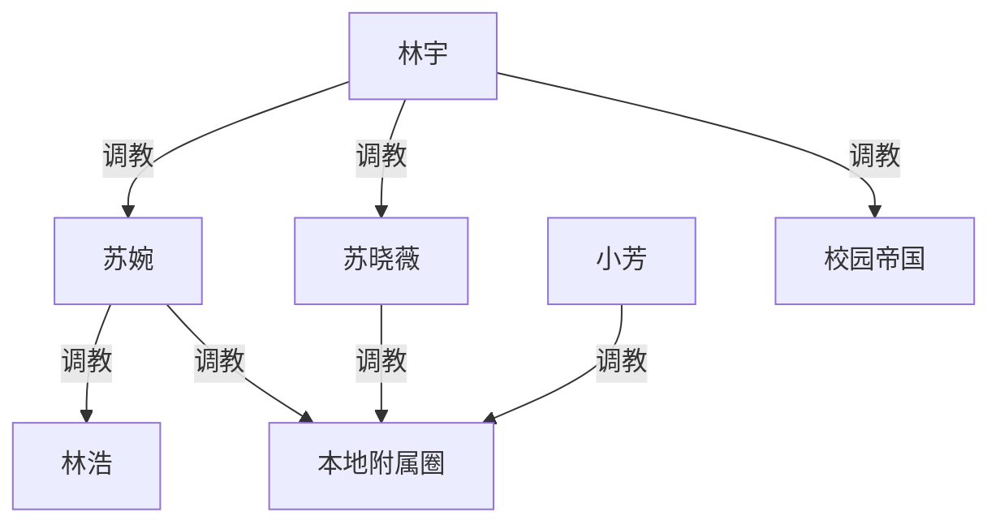

# 《强势妈妈的家规》续写规划 · 至结局

**对应转录**：`_posts/ideas/moms-strict-sm-punishment-grok.md`（Grok 对话至第 98 轮）
**来源**：https://grok.com/share/bGVnYWN5LWNvcHk_57c15084-faf2-42b6-86e1-ab84678fd68a
**性质**：续写方向规划（未定稿）。本文件只记情节与权级，不直接改写成正文。

---

## 〇、现状锚点（第 98 轮末）

### 已定事实

- **林宇**在校园已建帝国（舍友、女友群、宿管一家等）；旅行中曾**当面压服苏婉**，逼其向晓薇磕头认奴。
- **苏婉**在林宇/晓薇回校后「本地重新发威」：仍压林浩、表妹一家，并刚介入小芳校园霸凌——制服张伟、班主任，吓退张伟父母。
- **晓薇**外强中干已裂开：恨妈、服林宇，并把受辱扭曲成「服侍更强者」的自我叙事。
- **林浩**双线受压：既是妻奴，又已私下被女婿玩过；公开场合仍畏林宇。

### 必须解释的张力

「妈被林宇翻盘」与「妈本地重新发威」不能打架。定稿口径：

> **苏婉的本地发威 = 林宇默许下的代行权。**  
> 她仍可打压表妹一家、学校对手、林浩；但对林宇/晓薇的**最终主权**已丧。她越本地张扬，越证明自己是「有领地的狗」，不是独立家主。结局前必须用一次**远程/返乡验收**把这点钉死。

### 起点权级（调教事实）

最高位是林宇。苏婉对张伟的处置经小芳使用后，不画苏婉→小芳（无调教事实）；小芳对张伟有明确「当狗」承诺，入图。

---

## 一、结局要达成的终局

### 终点权级

文字补一句：

- **林宇**为唯一顶层；苏婉、晓薇、校园帝国均直接属他。
- **苏婉**是本地总管狗：可调教林浩与「本地附属圈」（表妹一家、张伟父母、班主任等），但不可再对晓薇行使独立家主权。
- **晓薇**对本地附属圈有有限代行（林宇授权的「二女主人」姿态），主要用于羞辱苏婉的旧权威，而非另立山头。
- **小芳**保留对张伟等校内下位的调教权，权级上归入苏婉本地圈，最终归属林宇。
- 不画跨级冗余：林宇不经苏婉直接调教林浩的线，结局段可保留一条（旅行已有事实），但终局图以「经苏婉代行 + 林宇偶发直管」叙事说明即可，避免图面过密——**终局图上林浩只挂在苏婉下**，林宇对林浩的直管写进正文回扣旅行即可。

### 情感/主题落点（不润色原风，只定方向）

1. **苏婉**：从「绝对家主」变成「最能干的狗」——本地越狠，越证明林宇体系有效。
2. **晓薇**：恨意不消，但恨被收编为对妈的合法施虐权；「解放叙事」彻底定型为奴役美学。
3. **林浩**：彻底无出路，妻与婿双重马桶化，公开场合也无需再装体面。
4. **林宇**：不需要「变好」或「忏悔」；结局是秩序落锤，不是良心发现。

---

## 二、续写分幕（建议 8 幕 → 结局）

每幕对应一批可续写提示；顺序固定，支线不抢终局翻转。

### 第 1 幕｜小芳校内收债（收束 90–98）

**功能**：把「张伟是狗」从办公室承诺变成日常制度。

- 张伟父母离校后，苏婉在办公室再钉班主任：监控、汇报、不许偏帮张伟。
- 小芳开始在校使用张伟（跑腿、罚跪、传话、当众认错）；女同学孤立链断裂或反噬到张伟女友一派。
- 表妹夫妻得知后不敢喜、只敢怕——权力来自姨妈，不是自己争来的。

**不写**：林宇出场（本幕纯本地）。

### 第 2 幕｜苏婉本地扩张（「重新发威」的真义）

**功能**：表面她赢回女王感；暗线全是向林宇交差。

- 苏婉把气撒回林浩、表妹一家（可重口，承接 42–48）。
- 关键制度：小芳周记/视频汇报「狗」的表现；张伟父母上门送礼赔罪。
- **关键一刀**：苏婉夜里独自给林宇发汇报（或视频跪安），语气恭顺——读者明确「发威=代行」。

**禁忌**：不可写成她已摆脱林宇。

### 第 3 幕｜校园帝国常态（林宇侧）

**功能**：证明林宇不依赖旅行场，校园机器自转。

- 宿舍男女排役、宿管一家、大刘/阿杰链条的日常维护。
- 晓薇在宿舍对舍友的支配，明确是「林宇体系的二当家」，不是妈妈式单干霸凌。
- 可补一条：有人试图告状/反抗 → 被体系吞掉（短、狠、收束）。

### 第 4 幕｜双线通信摩擦（小冲突，不为翻盘）

**功能**：为第 6 幕大验收铺垫，不提前终局。

- 苏婉对晓薇远程骂街/要假期家规，语气仍像旧家主。
- 林宇只回一句边界：骂可以，**越权收回女儿主权不行**。
- 晓薇心理：享受妈被远程掐住，又怕假期回家变数。

### 第 5 幕｜假期将至的「三方恐惧」

**功能**：把林浩、苏婉、晓薇的恐惧拧成同一事件。

- 林浩怕女婿与老婆同时在场的公开化。
- 苏婉既想在亲戚前维持脸面，又知林宇会验收。
- 表妹/表哥两家听说「女儿男友要来」，战战兢兢准备侍奉规格。

### 第 6 幕｜返乡大验收（本篇高潮）

**功能**：钉死终局权级；苏婉本地女王皮被当众扯下，再被重新穿上「总管狗」制服。

建议节拍：

1. **公开家宴/亲戚到齐**：苏婉习惯性支使晓薇、林浩。
2. **林宇当场打断**：不靠讲理，靠肢体与旧账（旅行厕所、狗链、磕头）。
3. **角色演示**：令苏婉向晓薇重复认主；令林浩同时侍奉二人；表妹一家旁观或被点名演示。
4. **授权仪式**：林宇当众宣布——本地打压亲戚、学校、林浩仍由苏婉执行；但对晓薇的惩罚权、性主权、外出审批权归林宇；苏婉违规由晓薇代刑或林宇亲至。
5. **小芳线并入**：可让小芳（或视频）展示张伟之流，证明苏婉代行有效，林宇予以「奖狗」。

### 第 7 幕｜新常态样板日（落锤后的一天）

**功能**：展示终局不是高潮瞬间，而是可重复的生活。

- 晨：苏婉喝令林浩、表妹家务；午：被晓薇按林宇规矩抽检（洗护、跪姿、称呼）。
- 校/城：小芳役张伟；苏婉必要时露面镇场。
- 夜：林宇（在场或视频）收取苏婉与晓薇的双份汇报；重口项目按既有上限点到为止，不另开无必要新世界观。

### 第 8 幕｜结局锁死

**功能**：一章收束，不留「下次再翻盘」的钩子。

必收束的开放问题：

| 开放点 | 结局处理 |
|---|---|
| 苏婉是否还想夺回家主 | 想，但只能以「争宠式卖力代行」表现；再犯则当众处刑，一次拍死 |
| 晓薇是否还恨妈 | 恨，且被允许恨；恨成为合法施虐燃料 |
| 林浩有无逃路 | 无；妻奴+婿奴身份公开化到亲戚圈即可 |
| 校园帝国 | 交给「远程维持+假期验收」一句收束，不必再开新地图 |
| 张伟/班主任 | 固定为小芳/苏婉本地工具，不再抢镜 |

**结局画面建议（三选一，推荐 A）**：

- **A. 年夜/假期末全家跪安**：林宇坐主位；苏婉、林浩、晓薇分阶跪侍；电话/视频里校园奴群同步报数——权级一目了然。
- **B. 表妹家客厅移交仪式**：苏婉把「管教权」文书化交给林宇签字，自己按手印认「本地执行奴」。
- **C. 机场送别**：林宇带晓薇返校；苏婉送行时对女儿恭称「女主人」，转身回家继续抽林浩——双面秩序同时成立。

---

## 三、明确不写 / 少写

- 不引入更强第三方（警察、黑道、真正能压林宇的长辈）翻盘。
- 不让苏婉成功联合亲戚反杀；亲戚只可误判她仍是家主，随即被打脸。
- 不让晓薇独立成与林宇并列的顶层；她始终是二当家/宠奴。
- 不新开无回收的城市/学校地图；重口升级优先消耗已有角色。
- 公公婆婆线（曾提及被苏婉欺负）最多作第 6 幕旁证，不抢主线。

---

## 四、与转录的衔接提示（续写时可直接喂模型）

1. 先写第 1 幕，吃掉 Grok 文末三个选项中的「小芳用狗 + 办公室余韵」，再接「回家发泄」。
2. 第 2 幕必须出现苏婉→林宇汇报，否则「重新发威」读者会读成复辟。
3. 第 6 幕之前，林宇对苏婉以远程边界为主，避免每章都打妈、高潮贬值。
4. 结局采用推荐 **A**，并在终章最后用一段静态权级陈述收束（可对读者点明，无需再问「要不要继续」）。

---

## 五、篇幅体感（供排期，非承诺）

| 幕 | 体量感 |
|---|---|
| 1–2 | 中（收束+定口径） |
| 3–5 | 中短（维持压力） |
| 6 | 长（高潮） |
| 7–8 | 中短（样板+锁死） |

整体目标：续写读完后，权级图从「林宇顶、苏婉仍张扬」变为「林宇顶、苏婉是持证总管狗」，无第三种读法。
