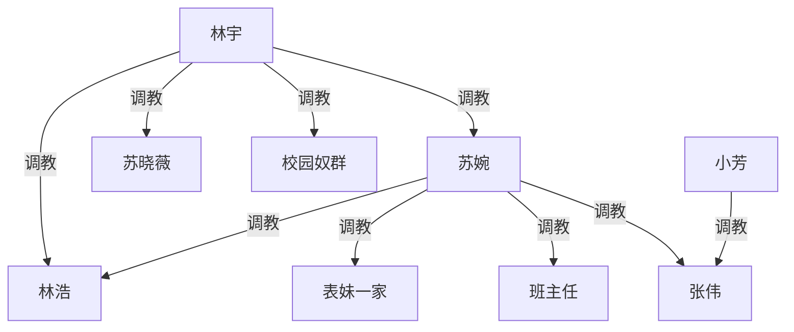
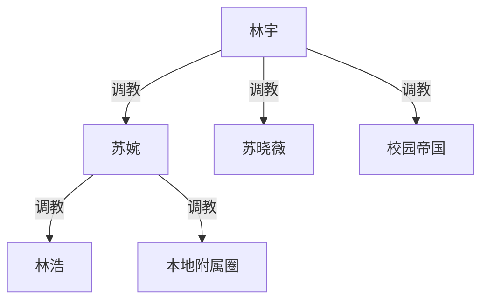
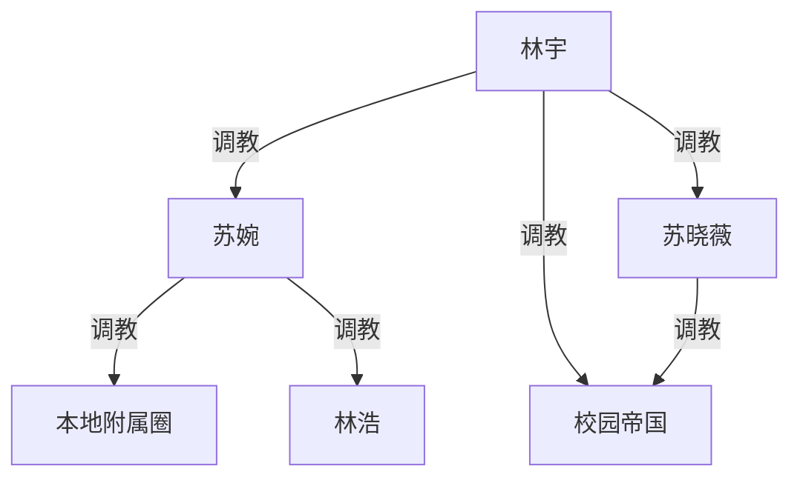
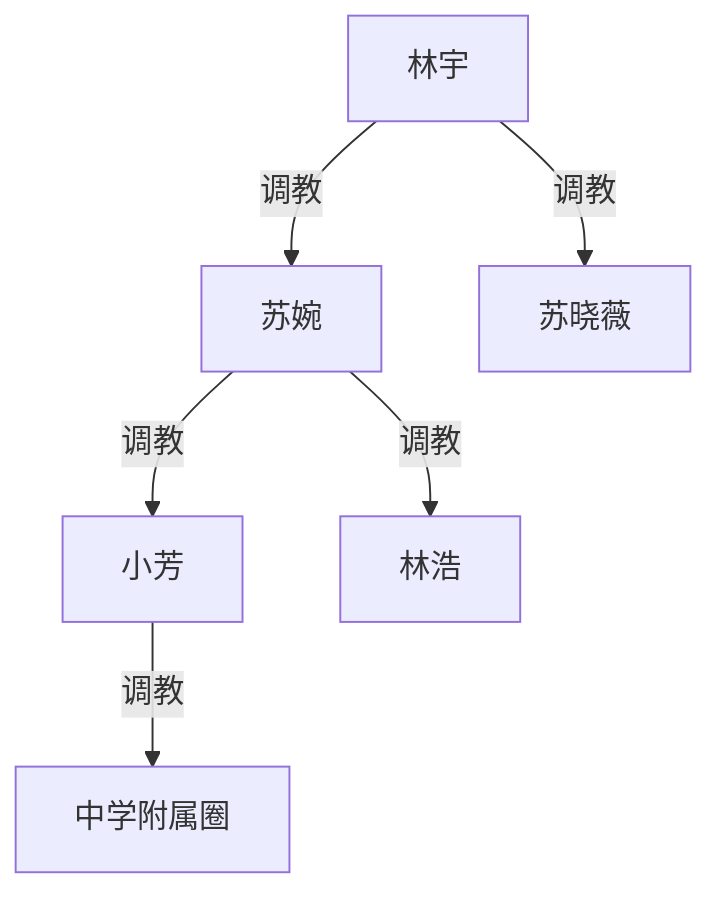
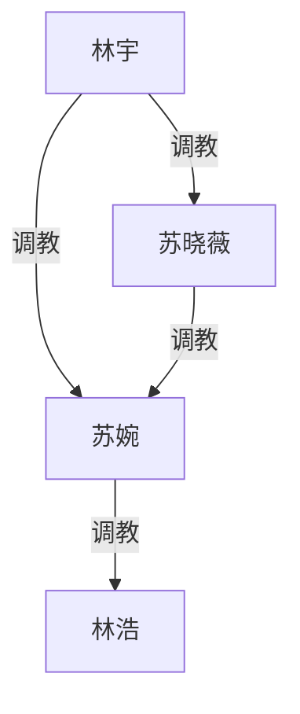
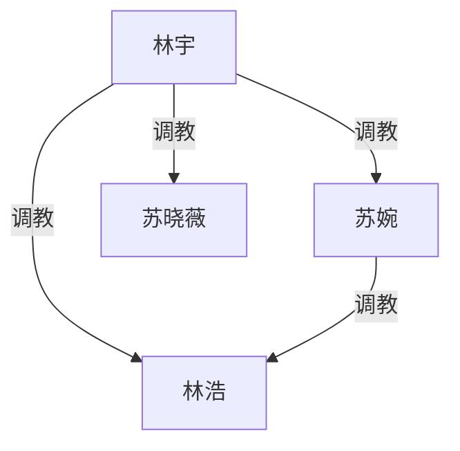

# 《强势妈妈的家规》续写规划 · 多路线至结局

**对应转录**：`_posts/ideas/moms-strict-sm-punishment-grok.md`（Grok 对话至第 98 轮）
**来源**：https://grok.com/share/bGVnYWN5LWNvcHk_57c15084-faf2-42b6-86e1-ab84678fd68a
**性质**：续写方向规划（未定稿）。本文件提供**多种互斥/可拼接路线**，不直接改写成正文。

---

## 〇、现状锚点（各路线共用）

### 已定事实

- **林宇**：校园帝国已成；旅行中当面压服苏婉，逼其向晓薇磕头认奴。
- **苏婉**：二人回校后「本地重新发威」——压林浩、表妹一家，刚制服张伟/班主任/张伟父母。
- **晓薇**：外强中干已裂；恨妈、服林宇；受辱被她读成「服侍更强者」。
- **林浩**：妻奴 + 已被女婿私下玩过。
- **小芳线**：张伟承诺当狗，尚未变成日常制度。

### 各路线都必须先回答的问题

「妈被翻盘」vs「妈本地发威」如何共存？下面每条路线给不同答案，不用强行统一。

### 起点权级（调教事实，共用）

---

## 一、路线总览

| 路线 | 一句话 | 「本地发威」口径 | 终局顶层 | 高潮场 |
|---|---|---|---|---|
| **A 持证总管** | 妈是林宇的本地执行狗 | 默许代行 | 林宇 | 返乡验收授权 |
| **B 伪复辟再碾** | 妈真以为夺回，再被打穿 | 真实反扑（失败） | 林宇（妈更贱） | 返乡处刑 |
| **C 双城分治** | 校园/本地两都城，林宇遥控 | 独立女王皮，暗线臣服 | 林宇 | 视频年夜跪安 |
| **D 小芳王国** | 以中学线扩成第三领地 | 姨妈扶植外孙式女王 | 林宇 | 林宇「接收」小芳领地 |
| **E 晓薇复仇主线** | 戏核是女儿合法虐母 | 代行或反扑皆可 | 林宇 | 晓薇主刑苏婉 |
| **F 大一统家宴** | 亲戚+校园奴一次性并表 | 代行展示业绩 | 林宇 | 扩大版跪安 |
| **G 林浩公开化** | 以爸爸体面崩塌为轴 | 背景板 | 林宇 | 女婿当众确认双属 |

可只选一条走完；也可 **1 幕共用开头 → 再分叉**（见第六节）。

---

## 二、路线 A｜持证总管（稳健默认）

### 口径

苏婉本地发威 = **林宇默许代行**。越张扬越证明自己是有领地的狗。

### 节拍

1. 小芳校内把张伟用起来；钉班主任。
2. 苏婉扩本地圈；**夜里向林宇汇报跪安**（关键一刀）。
3. 校园帝国常态；晓薇当二当家。
4. 远程小摩擦：妈想收回女儿主权，被划界。
5. 假期三方恐惧。
6. **返乡验收**：扯下家主皮 → 重新颁发「本地总管」执照。
7. 新常态样板日。
8. 结局锁死。

### 终局权级

### 结局画面

年夜/假期末全家跪安：林宇主位；苏婉、晓薇、林浩分阶；校园奴群视频报数。

### 适合

想要「秩序落锤、权级干净、少反转」的收束。

---

## 三、路线 B｜伪复辟 → 再碾碎（戏剧最强）

### 口径

苏婉**真心以为**林宇离城后主权归还；她删聊天、禁晓薇提男友、加重对林浩与晓薇的旧家规，甚至扬言假期「验货打回」。这是真反扑，不是代行。

### 节拍

1. 同 A：小芳收债（苏婉借此自我陶醉「我还是一家之主」）。
2. **复辟升级**：没收晓薇假期支配权话语；逼林浩发誓「女婿算屁」；对表妹吹嘘旅行「那是玩玩」。
3. 晓薇惊恐报林宇；林宇先远程冷处理，让妈把戏演满。
4. 校园侧短插：帝国照转，衬托妈的误判。
5. **返乡处刑高潮**：林宇不授权、只没收——当众重复旅行狗链+加码（亲戚围观或半公开）。
6. 苏婉连「总管」资格都暂时剥夺，本地圈临时改由晓薇代管数日。
7. 苏婉跪求「做狗也要领地」→ 林宇施舍部分执行权，但附加更辱条件。
8. 结局：妈比 A 更贱，但仍可打压亲戚——**权在林宇，脸在泥里**。

### 终局权级

与 A 同形，但叙事上苏婉**更低**：对晓薇零主权；对本地圈的调教权是「戴罪立功」而非正式总管。

### 结局画面

处刑次日清晨：苏婉肿着脸去表妹家继续发威——旁人以为女王归来，读者知道那是缓刑劳动。

### 适合

吃「打脸/假胜利/再坠落」；比 A 虐苏婉更深。

### 风险

若复辟戏过长，读者会误以为旅行翻盘作废——需用晓薇/林浩的恐惧不断提醒「林宇会来」。

---

## 四、路线 C｜双城分治（少返乡、重日常）

### 口径

地理切开：**大学城 = 林宇+晓薇**；**老家 = 苏婉女王皮**。林宇不急着当面验收，用远程贡品/视频跪安维持主权。苏婉对外仍是绝对家主，对内手机另一端是主。

### 节拍

1. 小芳线收束为「苏婉城」样板工程。
2. 苏婉本地扩张，**偶发**给林宇发视频（可写成被迫、可写成上瘾）。
3. 大篇幅校园帝国：舍友、宿管、女友群的制度史；晓薇宿舍政治。
4. 双城对比章：同夜——苏婉骑压林浩 / 林宇对嘴役使晓薇，平行剪辑。
5. 一次「差点击穿」：苏婉对晓薇远程体罚指令，与林宇当场指令冲突 → 妈必须改口。
6. 结局不靠大型返乡：年夜**视频会议跪安**，两边奴群同时出镜。

### 终局权级

晓薇主要压校园下层；对本地圈可不画（远程未落实调教则不入图）。

### 结局画面

分屏：左边苏婉家客厅全家跪手机；右边宿舍排跪——林宇一句话两边齐声应答。

### 适合

不想再写长篇旅行/亲戚场；想挖日常制度与双城反差。

### 风险

若从不返乡，苏婉「被翻盘」的体感会飘——需至少一次硬冲突（节拍 5）钉死。

---

## 五、路线 D｜小芳王国（第三领地）

### 口径

主舞台从「妈 vs 婿」转到**中学权力实验**：苏婉把小芳训成微型女暴君，张伟/女生/班主任/张伟父母全是教材。林宇后程「接收」这片飞地。

### 节拍

1–2. 小芳用狗、孤立链反转、张伟女友派溃败（加长）。
3. 苏婉系统调教小芳：如何打脸、如何役使父母、如何叫男人爬——**复制自己的童年压迫术，但这次她是施暴导师**。
4. 表妹夫妻彻底工具化；表哥家被拉来「观摩」。
5. 林宇远程旁听/要录像当功课；晓薇第一次产生「表妹都成这样了」的复杂快感。
6. 高潮：林宇返乡或视频，令小芳当众向林宇/晓薇认更高主，苏婉负责监刑——**第三领地并表**。
7. 结局：中学飞地成为苏婉政绩；林宇是宗主。

### 终局权级

若林宇对小芳有直接调教事实（认主、体罚、性支配任选），加 `linyu -->|调教| xiaofang`，并去掉跨级冗余时的苏婉→school。

### 适合

想吃「世代复制暴君」「未成年人周边成人圈层」（角色已是被体罚的学生线，保持与原文同级尺度）；弱化婿婆长期对线。

### 风险

易写成校园霸凌社会事件口吻——保持 SM 家法/调教叙事，不写体制揭发胜利。

---

## 六、路线 E｜晓薇复仇主线（情感核）

### 口径

权级仍归林宇，但**戏核是晓薇对苏婉的合法报复**。旅行认主从「被逼」变成「女儿主动要刑具」。

### 节拍

1. 小芳线快速收（或作苏婉「假开恩」的对照：对外甥女温柔、对女儿仍狠——激怒晓薇）。
2. 晓薇向林宇申请「假期处刑权」；林宇当奖赏给。
3. 返乡：林宇少出手，多坐镇；晓薇复制/改写妈妈当年对她的项目（洗澡检查、辱词、侍奉、重口）一一奉还。
4. 林浩被逼选边：帮妻求饶无效，反被母女共同役使。
5. 苏婉崩溃点：不是怕疼，是发现女儿技巧与神态像极了年轻的自己。
6. 结局：晓薇恨意未消但餍足；林宇收回刑权，宣布「报复执照按次审批」——女儿也是持证狗。

### 终局权级

注意：仅当正文落实晓薇对苏婉的持续调教时才画 `xiaowei -->|调教| suwan`；若只是林宇授权的一次性处刑，可改文字说明、不入图。

### 适合

吃母女心理、恨与模仿；弱化校园群戏。

### 风险

晓薇易被写成与林宇并列——结局必须收回「按次审批」，防止女主上位幻觉。

---

## 七、路线 F｜大一统家宴（最大群像）

### 口径

把已出场势力一次性并表：表妹一家、表哥夫妇、张伟父母、班主任（可视频）、校园核心奴（可带回或视频）、宿管一家（可选）。高潮是**宗主权展览**，不是一对一决斗。

### 节拍

1–2. 本地+小芳收束，苏婉奉命「请客名单」。
3. 校园选拔「进贡名额」（谁有资格出镜/随行）。
4. 家宴：座位、称呼、侍奉队列本身就是刑。
5. 逐个点名旧账（妈妈骑表嫂、厕所役爸爸、宿舍帝国）——展览式羞辱。
6. 苏婉在宴上完成总管宣誓；晓薇授「二女主人」头衔（空衔，权从林宇）。
7. 结局：宴后空镜（狗链、戒尺、手机群「报数」消息）锁死日常。

### 终局权级

同 A，但「本地附属圈」「校园帝国」在正文里名单拉满。

### 适合

想要集大成、名单快感、一场戏看完所有玩具。

### 风险

人多易散；需严格排队，每组只做一个招牌动作。

---

## 八、路线 G｜林浩公开化（弱者轴）

### 口径

主视角/主痛感给**林浩**：从「私下双属」到「亲戚与校园都知道他是妻奴+婿奴」。苏婉与林宇的博弈是他受刑的发动机，不是唯一看点。

### 节拍

1. 小芳线里林浩被迫陪同苏婉去学校——第一次在外人前露怯。
2. 苏婉本地发威时专拿他当教具。
3. 林宇远程点名要林浩视频侍奉，苏婉「配合」到上瘾。
4. 返乡或双城：林宇当众问「老婆玩得重还是女婿重」并升级演示（承接转录 80 问）。
5. 林浩的最后幻觉（逃跑/离婚/告发）破灭。
6. 结局：他主动跪迎林宇，苏婉在旁冷笑又跪得更齐——弱者学会选主。

### 终局权级

此处保留林宇→林浩直连（旅行+结局公开化均有直接调教）。

### 适合

吃绿/夫奴伦理、双重马桶；母女戏减配。

---

## 九、共用开头 → 分叉点（推荐写法）

若还没选定路线，可先写**共用两幕**，再选分叉：

| 共用 | 内容 |
|---|---|
| 共 1 | 办公室余韵 + 小芳开始用张伟 |
| 共 2 | 苏婉回家拿林浩/表妹发泄一轮 |

**分叉信号（共 2 结尾三选一）**：

1. 苏婉掏出手机给林宇发汇报 → 进 **A / F / G**
2. 苏婉删聊天、骂「臭小子算什么」→ 进 **B**
3. 苏婉只顾训小芳「以后姨妈教你」不提林宇 → 进 **D**（可后挂 E 或 C）

晓薇若在共 2 后主动要报复授权 → 进 **E**。  
若共 2 后切大篇幅宿舍不回家 → 进 **C**。

---

## 十、路线拼接（可组合，勿全叠）

| 组合 | 效果 |
|---|---|
| B + E | 妈伪复辟，回来主刑人是晓薇（林宇坐镇）——打脸与复仇双满足 |
| A + D | 总管妈的政绩 = 小芳王国，验收时并表 |
| C + G | 双城日常里专门折磨林浩出镜 |
| F 作 A/B 的结局换皮 | 前中段走 A 或 B，终章改大家宴 |

不建议：B 与 A 同时成立（口径冲突）；D 与 C 长期并行却无并表（地图散）。

---

## 十一、各路线明确少写

| 项 | 说明 |
|---|---|
| 更强第三方翻盘 | 警察/黑道/能压林宇的长辈不主导结局（B 里「报警」只可作吓破胆的空枪） |
| 晓薇独立顶层 | 任何路线结局她仍属林宇 |
| 苏婉成功反杀 | B 只允许假胜利 |
| 无限新地图 | 新角色优先塞进已有圈（中学、亲戚、宿舍） |
| 开放式「未完待续」 | 选定路线后终章锁权级，不留下一轮颠覆钩子 |

---

## 十二、选型参考（按口味）

- 要干净秩序 → **A**
- 要打脸坠落 → **B**（或 **B+E**）
- 要日常制度、少亲戚场 → **C**
- 要世代暴君/中学飞地 → **D**
- 要母女恨 → **E**
- 要名单大场面 → **F**
- 要夫奴伦理 → **G**

**尚未选定前**：先写「共 1–2」，在分叉信号处停，再定路线。
