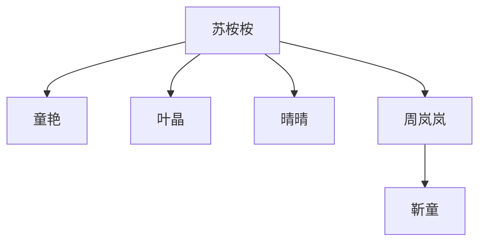
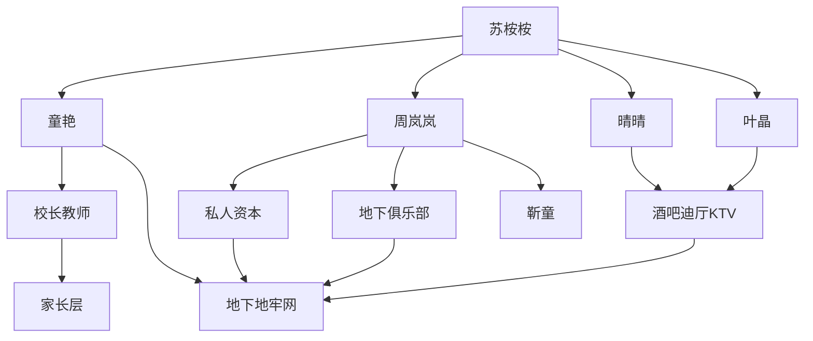
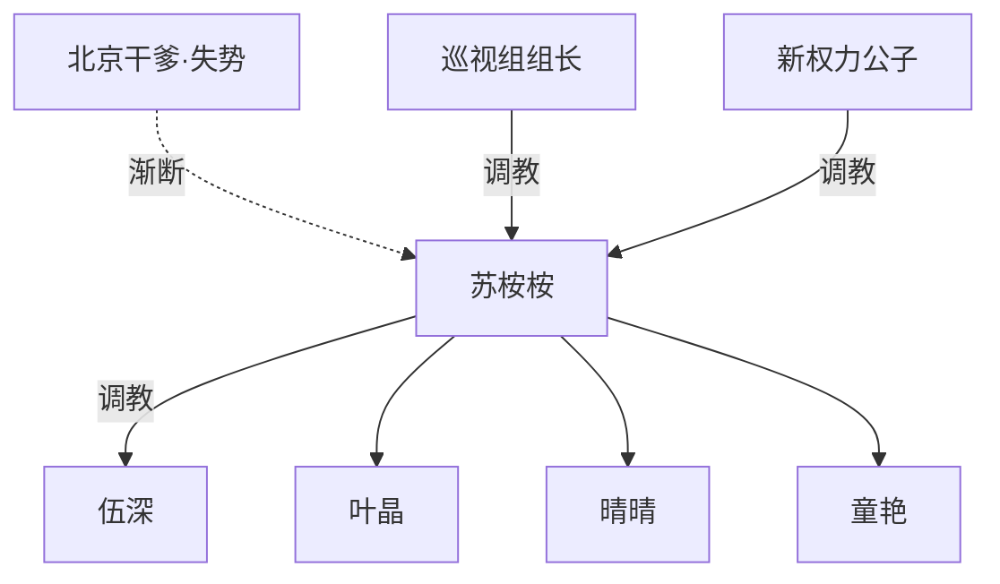

# 《邻居》X 市 · 收网后城内渗透与王国化规划

**对应原文**：`_posts/2020-11-03-the-neighbors.md`（主时间线）；`_posts/2020-09-30-jin-tong.md`（靳童单篇，并入 X 市）；`_posts/2022-09-17-domestic-queen.md`（薤湾县镇，专案收服）；`_posts/offshelf/journal-of-the-queen.md`（外城，暂不互动）；`_posts/2022-11-13-shang-yafang.md`（《司令千金尚雅芳》，**省—央—太子圈层灵感**，不强行同人）

**时间轴粗分**：第八部收网 → 第九—十部 **X 市城内渗透 / 王国化**（第三—十节）→ 第十一部起 **省—央定稿主线**（第十一节：干爹失势 → 巡视组长「皇上」→ 献身苟住；**底层不可挑战高顶**）

**性质**：第八部收网之后的续写 / 世界观扩展规划（未定稿、未排部、未排期）

**原则**：三篇已发正文**原样留存**；本文件只记录方向、程式与权力结构。权力图只画调教关系，见 `AGENTS.md`。

---

## 〇、前提：第八部收网终态（已定方向）

### 政治

- **苏桉桉**：市委书记，城内政治独大。
- **许愿**：市长；**范树人**：市人大主任（配合，不入调教图）。
- 反桉桉伞消失；**伍深**、北京干爹仍在省 / 中央层。

### 调教（收网后纵链）



图下一句：**收网后全市唯一不受上位调教约束的 S 节点为苏桉桉**；岚岚、靳童等原并列顶编入纵链。

### 收网三幕（规划，未写正文）

1. **收岚岚**：白萍兑现「介绍当官的」→ 岚岚膨胀 → 冲突中官员只听苏书记 → 岚岚投靠桉桉求保护。
2. **收靳童**：叶晶组局 → 岚岚脚锁靳童 → 桉桉亮相 → 靳童影响范树人，三顶并一。
3. **终态**：如上纵链；各奴网（公寓、民政、范家等）归属最高位。

---

## 一、同宇宙合并口径（已定）

| 作品 | 定位 | 与 X 市关系 |
|------|------|-------------|
| **邻居 + 靳童** | 主宇宙 | **同一 X 市**（正文「新市」= 市区俗称） |
| **家庭女王（郦娟等）** | 市辖县镇 | **同宇宙、低层级**；**专案轻易收服**，不当第三顶 |
| **女王志（尹娜）** | **另一座城市** | **暂不互动**；同城会与邻居商业线冲突且正文无尹娜级帝国 |

### 郦娟线 · 专案收服

- 依据：靳童单篇 **下到县里即「天顶」**（县长二十分钟内安排人、乡长磕头、渡假村主任当奴）。
- 郦娟靠镇粮所 + 县书记哥哥 + 省城姑妈，**无全市 SM 顶资格**。
- 收服不必大战：民政 / 粮站旧案 / 童艳—白萍线 **立项下乡** → 镇域女王 **并入网点或 switch**，不进入主链争夺。

### 尹娜线 · 外城封存

- 若将来要写：仅限 **外省女王来 X 市开分店 → 被桉桉打服** 的单场，非日常互动。
- 地图：`universe-locations.html` 中 **X 市** 与 **女王志所在城** 保持 **分 cityId**。

---

## 二、第九部及以后 · 总目标

| 项目 | 内容 |
|------|------|
| **时间** | 第八部收网**之后** |
| **叙事目标** | 正常地级市 → **桉桉个人王国** → 终局 **巨型地下 SM 地牢**（地上城市仍运转，地下 / 内层全城奴链互通） |
| **总铁律** | 城内**不允许独立 S**；原女王、收费 Dom、俱乐部主理人 → **收编为 switch**，调教边只向上连桉桉体系 |
| **操盘分工** | **叶晶**（媒体 / 情报）· **晴晴**（街面 / 夜场）· **童艳**（民政 / 教育 / 儿童 / 收容）· **楚铭 / 工商** · **岚岚**（民间女王收编）· 桉桉 **不必每场亲自扫场** |

---

## 三、六层渗透程式（城内扩展）

### 第一层 · 街面灰产（酒吧 / 迪厅 / KTV）

**正文钩子**：晴晴小太妹、楚铭摆平蓝妮、叶晶迪厅叫曹安舔脚、迪厅同好被公安扫过、蓝妮宾馆桑拿 + 迪厅 + 应召链。

**方向**：

- 不以纯械斗抢地盘，而以 **SM 收编** 替代：老板 / 妈咪 / 领班先成脚奴，再逼下面小姐、保安、混混排队认主。
- 楚铭：**工商 + 治安口子**——证照、消防、扫黄节奏配合叶晶口风；**只扫不服的，不扫已挂链的**。
- 叶晶迪厅线扩展为各场 **驻场 M / 老板跪包房** 标配。

**阶段结果**：夜场成 **晴晴 → 叶晶 → 桉桉** 的外围脚垫；卖淫可仍在，**抽成与羞辱权**归体系。

---

### 第二层 · 私人资本（统奴化）

**正文钩子**：卢微两家连锁超市财务总监、郑媛拟引荐岚岚；许愿给佳佳开高档时装店；卢微哥哥百货；忻忻想开服装店。

**方向**：

- 岚岚 + 郑媛引荐式收老板：先私人做奴，再以担保 / 供货 / 消防 / 税务 **换股权或实控**。
- 童艳 **民政 + 孤儿 + 蓝院** 握劳动力与丑闻；许愿 **海归资本** 收小老板。
- 规则：**在 X 市开店 = 至少一名股东或法人进奴链**；财务总监、店长优先（卢微为模板）。

**阶段结果**：超市、时装、宾馆（蓝妮线）→ **明面商业 + 暗面全员 switch**。

---

### 第三层 · 地下 SM 俱乐部 / 收费女王

**正文钩子**：叶晶知本市迪厅有同好、被公安扫荡过。

**方向**：

- 叶晶 / 进香 **钓鱼** 或 **公然突击**（见第四节拘留所程式）。
- 铁律：**纯 S → 对桉桉 switch**；对下位仍可 S，**上连必须存在**；**收费女王 → 局费进体系**；硬顶 → 专案 + 拘留所模板。

**阶段结果**：城内 **不存在第二个不被看见的 S 顶**；俱乐部变 **地牢分店**。

---

### 第四层 · 教育体系（校长 → 教师 → 家长）

**正文钩子**：甘露—信义—方方圆圆（见第七节）；信义辞教授当中学老师；甘露打工子弟学校班主任；童艳管民政办领养。

**方向**：

- 从一所中学扩到 **教育局换校长**；校长 **脚奴 + 编制权**。
- 教师链复用 **「女王妈妈 / 仙女奶奶 / 驱魔」** 话术；可升级为 **「苏奶奶 / 书记家」**。
- 家长层：**关键家长（富、官、刺头）进链**，其余被金字塔气压。

**阶段结果**：学校成 **向下渗透竖井**，与 orphan、蓝院 **汇流**。

---

### 第五层 · 家长与社会中层

- PTA、培训班、少年宫、驾校、物业等同模板。
- 找一个已在链上的 M（楚铭、信义、曹安类）当触点；**SM 羞辱替代金钱贿赂**。
- 节奏：**今天舔脚 → 明天带配偶 → 后天孩子进 orphan 预备队**。

---

### 第六层 · 终局：巨型地下 SM 地牢

| 地上仍正常 | 地下 / 内层 |
|------------|-------------|
| 蓝院、灰院、orphan | 儿童 / 弃民奴池 |
| 蓝妮宾馆桑拿、迪厅 | 应召 + 脚奴工厂 |
| 童艳公寓、岚岚别墅 | 中级女王行宫 |
| 靳童五层楼、收容站 | 范家 + 政治奴 |
| 新建「会员俱乐部」 | **总地牢**——桉桉唯一 S 顶的祭祀场 |

终局意象：**白天仍是北方穷市**；夜里场子、学校库房、民政地下室 **门禁互通**，全城是 **同一奴链的不同楼层**。

---

## 四、灰产 · 公安扫场 + 情境 · 两相夹击

### 双轨分工

| 轨道 | 执行 | 作用 |
|------|------|------|
| **明面：公安扫场** | 常规扫黄 / 治安；节奏由 **叶晶 + 楚铭 + 桉桉市委** 拿捏 | 不服者真扫；已挂链者扫别人或扫完放行 |
| **暗面：情境 / 势力** | 晴晴混混、妈咪、已收脚奴老板 | 扫前 / 扫后 **脚锁、认主、供名单** |

### 对象两条结局

1. **情境收服**  
   扫场前已在包间 / 库房跪完、挂 **叶晶 → 晴晴 → 桉桉** 链；扫场为 **表演性配合**（交过气小姐、假账本）；扫完 **清净收复**——换「干净」牌照，实则 **SM 税** 进体系。

2. **扫进去再弄服**  
   硬顶场子真被带走 → **拘留所程式**（第五节）→ 出所时已无脸当 S → **清净收复**（换法人、换妈咪、原老板当驻场 M）。

### 与总铁律的关系

- 扫 = **筛选 + 恐吓 + 合法外壳**  
- 情境 = **收链 + 抽成 + 羞辱**  
- 出所再收复 = **防假服、外逃、另起炉灶**

**读者可信口子**：老板以为交保护费即可，扫完仍要 **当众舔晴晴脚**——保护费主人是 **苏体系**，不是公安 alone。

---

## 五、拘留所收服 · 地下 S / 收费 S（狠毒版程式）

适用于：**夜场硬顶、俱乐部、收费女王**；与灰产「扫进去」**共用模板**。

### 面上 / 里子（避免出戏）

| 面上 | 里子 |
|------|------|
| 治安拘留、审讯、「法制教育」 | 执行面 = **桉桉体系 switch** |
| 卷宗、手铐、候问室像真的 | 女线：童艳民政口女 switch **着警服协查** 或已收编女警 |
| 普通小姐走真罚 | 男线：楚铭 / 晴晴线 **特勤着警辅** |
| | **真扫黄** 与 **特审** 分房；叶晶放风：「这几间今晚别扫，要留人」 |

### 五步程式

| 步 | 内容 |
|----|------|
| **1. 公然抓** | 不隐秘钓鱼；淫秽 / 组织活动 **公开带走**；俱乐部门口、女王、会员一并上铐； **同城传闻一夜传开** |
| **2. S 与 M 同所** | **刻意不分房**；女王与固定 M、付费奴、妈咪 **同一拘留室 / 强可视**；M 见 S 碎、S 见 M 已录口供 |
| **3. 当着 S 审** | 分开问、**口供对读**；M 说脚刑 / 圣水 / 收费；**念给 S**；否认则 **口供 + 监控**；问 **谁收钱、谁组织**——把 S 从「情趣」拽进「案卷」 |
| **4. 方法反转** | S 与 M 放一起；**用 S 对 M 的方法对待 S**（跪舔脚、圣水、场子黑话命令）；**M 必须在场**观看或被迫参与（M 亦 switch 向上留口） |
| **5. 放出来 · 清净收复** | 不诉或轻罚 = **交换**：俱乐部过户、会员名单、终身 switch、定期报到；对外「女王退圈、店查封」；对内 **改名会员制、原女王任驻场羞辱对象** |

---

## 六、拘留所 · 同性 S 执行 + 旁观者换顶（升级版）

在第五节第 4 步之上：**执行者性别对齐原 S**；**旁观者改宗**。

### 6.1 收费女王 + 客户同抓（女 S · 女执行 · 客户旁观）

**抓法**：俱乐部突击；女王 + 包间 **VIP 客户** 一并带走。

**场内核**：

1. 先审女王；对客户 **复读 M / 客户自己** 的口供。
2. **女执行面**（女警 switch / 编内女 S 着制服）在 **客户可见** 处，按场子规矩 **把女王当奴玩**。
3. 客户本是 **买 S 幻想** 的人——**谁在场里像 S 谁就是顶**；女王在客户面前被踩 → **效忠迁移到制服女**（「原来这才是真女王」）。

**收服结果**：

- **客户** → 释放后与俱乐部名单 **同挂链**（叶晶 / 晴晴外围 M）。
- **原女王** → 在客户面前 **社会性死亡**；switch；常需 **在该客户见证下** 示从属。

**可对白（示例）**：「你以前给她钱让她踩你。从今天起，她踩你之前要先看我们的脸色。你要还玩，就到报到的场子来。」

---

### 6.2 男 S + 女奴同抓（男 S · 男执行 · 女奴旁观）

**抓法**：地下局 / 私调教室；男 Dom + 固定女奴一并进所；**女奴必须看见** 男主人被处置。

**场内核**：

1. 对女奴 **复读男 S 口供**。
2. **男执行面**（男警 switch / 编内男 switch）对男 S 用 **男 S 对女 M 的权力语法**（跪、踩、报奴名）——在 **女奴视线里** 完成。
3. **男性气概崩盘**写 **身份符号**：男 S 在 **另一男人** 面前跪、被命令 **像他对女奴那样** 说话；不敢反抗（手铐 / 案卷 / 加刑）。

**女奴心理（正文奴性逻辑：「发情」= 找到新顶、身体先投降）**：

- 原依附 **男 S 的雄性**；男 S 被男警压垮 → **旧顶成笑话**；**新顶 = 所里第一个让她看见「真 S」的男人** → 服从欲与性 **向男警 / 男警代表的体系偏移**。

**收服结果**：

- **女奴** 出所后 **优先挂男警 → 晴晴 / 叶晶链**。
- **男 S** 必须 **对女奴公开 switch**；女奴在场时 **不可再对女奴发 S 令**，**只允许对上行 S**。
- 释放时可安排：**在女奴面前** 向新顶磕头 / 报奴名（ **清净收复** 报到场，叶晶旁观）。

---

### 6.3 其他组合

| 组合 | 模板 |
|------|------|
| 女 S + 男 M | 女警搞女 S，男 M 旁观 → M 知「女主人也就这样」→ 分别挂链 |
| 女王 + VIP + 固定脚奴 **三人同抓** | 先女警玩女王（客户看）→ 再令女王对客户下口令（客户跪）→ **一夜两 S 清零、M 换顶** |

### 6.4 同性执行 + 旁观者 · 分镜表

| 步 | 收费女王线 | 男 S + 女奴线 |
|----|------------|----------------|
| 1 | 女王 + 客户同抓 | 男 S + 女奴同抓 |
| 2 | 对客户复读女王口供 | 对女奴复读男 S 口供 |
| 3 | **女对女**，客户可见 | **男对男**，女奴可见 |
| 4 | 客户对 **女执行面** 认新顶 | 女奴对 **男执行面** 发情 / 认顶 |
| 5 | 女王在客户前 switch 登记 | 男 S 在女奴前 switch 登记 |
| 6 | 同挂叶晶 / 晴晴 / 童艳报到 | 同左 |

---

## 七、教育渗透母本 · 甘露—信义—方方圆圆（原版摘要）

> 续写 **第四层教育线** 时以此为准；**原版无公安 / 拘留所**，与第五、六节 **不矛盾**——甘露线是 **早期样板**，俱乐部线是 **成年 S 清零样板**。

### 7.1 信义—甘露—童艳

| 阶段 | 内容 |
|------|------|
| 大学 | 信义崇拜童艳；甘露追信义七年；信义只把甘露净脚当 **替身**，嘴里仍是童艳汗脚 |
| 婚后 | 信义坦白脚奴癖，约定不要孩子；甘露容忍 |
| 转折 | 信义赴童艳城开会，童艳已当女王，**宾馆收脚奴**，赠 **带脚汗丝袜** |
| 共奴 | 信义要带丝袜离婚；甘露 **最后一夜** 被丝袜性爱征服 → 跟至童艳市；信义每日下午舔脚，带回 **丝袜 + 洗脚牛奶**；甘露从被迫到习惯 |
| 饭店 | 童艳设局；夫妻共奴；甘露吮洗脏袜、舔鞋；童艳：**主人快乐建在奴的屈辱上**；甘露改口 **主人 / 女王**，无人在场只能跪 |

**本质**：甘露非天生 M，是 **爱信义 + 输给童艳 + 性生活被童艳物料绑定** → **夫妻共奴**；童艳得 **成年脚奴 + 教师掩护**。

### 7.2 方方、圆圆

| 阶段 | 内容 |
|------|------|
| 身世 | 被虐准孤儿；老师轮流带养嫌累赘 |
| 领养动机 | 信义要 **献给童艳**（非让甘露被孩子伺候）；夫妻观童艳家 **孩子舔脚、骑马、鞭、圣水** |
| 合法化 | 童艳要；**白萍调教**；民政（童艳管辖）办领养 |
| 甘露「教育」 | **体内魔鬼**；**仙女奶奶（童艳）** 用脚汗、洗脚牛奶药死魔鬼；踢踩 = 踢魔鬼；老师爸妈也是奴；**舔手练习 → 舔童艳脚**；学跪行 |
| 入童艳家 | 墙边跪看一夜；喝洗脚牛奶；见圣水；正式为奴孩；甘露班主任 **方便旷课送去** |

**本质**：**教师身份 + 合法领养 + 童语洗脑**，把已驯服儿童转交女王；甘露 = **献祭者、教头、共奴**。

### 7.3 原版 vs 续写扩展

| 原版 | 续写可写 |
|------|----------|
| 一所打工子弟学校、两个孩子 | 校长—教师—家长金字塔 |
| 话术「魔鬼 / 仙女奶奶」 | 可升级为「苏奶奶 / 书记家驱魔」 |
| 入口：信义献奴、童艳要新玩物 | 入口可加：专案 + 公安 + 童艳民政 |
| 童艳 = 局部女王 | 收网后同模板 **挂桉桉顶** |

---

## 八、渗透完成态 · 权力结构图



图下一句：**渗透完成后，原 S 仅可对下保留 S 表演，调教边必须向上连叶晶 / 童艳 / 桉桉体系**。

---

## 九、正文已有钩子 · 对照表

| 层级 | 已有段落 / 角色 |
|------|-----------------|
| 早期地下奴 | 李恒、文芬（桉桉杂志社—姑奶奶链） |
| 夜场 / 混混 | 晴晴、楚铭、蓝妮、迪厅叶晶—曹安、伍深官大 |
| 商业 | 卢微、郑媛、佳佳时装店、蓝妮宾馆 |
| 教育 | 甘露、信义、方方圆圆、鸿鸿、白萍 |
| 民政 / 地牢素材 | 童艳、白萍 orphan、蓝院、收容站 |
| 范家 | 靳童五层楼、范树人人大 |
| 县镇 | 靳童下县（县长 / 乡长 / 香芝）→ 郦娟专案预演 |

---

## 十、写作节奏建议

1. **一部只吃一两层**（例：第九部 = 夜场 + 一个收费女王；第十部 = 卢微资本 + 一所学校）。
2. **每部留一个「正常城市还在反抗」的锚**（公安扫黄、家长投诉、外省女王来访）。
3. **郦娟专案** 可作 **第一部渗透预演**（童艳下乡），不占城内主线篇幅。
4. **尹娜外城** 暂不写互动。

### 推荐第一幕（待定）

**公开扫俱乐部 → 拘留所反转（含第六节同性执行 + 旁观者）→ 放出来当天叶晶带「报到」**  
可选加强：**收费女王 + VIP 客户 + 固定脚奴三人同抓**，一夜 **两 S 清零、M 换顶**。

---

## 十一、《司令千金尚雅芳》· 省—央后续灵感

> 用户所称「司令天津上雅芳」即 `_posts/2022-11-13-shang-yafang.md`（标题 **《司令千金尚雅芳》**）。**不将尚雅芳并入 X 市同人**；只借其 **顶层权力 + SM 相对性** 写桉桉在 **城内王国完成之后** 还能往哪走。

### 11.1 尚雅芳篇 · 权力要点（摘要）

| 层级 | 内容 |
|------|------|
| **院内顶** | 副司令千金、23 岁女少校；女兵勤务、圣水、鞭刑；秘书中尉亦奉若女王 |
| **相对从属** | 准夫为 **司令之子** → 政治联姻；男友风流出轨她仍须顺从（**权位高于性别 S**） |
| **以身换权** | 父被查 → 献身 **中央大员** → 认 **乾爸** → 父 **升司令**；再进京与乾爸续 |
| **太子圈翻车** | 乾爸 **三公子**（陈司令系）视其为 **玩具**：嘴脱鞋、眼交、商厦夹具逛街、聚会被当 **酒托母狗** |
| **身份幻灭** | 自认「司令千金」；在 **高干子弟小集团** 里只是 **有身份的玩具**；介绍从不给真名分 |
| **技术下沉** | 京辱后回军区 → 把 **人当畜宠** 玩法用在女兵、养的小白脸上 |

**核心命题**：**权力顶 ≠ SM 顶**；越往上，**政治序** 越能碾压 **场内 S**；**性 / 羞辱** 是硬通货，但 **谁定规则** 看谁官更大、谁爹更大、谁在太子圈。

---

### 11.2 与《邻居》已有顶层的对照

| 维度 | 尚雅芳 | 邻居 · 桉桉（正文已写） |
|------|--------|-------------------------|
| 本地 SM 顶 | 院内女王 | 收网后 **X 市唯一 S 顶**（规划） |
| 省内靠山 | 父副司令 → 司令 | **伍深**（省委副书记·人事） |
| 中央靠山 | 中央大员 **乾爸** | **北京干爹**（六十余，别墅、护桉桉） |
| 拉下水 | 无（她是献身方） | **伍深** 已被叶晶 / 晴晴 / 佳佳 + 桉桉 **反向收为脚奴** |
| 地方治理 | 不管 civilian 城 | **市委书记**；换血、林纸、色情证、免费医疗 |
| 风险 | 太子圈 **降维打击** | 省里告状、调查组——已被 **伍深 + 干爹** 压过 |

**缺口（正是后续空间）**：

1. 邻居写了 **桉桉在上** 拉伍深、哄干爹，**未写** 尚雅芳式 **「更高圈层把桉桉当玩具」** 的长段。  
2. 城内王国化（第三—十节）完成后，**伍深 + 干爹** 是否仍够罩住 **全省 / 巡视 / 红二代** 级压力？尚雅芳回答：**不够，上一档还有「狗笼」**。  
3. 尚雅芳 **回院虐女兵** = 桉桉可把 **京圈 / 太子圈学来的玩法** **下沉回 X 市地牢**（与第六节终局 **巨型地牢** 衔接）。

---

### 11.3 定稿主线 · 「干爹失势 → 巡视皇上 → 献身苟住」

> **用户定调**：上下层给人的感受应是——**底层不可能挑战高顶层**。X 市内桉桉再像皇帝，**也翻不了巡视 / 央层的天**；能做的是 **尚雅芳式** 用身体与人脉 **勉强保住地位**，不是地方反杀中央。

#### 核心命题

| 层级 | 规则 |
|------|------|
| **X 市以下** | 郦娟、收费女王、岚岚（收网后）等 **无法挑战桉桉**；城内渗透即证明 |
| **X 市 ↔ 省** | 伍深可帮压告状，但 **伍深自身也可被牵连** |
| **省 / 央 ↔ 桉桉** | **纪委巡视组组长** 进驻新市后，对桉桉即 **「皇上」**；桉桉 **不能** 用城内程式收服他 |
| **交易** | 桉桉 **接受顶级权力的肆意使用** ↔ **档案不致命、书记暂保、伍深不坠**（**苟住**，非翻盘） |

#### 因果链（四幕）

```text
【1】北京干爹逐渐失势
    退休 / 调离 / 被查边缘 → 无法再违规压省里调查 → 桉桉失去最高伞

【2】中央或省派纪委巡视组进驻 X 市（新市）
    名义：林纸项目、任人唯亲、色情证照、孤儿 / 收容站、范家…
    伍深被约谈或靠边；许愿 / 李恒等 **链上节点** 各自恐慌

【3】巡视组组长（男）成为桉桉面前的「皇上」
    进驻前或进驻初：桉桉凭 **早年进京伺候干爹** 搭上的 **新权力公子 / 京圈人脉**
    （尚雅芳：浴池认乾爸 → 三公子；桉桉：**第二把伞** 或 **中间人** 引组长「私下了解」）

【4】苟住而非征服
    组长对桉桉 **随意使用**（场域：宾馆 / 别墅 / 封闭审查点；模块见 11.6）
    桉桉 **switch**；叶晶等 **不得** 对组长用城内「收 S」程式——用了即 **灭顶**
    结局：**勉强保位**（留任或平调但 **X 市链不断**）；干爹线 **淡出**；组长离境后 **新公子** 成远期绳
```

#### 与城内王国的并行关系

- **对外**：巡视期间 **夜场、地牢、俱乐部** 必须 **收手或伪装**——叶晶 **情报**、童艳 **民政口径**、李恒 **公安配合** 巡视组「看得见的那一层」。
- **对内**：桉桉仍可在 **组长不在场时** 对 X 市 **唯一 S**；但 **叶晶 / 童艳 / 晴晴** 若知 **书记在组长前跪** → **链的羞耻与忠诚** 成戏剧张力。
- **读者感受**：城内 **巨型地牢** 再深， **一层窗纸** 就被 **巡视组组长** 捅破——**尚雅芳「司令千金在三公子面前是母狗」** 的 city-scale 版。

**与城内铁律**：X 市内 **不许独立 S** 不变；**省—央层** 桉桉 **switch**；对下 **仍唯一 S 顶**（类似尚雅芳回大院仍是公主，在三公子 / 组长面前是母狗）。

---

### 11.4 人物与势力（定稿）

| 角色 | 功能 |
|------|------|
| **北京干爹** | **渐失势**；过去帮桉桉压省里（正文 18577 行一带）；失势后 **电话打不通 / 只能自保** |
| **伍深** | 人事副书记；巡视压力下 **难再护桉桉**；可写 **自身被查** 或 **被迫与桉桉切割** |
| **巡视组组长（男·新角色）** | **省—央「皇上」**；不进 X 市 SM 顶， **只接受从属**；离境后桉桉 **仍怕回访** |
| **新权力公子 / 京圈中间人（新角色）** | 桉桉 **伺候干爹时期** 搭线（宴会、总统套房、干爹圈子 **另一系公子**）；向组长 **递话 / 递人**；桉桉 **再献身** 换 **调查尺度** |
| **叶晶** | 对外 **台长体面**；知情后 **更紧** 绑死桉桉（也 **更怕** 失去顶） |
| **许愿 / 李恒** | 政治节点；巡视 **审计** 口实；**不** 挑战组长 |

**不设** 桉桉 **收服巡视组长** 的主线结局（与 **底层不能挑战高顶** 冲突）。可选 **极暗线**：组长 **调离后** 桉桉 **记档案** 对付其 **下属组员**（仍 **不碰组长本人**）。

---

### 11.5 分部建议（第十一部起 · 按定稿主线）

| 部 | 工作名 | 内容 |
|----|--------|------|
| **十一** | 干爹伞断 | 干爹失势传闻；省里 **重启告状**；伍深 **第一次** 压不住；桉桉 **秘密赴京** 找 **新公子线**（回忆 + 当下） |
| **十二** | 巡视进驻 | 纪委巡视组 **进新市**；组长 **不通过桉桉指定接待**（破她 59 章规矩）；许愿 / 李恒 **被谈话** |
| **十三** | 皇上 | 组长 **单独约桉桉**； **尚雅芳式** 肆意使用（封闭房间 / 「书记也是人」）；桉桉 **switch**；可选 **叶晶在场一次** 崩认知 |
| **十四** | 苟住 | 公子 **中间斡旋** + 桉桉 **再献身**；报告 **有限结论**；桉桉 **留任** 或 **平调** 但 **链未断**；伍深 **结局待定** |
| **十五** | 回卷 | 巡视走后 **更严** 城内 **不许独立 S**（ **怕再留把柄** ）；地牢 **转地下**； **新公子** 远程 **索贡**（脚 / 视频 / 进香赴京） |

**备用暗线（11.10）**：桉桉曾幻想 **收编公子** → **反噬** → 证明 **地方 SM 顶碰不了央纪**。

每部仍 **只打一个变量**；**不** 与第九—十部城内渗透抢戏。

---

### 11.6 场景模块（定稿优先序）

| 优先级 | 模块 | 用于 |
|--------|------|------|
| **P0** | **巡视进驻破接待规矩** | 十二部；桉桉 **失先手**（正文 17227：须她指定接待） |
| **P0** | **组长私密召见 = 皇上** | 十三部； **审查室 / 宾馆**，非俱乐部 |
| **P0** | **尚雅芳式「肆意使用」** | 十三部； **不写桉桉赢** |
| **P1** | 干爹电话失效 | 十一部开场 |
| **P1** | 京圈 **第二伞** 宴会（回忆杀） | 十一部；搭 **新公子**（伺候干爹时结识） |
| **P1** | 叶晶 **目睹** 或 **事后知悉** 书记跪 | 十三—十四部 |
| **P2** | 商厦 / 聚会托盘 / 装狗 | **公子局** 曾历； **不对组长** 主动用（除非组长要求） |
| **P2** | 地牢 2.0 转深 | 十五部； **巡视后藏得更深** |

**介绍三级（定场白）**：

1. 对外：「X 市委书记苏桉桉」  
2. 公子局：「干爹的乖女儿」  
3. 组长前 / 公子辱时：「 **一条会伺候人的母狗** 」—— **与尚雅芳「乞食的小母狗」同型**

---

### 11.7 省—央层 · 调教关系图（定稿）



图下一句：

- **巡视组组长** 为 **省—央段明确上位调教者**（对桉桉）； **底层链不可反向**。  
- **新公子** 与组长 **可并存**（公子 **引见 / 共享** 尚雅芳式）； **无** 桉桉 → 其 **收编线**。  
- **干爹** 与桉桉旧边 **虚线渐断**；桉桉对 X 市以下 **实线不变**。

---

### 11.8 与前三篇宇宙口径

| 作品 | 在省—央后续中的位置 |
|------|---------------------|
| **邻居** | 主战场；巡视 **可查** orphan、蓝院、范家作 **政治口实** |
| **靳童** | 范家 **人大** 线； **不必** 收编进组长链 |
| **家庭女王** | 薤湾 **专案** 已收；巡视可 **顺带** 提县镇旧案 |
| **女王志 / 尹娜** | 仍 **外城**，不常驻 |
| **尚雅芳** | **结构灵感**；建议 **不出场** |

---

### 11.9 叙事纪律 · 避免写偏

| 勿写 | 宜写 |
|------|------|
| 桉桉 **收服** 巡视组长 | 桉桉 **服务** 组长换 **尺度** |
| 拘留所程式 **对组长** | 程式 **仅对 X 市内** 收费 S / 场子 |
| 叶晶团队 **进京收太子** 成功 | **失败或反噬** 证明 **顶不可挑战** |
| 干爹 **最后一搏翻盘** | 干爹 **失势** 作 **旧时代** |
| 复制尚雅芳 **纯辱第一人称** | **群像** + 桉桉 **算计仍败一层** |

**情感落点**： **X 市王国再完整，也在更大的天之下**；桉桉 **苟住** 已是精明上限， **不是** 征服央顶。

---

### 11.10 备用 · 未成功的「收公子」尝试

- 十一部可闪回：桉桉曾以为 **京城人脉 = 能用城内程式收公子** → **公子把柄交巡视** → 加速 **干爹伞断**。  
- **仅作教训**，不作 happy ending。

---

## 十二、待定项

| 项 | 状态 |
|----|------|
| 第九部主轴（夜场 / 俱乐部 / 教育 / 资本 谁先） | 未定 |
| 拘留所执行面：真警 switch 比例 vs 纯编内 | 未定 |
| 终局地牢：是否物理连通蓝院—收容站—靳童五层 | 未定 |
| 是否写入 `universe-locations.html` 注释 | 未定 |
| **省—央主线** | **已定**：干爹失势 → 巡视组长「皇上」→ 京圈公子中介 → 桉桉 **献身苟住**（见 11.3—11.5） |
| **巡视组长姓名 / 级别** | 未定（中央组 or 省纪委派中央模板） |
| **伍深结局** | 未定（双规 / 切割 / 留用） |
| **桉桉留任 or 平调** | 未定 |
| **新公子** 与组长 **是否同一人系统** | 未定 |
| 尚雅芳是否 **彩蛋出场** | 建议 **不出场**，只借结构 |

---

## 十三、相关文件

- `AGENTS.md` — 正文格式与 Mermaid 制图约定  
- `universe-locations.html` — 城市落点（X 市 / 薤湾 / 外城分 pin）  
- `_posts/2020-11-03-the-neighbors.md` — 主正文（伍深、干爹、59—63 章）  
- `_posts/2020-09-30-jin-tong.md` — 靳童（并入 X 市，官职以邻居为准）  
- `_posts/2022-11-13-shang-yafang.md` — 《司令千金尚雅芳》（省—央灵感源）
