# 过往宇宙

## 人物

- 陈家
    - 陈曼家
        - *S*
        - 陈曼：21岁
    - 陈丹妮家
        - 张峰
        - 陈丹妮
    - 陈雯家
        - 陈雯：30岁
        - 刘石：34岁
- 刘家
    - 老妈
    - 大姐家
        - 大姐夫
        - 大姐：~38岁
        - 何玉家
            - 何玉：~25岁
            - 何玉男友
        - 何美芳家
            - 何美芳：~25岁
            - 何美芳男友
    - 二姐家
        - 二姐夫
        - 二姐：~38岁
        - 阿玲家
            - 阿玲：~25岁
            - 阿玲男友
    - 刘石家
        - 陈雯
        - 刘石
- 学院（XX私立大专）
    - 李爽
    - 陈曼（=奇幻学院陈风，发表时直接改名）
    - 徐晴
    - 小菲（同届，桃县后入学）
    - 小菲妈妈、小菲家保姆（桃县；见「钱教授 · 小菲线」）
    - 黄小丽、何芳
    - 李爽线：刘燕、刘燕母亲、网吧老板娘、宿管丈夫、女班主任
- 黄蕊（早陈曼等约 5～6 年入学；专升本离校时陈曼方入学；与国内主轴人物**淡化联系、不画具名学院边**）
    - 国内：专科→专升本→本科→出国；中层气质，仅闪回欺弱层（不抢黄小丽终局）
    - 美国：助教 + 交换项目 coordinator（见下「美国交换·待定」）
- 美国（更未来；一般私立大学文科实验课；**整体情节待定**）
    - 黄蕊：学姐校友；非全图顶
    - 交换生（待定）：陈曼、徐晴等
    - 越南妹：本地亚裔（服白、鄙 FOB）
    - 凯莉、雪娜（≠桃县何雪花；户内已收编，非现行顶）
    - 凯莉男友（征服凯莉、统凯莉家；现行美国顶）
    - 雪娜爸爸（统雪娜全家；**县 Sheriff/警长**（执法身份待定，见专节）；现行美国顶；张峰赴美案收编张峰）
- 小Y线（《过往》前女友篇 → **职场接入主轴**）
    - 小Y（~21；城居女王 → 张峰体系职场女性 → 被收编）
    - 小如、小如男友、公车妇人（已发；收小Y 后出边**待定**）
- 张峰赴美案·监所（**待定**，见专节）
    - 马库斯 Marcus（pod 主压迫者，待定）
    - 里奇 Rick（副手，待定）
    - 阿伟 Wei（华裔混监，可选，待定）

## 目录

- 张峰的发迹
- 陈曼的大学生活
- 大姐夫归来
- 张峰收大姐夫（情节见下，正文待写）
- 陈家 · 玩刘石收陈雯
- 陈家 · 丹妮正宫奴
- 陈家 · 跟踪
- 陈家 · 破门翻车
- 陈家 · 正宫奴讲罪
- 陈家 · 整合仪式
- 美国交换（**整体情节待定**，接续《过往》美国篇未完稿）
- 雪娜爸爸 · 执法身份（**待定**）
- 张峰赴美 · 触法被捕（**陈曼归国后**；正文待写）
- 张峰赴美 · 县监狱友线（**待定**）
- 张峰遣返之后（**规划**）
- 张峰 · 收李爽（**发迹篇**；规划）
- 张峰 · 陈丹妮 · 收小Y（**职场篇**；规划）
- 张峰 · 李爽 · 小Y 关系演进（**国内三顶规划**）
- 小Y线（**旁轴规划**）
- 钱教授 · 小菲线（**桃县/学院衔接**；规划）

## 元素

- 大姐夫：一家之下一家之上
- 阿玲男友》阿玲》美芳》美芳男友，阿玲男友、美芳男友有仇
- 地理：桃县 → S市郊XX私立大专 → 二线城市/农村（刘石）→ 美国一般私立大学（黄蕊远期）
- 专升本：统招3+2——专科三年，大三下升本，本科再两年；**黄蕊早于陈曼等约 5～6 年入学，无同届交集**
- 美国交换：**待定**（黄蕊促成正牌校际交换；host student / host family；支配序与边上性调教档位见专节，续讨论）
- 权力图：**终态**源顶=凯莉男友、雪娜爸爸（**2**）；历史顶已收编仍入图=**小Y**、李爽、小菲、徐晴、陈风、陈曼、陈雯、陈丹妮、凯莉、雪娜、**张峰**；黄蕊在美国为中间层（非顶）。跨洋边**例外**：`雪娜爸爸 → 张峰`。国内：`张峰 → 李爽`（发迹篇）；`张峰 → 小Y`、`陈丹妮 → 小Y`（职场篇，见专节）

## 情节

- 张峰的发迹
    - 升任工程主管，体罚下属。
    - 征服其他部门女主管，获得资源支持。
    - 欺压其他工程主管，排挤不服的工程主管。
    - 工程部经理离职，升任工程部经理，征服、排挤、替换其他部门经理。
    - 陈丹妮知情：张峰外室与女奴网；在家渐有下位感，仍是乖老婆，暂不正式收奴。
    - **收李爽（规划）**：外面收服的学生妹赏给男下属时碰李爽圈（刘燕等）→ 李爽讨人 → 张峰反收；图上 `张峰 → 李爽`（见专节）。
- 大姐夫
    - 普通暴政
    - 家庭内部 大姐女儿
    - 吃饭 二姐老妈
    - 偷窥事件 二姐夫
    - 管教 阿玲二姐老妈
- 张峰
    - 陈家归来 双线并行，一明一暗
    - 大姐夫发现丹妮虐何玉
    - 收服大姐夫
    - sm摆到明面 复刻大姐夫玩法，当面玩全家
    - 送别 大姐夫 收回二姐及全家
- 陈家（征服大姐夫之后；张峰暂不知李爽/学院线）
    - 前置：已发《家庭悲哀》春节三姐妹放纵可作本段之前；收陈家=张峰收权续篇。
    - 信息差：丹妮知外室女奴；陈曼不知；陈雯不知规模。
    - ① 玩刘石收陈雯：丹妮/张峰玩刘石，陈雯偶发「保护」→ 张峰「你装什么装」当场收陈雯为奴。
    - ② 丹妮正宫奴：陈雯已跪后，张峰渐把丹妮从乖老婆正式收为正宫奴（不独占张峰）。
    - ③ 陈曼：跟踪酒店 → 破门翻车 → 丹妮现场讲罪 → 贱本性淌水 → 羞辱收奴。
    - ④ 整合仪式：三姐妹名分落定；**收陈家时段**图上陈家以张峰为顶（终态见「张峰赴美」）。
    - 不写：**张峰不知陈曼与李爽的关系**；不以李爽为陈曼把柄。
    - **收小Y（规划）**：收陈家后、赴美前；小Y 入职/调任张峰体系；张峰 + **正宫奴丹妮** 收服；图上 `张峰 → 小Y`、`陈丹妮 → 小Y`（见专节）。
- 张峰赴美（**陈曼交换归国之后**；与凯莉线无涉）
    - 商务出差；随行**陈丹妮** + **财务部女主管**（发迹篇首奴；秘书/财务口径）；派对候遣段 **C 同当奴** + 女主管同仆（见专节）。
    - 触法途径**二选一待定**（见专节对比）。
    - 雪娜爸爸：**County Sheriff**（待定，见专节）；触法案现场收编张峰；枪口威胁下羞辱调教。
    - 终态图：`雪娜爸爸 → 张峰`；张峰**不再是源顶**；对陈家仍可有出边（奴下奴实操顶，上有雪娜爸）。
    - **县监狱友线**：Marcus pod 玩弄至崩溃 → 雪娜爸**压制狱友**并展现权威 → 斯德哥尔摩；监所纵链 `雪娜爸爸 → Marcus → 张峰`（倾向入图）。
    - **遣返之后**：离监后可选**美国候遣**；可被召至**雪娜家派对当奴**（见专节）；归国后国内仍 `张峰 → 陈家/李爽/小Y` 实操顶，头上 **`雪娜爸爸 → 张峰`** 不变。
- **张峰 · 李爽 · 小Y**：国内演进见专节；**已定**小Y 以职场女性身份被张峰/陈丹妮收服（`张峰 → 小Y`、`陈丹妮 → 小Y`）；国内终态**无源顶**。
- 黄蕊：与国内李爽/陈曼/徐晴等**淡化、不画具名学院调教边**；美国线见「美国交换·待定」

## 权力图（终态，41 节点 64 边）

中国主轴 + 美国课；箭头仅调教。不画李爽↔美国；**跨洋边例外** `雪娜爸爸 → 张峰`（赴美触法案）。不画跨级冗余。

**现行源顶（2）**：凯莉男友、雪娜爸爸。

**历史顶·已收编（11，仍入图）**：小Y、李爽、小菲、徐晴、陈风、陈曼、陈雯、陈丹妮、凯莉、雪娜、张峰。

**张峰**：发迹篇收李爽；收陈家后曾为中国源顶；收小Y 后脚下增城居奴；赴美案后由雪娜爸爸收编（监所**斯德哥尔摩**依附，图上仍 `雪娜爸爸 → 张峰`）；**终态非顶**。

**李爽**：`张峰 → 李爽` 后非源顶，仍保留学院扇形出边。

**小Y**：职场被 `张峰 / 陈丹妮` 收编后非源顶；对小如/男友/妇人出边待定。

**陈丹妮**：张峰正宫奴；`陈丹妮 → 小Y` 独立调教边。

**陈风 / 陈曼**：融合同人；分列节点 = 学院发布名 / 姻亲名。

**监所**：`雪娜爸爸 → Marcus → 张峰` 监所纵链（倾向入图）+ `雪娜爸爸 → 张峰`（会见/斯德哥尔摩）；Marcus 节点待定。

```mermaid
graph TD
  xiaoy["小Y"]
  xiaoru["小如"]
  nan_you["小如男友"]
  bus_fu["公车妇人"]

  xiaofei["小菲"]
  baomu["小菲家保姆"]
  yanyan["艳艳"]
  yanyan_mu["艳艳母亲"]
  honghong["红红"]
  liulei["刘磊"]
  xuehua["何雪花"]
  gui_shen["贵婶"]

  lishuang["李爽"]
  xuqing["徐晴"]
  chenfeng["陈风"]
  huangxl["黄小丽"]
  hefang["何芳"]
  liuyan["刘燕"]
  liuyan_mu["刘燕母亲"]
  wangba_nv["网吧老板娘"]
  suguan_fu["宿管丈夫"]
  ban_zhuren["女班主任"]

  zhangfeng["张峰"]
  chenman["陈曼"]
  chenwen["陈雯"]
  chendanni["陈丹妮"]
  chenman_shiyou["陈曼大学舍友"]
  liushi["刘石"]
  laomu["老妈"]
  dajie["大姐"]
  erjie["二姐"]
  erjiefu["二姐夫"]
  aling["阿玲"]
  meifang["何美芳"]
  heyu["何玉"]

  huangrui["黄蕊"]
  yuenan["越南妹"]
  kaili["凯莉"]
  xuena["雪娜"]
  kaili_nan["凯莉男友"]
  xuena_ba["雪娜爸爸"]

  xiaoy -->|调教| xiaoru
  xiaoy -->|调教| nan_you
  xiaoy -->|调教| bus_fu

  lishuang -->|调教| xiaofei
  xiaofei -->|调教| yanyan
  xiaofei -->|调教| yanyan_mu
  xiaofei -->|调教| honghong
  xiaofei -->|调教| liulei
  xiaofei -->|调教| xuehua
  xiaofei -->|调教| gui_shen
  xiaofei -->|调教| baomu

  lishuang -->|调教| xuqing
  lishuang -->|调教| chenfeng
  lishuang -->|调教| liuyan
  lishuang -->|调教| liuyan_mu
  lishuang -->|调教| wangba_nv
  lishuang -->|调教| suguan_fu
  lishuang -->|调教| ban_zhuren
  xuqing -->|调教| huangxl
  xuqing -->|调教| hefang
  chenfeng -->|调教| huangxl
  chenfeng -->|调教| hefang

  zhangfeng -->|调教| chenwen
  zhangfeng -->|调教| chendanni
  zhangfeng -->|调教| chenman
  zhangfeng -->|调教| erjiefu
  zhangfeng -->|调教| lishuang
  zhangfeng -->|调教| xiaoy

  chendanni -->|调教| xiaoy

  chenman -->|调教| chenman_shiyou
  chenman -->|调教| liushi
  chenman -->|调教| aling
  chenman -->|调教| erjie
  chenman -->|调教| laomu
  chenman -->|调教| heyu
  chenman -->|调教| meifang
  chenman -->|调教| dajie

  chenwen -->|调教| liushi
  chenwen -->|调教| laomu
  chenwen -->|调教| dajie

  chendanni -->|调教| erjiefu
  chendanni -->|调教| erjie
  chendanni -->|调教| dajie
  chendanni -->|调教| meifang
  chendanni -->|调教| laomu
  chendanni -->|调教| aling

  kaili_nan -->|调教| kaili
  xuena_ba -->|调教| xuena

  kaili_nan -->|调教| huangrui
  xuena_ba -->|调教| huangrui

  kaili_nan -->|调教| xuqing
  kaili -->|调教| xuqing
  xuena_ba -->|调教| chenman
  xuena -->|调教| chenman

  huangrui -->|调教| yuenan
  huangrui -->|调教| xuqing
  huangrui -->|调教| chenman

  yuenan -->|调教| xuqing
  yuenan -->|调教| chenman

  kaili -->|调教| yuenan
  xuena -->|调教| yuenan

  xuena_ba -->|调教| zhangfeng
```



**中国簇要点**：`张峰→李爽`（发迹）；`张峰→小Y`、`陈丹妮→小Y`（职场收小Y）；`张峰→陈雯/陈丹妮/陈曼/二姐夫`（张峰终态非顶）；`李爽→` 学院扇形；三姐妹仍向下刘家。**国内终态无源顶**。

**美国簇要点**：户内 `凯莉男友→凯莉`、`雪娜爸爸→雪娜`；**张峰赴美案** `雪娜爸爸→张峰`；监所线待定。

## 大姐夫归来

## 张峰的发迹

张峰毕业后，就进入一家中型公司做工程师。他能力很强，很快就升任了主管。张峰当主管很有一套，要求下属全方位服从，凡是要求的必须做到，不然就要接受严厉的体罚。不管男下属女下属，都会被他罚站、打手心、打屁股、扇脸，严重的还要脱裤子打屁股。但他虽然对女下属不留情面，却不歧视女下属。很多人看不起女工程师，觉得这个工作不适合她们。张峰却不这么认为。他认为大部分女工程师不如男工程师，主要是因为从小养成的散漫，对自己不够狠，还经常依赖男同事解决问题。在他手下逼一逼，女工程师都不比男工程师弱，还更细心。他手下的男工程师效率也很高。一是因为张峰很会识人，有时候比手下都更了解他们能力的极限在哪里。因此总能逼他们做到他们本来都不会尝试的事情。二是因为手下的男女工程师都对他怕得要死，他布置的任务他们都会拼命完成。三是因为张峰不仅有惩罚，还有奖励。干得好的男下属都会奖励一个张峰在外面收服的学生妹。好几个男下属的对象都是这样解决的。四是因为张峰的团队资源总是最充足的。至于为什么，则是接下来要讲的事。

张峰的团队在部门里是效率最高的，他个人在公司里也是雷厉风行，气场很强。很多其他部门的主管，尤其女主管，都有点害怕他。所以，他去要资源的时候，其他部门的主管经常不敢不配合，他总能要到需要的资源。财务部有一个女主管，很早就注意到张峰了。他人高马大，长相帅气，气场又强，财务部女主管很快就被迷倒了。张峰当上主管之后，财务部女主管就经常接工作机会和张峰接触，后来开始私下约张峰。张峰当然不客气，很快就把财务部女主管带到酒店了。在床上，财务部女主管被肏得连连求饶。财务部女主管第三次快高潮的时候，张峰突然停下，让她叫爸爸，还让她求自己打她屁股、扇她耳光，这才继续抽插，给了她第三次高潮。财务部女主管三次高潮之后，张峰还是没射。于是张峰就把她按在床边跪下给自己口交，最后射进了喉咙深处。就这样，没几次财务部女主管就被张峰调教成乖巧的性奴了，给他舔脚、舔屁眼、深喉、内射，还给他寻觅别的性奴。

法务部也有一个女主管对张峰感兴趣。她一开始和财务部女主管相互竞争。但张峰第一次肏她的时候，就问她同不同意和财务部女主管一起服侍自己。法务部女主管为了还能有机会和张峰在一起，忙说自己不介意张峰有别的女人。其实法务部女主管已经结婚了，但张峰丝毫不把她老公放在眼里。很快，在财务部女主管和法务部女主管的帮助下，张峰又收服了几个其他的女主管。她们和张峰经常一起工作聚餐，然后就去酒店淫乱地一起被张峰调教。这些女主管不论年龄都叫张峰爸爸，然后互相按被张峰收服的顺序姐妹相称。

这时候，没有张峰性奴的部门已经不多了，只剩HR部和市场部。市场部有个女主管，业绩和长相都不错，还是公司著名的冰山美人，对男同事都很冷漠。张峰有一次表露了对她的兴趣，很快他的性奴们就开始争相想方法帮张峰收服市场部女主管了。经过一段时间，不少女主管和市场部女主管已经混成了闺蜜。张峰觉得收网的时间到了，就让和市场部女主管混熟了的那几个女主管把她约出来灌醉，然后拉到楼上酒店房间里。张峰在房间里强上了市场部女主管。市场部女主管高潮了四五次之后，张峰把她翻过来靠在床边口交。张峰知道她很刚烈，所以提前用扩口器固定住了她的嘴，然后直接插入到最深处，把浓浓的精液直接射进了她的喉咙深处。张峰拔出来之后，其他性奴们就争抢着上来给他舔干净了鸡巴。这时候市场部女主管竟然还愤怒地说要去报警把张峰抓起来。张峰笑着说周围这些姐妹都会给他做不在场证明的。然后就让几个女奴把市场部女主管拉去卫生间彻彻底底地洗了一遍。出来之后，张峰就要市场部女主管给他舔脚。市场部女主管宁死不屈。张峰对此早有准备，他让一个女奴拿来了一个毛巾，盖到市场部女主管头上之后往上撒尿，也就是传说中水刑的升级版，尿刑。市场部女主管几秒钟后就求饶了。张峰让女奴把毛巾揭下来，告诉市场部女主管，如果她一会儿不听话，周围这些姐妹都已经按他说的喝好水了。市场部女主管已经服服帖帖，洗好脸之后按张峰要求依次给他舔了脚、鸡巴、阴囊、和屁眼。张峰还让她给几个其他女奴舔了脚和下面。

HR部有一个和张峰合作最多的主管，为人非常正派，也很热爱工作张峰很欣赏她，所以也一直没有下手。有段时间张峰部门比较缺人，他就经常催促HR部女主管帮他招人。一次加班时HR部女主管突然开始很紧张想回家，张峰逼问她有什么事，她吞吞吐吐说不出来，张峰就霸道地不让她回家。HR部女主管越来越紧张，张峰忽然发现她身上的伤痕，终于逼问出老公对她管得很严、一言不合就家暴。张峰决定和她一起回家解决这个问题。HR部女主管给老公打电话说自己现在回家，老公骂她怎么不早点回来，一点都不检点，路上被人搞了怎么办。HR部女主管说今天工程部张主管送她回家，老公暴怒咒骂她不要脸。到家的时候，


# 陈曼的大学生活

陈曼大学的时候，寝室里有6个女生。除了陈曼，还有小A、小D、小甜、小玉和小F。陈曼睡上铺，又是大小姐性子，有时候经常在上铺懒得下来，于是经常会使唤下铺的三个室友帮她拿东西。下铺的三个室友性格都比较软弱，有点崇拜陈曼都美貌，又有点害怕身强力壮的她，所以她一有要求她们都照做。慢慢的，拿外卖、取快递这样的活也交给室友代劳了。这样一来，陈曼逐渐也习惯了室友们的“服侍”，愈发耍起大小姐性子来。

一开始，她们寝室没有排值日表，陈曼便经常使唤靠门的两个室友倒垃圾、打扫卫生。但陈曼还是觉得每次都要自己提醒不方便，于是有一天便在群里叫所有室友开会。陈曼把周一到周五分别分给了五个室友，又规定周六集体大扫除、周天休息。整个规定里完全没有提到陈曼需要做什么，但室友们却没有一个人敢出声反对，这算是正式确认里陈曼大姐大的地位。从此，陈曼在寝室里更加骄横了，不仅从不打扫卫生，而且还在室友打扫的时候指挥来指挥去的。有时候，值日的室友打扫的让陈曼不满意了，就会被罚站。

有一天，小D和男友吵架了，心情很差，就顶撞了陈曼一下。陈曼当时只是冷笑了一下，没有说话。那天晚上，在小D一个比赛还有1个小时就要提交方案的时候，陈曼突然说要开寝室会。小D自然不愿意，但陈曼走过去一下把她从椅子上拽起来，然后拉到寝室中间。小D拼命的挣扎，然而她哪里是身强力壮的陈曼的对手。陈曼轻轻松松地用两只手制着她。时间一分一秒地过去，想到近在眼前的比赛截止线，小D终于崩溃了，哭着求陈曼：“求求你放开我吧！”陈曼来了兴致，问她“你错了吗？”小D赶忙回答：“我错了。”陈曼并不满意，问她：“你和谁说话呢？”小D答道：“我错了小曼。”陈曼冷笑一声，一字一顿地说：“叫曼姐，用您。”小D抽泣着说：“曼姐我错了，求您放开我吧！”陈曼问道：“知道错了？你认错的诚意呢？”说着用眼睛瞟了一下堆在自己床上的脏内裤。小D愣了一下，明白了陈曼的意思。为了准备了这么久的比赛，她也只能豁出去了，就说：“曼姐，您只要放了我，我帮您把内裤都洗了。”

# 大姐夫归来

过年后不久，大姐夫升迁，从隔壁的M市回到了K市。大姐夫的新岗位职位很高，但是个闲职，所以经常有机会待在家里。在M市掌惯了实权的大姐夫很不习惯，之前任上习惯了对人呼来喝去的，因此在家里也颐指气使的。之前家里吃了饭都是老妈洗碗，大姐夫看不惯，便要求大姐和二姐一起洗碗。虽然这也不是什么大事，但是二姐被人指手画脚还是很气不过。不过因为家里从地位和性格上都没什么人能和大姐夫抗衡，二姐夫也不敢吭声，因此二姐也只能打破门牙往肚里咽。

。。。。。。

大姐夫在大家里如此霸道，在自己家里更是有过之无不及。之前他就常常因一些鸡毛蒜皮的小事对大姐和女儿们动辄打骂，现在更是变本加厉。有一次，何玉数学考试没及格，就被罚跪了一下午。晚上大姐和美芳看不过去，劝了两句，结果被罚一起跪，到睡觉的时候大姐夫才让她们起来。

。。。。

那天，大姐夫正心烦意乱，吃饭时又在饭菜里看到一根头发，气得破口大骂。老妈吓得赶紧过去恭恭敬敬地把有头发的饭菜撤下，并连连道歉说重做一份。大姐夫在饭桌上骂骂咧咧的还是不停，全家气氛紧张极了，也没有人敢说什么。

可谁也没想到，也不知是老妈老糊涂了还是怎么的，重新做好端上来的饭菜里居然还有头发。大姐夫看到之后，拍桌子叫老妈过来，让她看里面是什么。老妈吓得浑身发抖，话都说不出来一句。没想到，这时候大家居然听到啪的一声，大姐夫的耳光清脆地落在了老妈脸上，接着骂道：“你个老不中用的东西，做个饭都不会做。头上的毛居然能掉在饭菜里，想恶心死老子吗？”

老妈也没想到大姐夫居然敢打她耳光，一时间愣住了一动不动。一旁的二姐虽然平时忍气吞声，但看到老妈在自己面前被这样侮辱终于也忍不住了，拍桌子起来要和大姐夫对峙。可站起来之后，气势上还是矮了三分，一时有点词穷，只从嘴巴缝里挤出几个字说：“你。。。你还有没有点老少之分了？”

大姐夫本来就在气头上，二姐又当面顶撞他，他气得走过去就是一巴掌。二姐被扇得一个趔趄，气得直喘粗气，看看大姐夫，又看看二姐夫。可大姐夫扇完二姐就狠狠地瞪了二姐夫一眼，他现在连头都不敢抬，更别说替二姐出头了。

大姐在一旁看到闹得实在太大了，就小声给大姐夫说：“老头子，你平时这样也就算啦，今天全家都在，别伤了和气。”但气头上的大姐夫哪听得了劝，过去就是两个耳光，然后让大姐跪下认错。大姐没想到自己摸了驴屁股，吓得够呛，乖乖跪下给大姐夫认错了。大姐夫气还没消，又让美芳和阿玲也跪在大姐旁边，然后一边骂着“一家不中用的东西”，一边摔门而出了。大姐一家也不敢起来，那天一直跪到大姐夫回来，又认了遍错，才起来，第二天膝盖都青了。

。。。。。。。

# 陈家 · 玩刘石收陈雯

大姐夫送别、刘家并入张峰之后。张峰与丹妮（尤其丹妮）多次拿刘石开刀：舔鞋、摁头、当众羞辱。陈雯平日驭夫，此时却偶发拦一下、护一下——要的是正妻面子，不是真护人。

递进两场：丹妮揭穿「姐你让他舔的时候呢」；陈雯再挡则丹妮翻脸。张峰起身，不骂刘石，先钉陈雯：**你装什么装？** 当众收服（舔鞋/口令/不许再护）。陈雯为陈家第一个正式之奴；刘石脚下物。图上：`张峰 → 陈雯`。

# 陈家 · 丹妮正宫奴

陈雯已跪，张峰「能压陈氏姐妹的男人」已立。丹妮发迹篇已有下位感，此段正式正名：卧室规矩进屋、或家宴对比（陈雯侍奉、丹妮不能再摆张太太架子）。丹妮陈述口径预埋：**张峰外有很多女人、很多女奴；自己是正宫奴，不独占。** 对外仍华贵、管二姐夫；对张峰与财务部性奴同套。图上补：`张峰 → 陈丹妮`。

# 陈家 · 跟踪

陈曼起疑：张峰深夜外出、女主管电话、丹妮接话神色如常（不拦不解释）。陈曼傲气，以为抓出轨=握把柄，瞒着丹妮跟踪。

# 陈家 · 破门翻车

跟至酒店，见张峰与发迹篇女奴进房。陈曼踹门闯入，举手机要拍。张峰反手夺机、当场按住；扇肿弄成猪相，或就地正法后绑缚。陈曼由抓奸者翻为闯入者。

# 陈家 · 正宫奴讲罪

陈曼嚷要告诉雯姐。张峰叫丹妮来。丹妮不慌，现场讲：早知张峰外室女奴众多；己为正宫奴，不管独占；曼丫头以为的把柄是笑话。陈曼认知崩塌；嘴硬时身体下意识淌水。张峰与丹妮羞辱「举手机像抓奸、听姐姐讲奴就流水」；收为名奴。保留 *S*：对外仍女王将；张峰不知陈曼与李爽关系。图上补：`张峰 → 陈曼`。

# 陈家 · 整合仪式

三姐妹名分落定；可选刘家奴列队。收陈家时段张峰为陈家顶；**终态**见「张峰赴美」（雪娜爸爸收编后张峰非全图顶）。手机照片删净。

# 美国交换（整体情节·待定）

接续《过往》「美国一所私立大学」未完稿。比刘石案、张峰收陈家更未来；**早于**「张峰赴美·触法被捕」（该案在**陈曼归国后**）。雪娜≠桃县何雪花。不画李爽—美国跨洋边；黄蕊与国内主轴**淡化联系**。

## 已定口径（讨论沉淀，可修订）

- **黄蕊**：早陈曼等约 5～6 年入读 XX 私立大专，专升本→本科→出国；现为美方助教 + **校友学姐** 促成**正经校际交换**（中方择优派生，非送弱生）。
- **交换生（候选）**：陈曼、徐晴；大专英语与适应力弱；名义荣誉回国，私下多层臣服。
- **Host**：凯莉 host 徐晴 + 凯莉家（户顶凯莉男友）；雪娜 host 陈曼 + 雪娜家（户顶雪娜爸爸）；两家对亚裔助教、同学有**系统性欺凌**记录（已发课堂+续写）。
- **越南妹**：**本地亚裔**；服白、看不起从亚洲来的（FOB）；被白人踩惯，学期末在**校园场**对交换生亦可上位（与 host 家场域分开）。
- **支配序（草案）**：
  - 户内：`凯莉男友 → 凯莉`（征服凯莉、统凯莉家）；`雪娜爸爸 → 雪娜`（统雪娜全家）；凯莉、雪娜为户内已收编历史顶，非现行顶。
  - 办公室：`凯莉男友 / 雪娜爸爸 → 黄蕊`（性调教）；不画 `凯莉/雪娜 → 黄蕊`（避免姐妹跨级压中间层）。
  - `黄蕊 → 陈曼、徐晴、越南妹`（办公室/车内等）；
  - `越南妹 → 陈曼、徐晴`（实验课/校园等）；
  - Host 家：`凯莉男友 → 徐晴` 与 `凯莉 → 徐晴`；`雪娜爸爸 → 陈曼` 与 `雪娜 → 陈曼`（户主直收 + 女儿 host 代管，双轨并存）。
  - 校园：`凯莉 / 雪娜 → 越南妹`（在户主名下代管）。
- **学期末（草案）**：项目对外成功续签；交换生带评语回国；美国局部边可视为学期事实，归国后中国主轴边仍作主口径。
- **待定**：各边具体场次与档位、是否第二批交换、懦弱中国女生是否另线、权力图是否单画美国子图。

## 已发锚点

- 课堂：凯莉、雪娜忽视越南妹捡弹簧；黄蕊对越南妹起意（楼梯/办公室未完稿）。
- 图上美国现行源顶不含黄蕊；现行顶为凯莉男友、雪娜爸爸；凯莉、雪娜已收编仍入图。各边具体场次与档位续讨论。

# 雪娜爸爸 · 执法身份（待定）

> 张峰赴美案与县监狱线的**执法顶**设定；正文未写定。以下按美国县制**可行方案**写入规划，供后续锁定。

## 推荐方案 A：County Sheriff（县警长）

| 维度 | 内容 |
|------|------|
| **职务** | **County Sheriff**——县一级**民选**执法首长；本县治安、逮捕、送达、法庭安保等职责在其体系内。 |
| **与监狱关系** | 多数县：**Sheriff 兼任 County Jail 典狱长**（ex officio warden）；张峰触法后**预审羁押**通常进 **County Jail**，非州监狱。 |
| **叙事功能** | 可**合法出现在逮捕/审讯**；可**合法进入监区/会见室**；对 pod 分仓、线人 Marcus、删监控、认罪协商有**系统级杠杆**——与「狱友玩弄→Sheriff 压制→斯德哥尔摩」同一条线。 |
| **户内身份** | 仍是雪娜家**户顶**（`雪娜爸爸 → 雪娜`）；执法身份与 host 父亲、交换项目同城地理**可衔接**（陈曼曾 host 雪娜家）。 |

## 明确不是谁

- **不是 CO / Detention Officer（狱警）**：CO 为监所一线编制，听 Jail Captain / Sheriff 体系调度；**雪娜爸本人不写穿制服巡 pod**，除非剧情需要短暂入监（仍是以 **Sheriff** 身份，非 CO 职级）。
- **不是 City Police Chief**：市警察局长通常**不直管 County Jail**；若写市警出警、再移交县羁押，Sheriff 可在**收押后**接手——逮捕现场是否 Sheriff **亲自到场**见下「待定项」。

## 体系内从属（不入调教图）

```text
County Sheriff（雪娜爸爸）
  └─ Undersheriff / 副警长（分派、删监控、Marcus 线人管道）
       └─ Jail Captain / 监所队长
            └─ CO / Detention Officer（分仓、执行 pod 安排）
                 └─ 在押犯 Marcus（线人/换减刑，非编制）
```

- **Marcus 听 CO = 听 Sheriff 管道**；Sheriff **压制 Marcus** 时，CO 在场配合、不开口顶撞——见「县监狱友线」。
- 副警长、Jail Captain、CO **仅系统工具**，图上**不增节点**。

## 逮捕与收编场（部分待定）

| 项目 | 倾向 | 状态 |
|------|------|------|
| **报警响应** | 性侵犯 / 家暴类重案；县 Sheriff 办公室或值班 Deputy 接警 | 已定方向 |
| **谁戴手铐** | Deputy 或 SWAT 到场执行逮捕；**调教收编**由 Sheriff 主导（审讯室/现场后段） | **待定** Sheriff 是否**第一现场**同框 |
| **枪口/制服** | 合法配枪、警徽；「枪口威胁下羞辱调教」= 图上调教事实的符号场 | 已定方向 |
| **与陈曼 host 史** | 可选：Sheriff 认出 Chen 姓 / 雪娜 host 背景，一句点破「你小姨子在我女儿家……」 | 可选 F，待定 |

## 与终态权力图

- **源顶不变**：`雪娜爸爸` 仍为美国源顶之一；执法职务是**身份补全**，不新增平行顶。
- **跨洋边**：`雪娜爸爸 → 张峰`（触法收编 + 斯德哥尔摩心理厚度）；**不画** Sheriff → CO 类边。
- **监所纵链（倾向）**：`雪娜爸爸 → Marcus → 张峰` + `雪娜爸爸 → 张峰`；Marcus 是否入终态全图仍待定。

## 待定项（锁定前不写死）

1. Sheriff **亲自出警** vs **Deputy 逮捕、Sheriff 只在局里收编**——影响 A/B 触法途径的现场戏量。
2. 县名、大学 town、Sheriff 选举任届（纯背景）是否与交换项目**同一 county**——倾向**是**，未锁。
3. 认罪 / 遣返协议中 Sheriff 杠杆的**法律细节**（律师戏）——叙事够用即可，不做法律论文。
4. 遣返后张峰对 Sheriff **远程服从**是否写正文——见「张峰遣返之后」专节。

---

# 张峰赴美 · 触法被捕（陈曼归国后）

比美国交换学期**更晚**；与凯莉/凯莉男友线**无涉**。接续张峰已收陈家、陈曼已荣誉归国。雪娜爸爸执法身份见上专节（**County Sheriff，待定**）；兼雪娜家户顶。

## 已定

- **时间**：陈曼交换结束回国之后，张峰再以企业身份赴美出差。
- **随行**：**陈丹妮**（正宫奴；公务妻子身份掩护，私下仍服侍）；**财务部女主管** 1 名（发迹篇首奴；商务财务对接/秘书口径，非公开主奴）。
- **终态图**：`雪娜爸爸 → 张峰`；张峰**不再是源顶**（全图源顶 **2**：凯莉男友、雪娜爸爸；**国内无源顶**）。
- **现场**：报警 → Sheriff 体系响应（**亲自或 Deputy，待定**）→ 雪娜爸爸主导收编 → 枪口威胁下羞辱调教（图上调教事实）。
- **不写**：凯莉男友参与、知晓或同框此案。

## 触法途径对比（二选一待定）

### A. 本地约炮触法

| 维度 | 内容 |
|------|------|
| **经过** | 丹妮白天应酬、晚间独处；张峰 App/酒吧约本地人；把国内 SM 习惯原样套用（无书面同意、束缚、录像、拒 safeword）。对方事后报警 sexual assault / rape。 |
| **优点** | 「不小心」最强：文化/legal 盲区，非预谋犯罪感；张峰个人性格翻车，与国内发迹篇「摆得平」形成对照；不损害丹妮「正宫奴」人设（她非直接受害表述）。 |
| **缺点** | 与「带丹妮出差」耦合偏弱，丹妮多半事后接应/善后；雪娜爸出场略「巧合」，需同一城镇（可与交换大学同城，利用陈曼曾 host 过的地理，雪娜爸认出陈家姓）。 |
| **丹妮戏** | 保释/遣返谈判、见丈夫跪警长、回国是否告诉陈雯陈曼、正宫奴身份震荡。 |
| **陈家后效** | 陈曼若知「当初 host 她爸抓了姐夫」——信息差炸弹；张峰回国仍管陈家但头上多了美国警长。 |

### B. 酒店对陈丹妮（或对外展示主奴）触法

| 维度 | 内容 |
|------|------|
| **经过** | 套房内对丹妮 SM 过火（项圈、鞭打、尿刑类国内常法），美国法不认婚内/主奴同意；邻居、走廊、酒店安保听到或拍到 → 报警 domestic violence / sexual assault。亦可写成对外籍「妻子」施暴的刻板报案。 |
| **优点** | 与随行丹妮**强绑定**；「把国内那套带出国」主题最集中；丹妮既是奴又是美方眼中的受害人/证人，正宫反差大；无需另引入炮友。 |
| **缺点** | 需**第三方**报案（丹妮本人不宜主动报警毁家）；公司高管「虐待妻子」舆论更脏，遣返/和解压力更大；若写太狠，丹妮后续是否仍服张峰要补心理线。 |
| **丹妮戏** | 现场被问询、英文陈述与真实奴口供撕裂；警长面前张峰跪、丹妮震惊或暗爽；归国后姐妹场域权力是否重组。 |
| **陈家后效** | 陈雯/陈曼可能以「姐夫在美国打姐姐」道德冲击，叠加张峰已非全图顶——陈家内部戏更足。 |

### 简要比对

|  | A 约炮 | B 酒店·丹妮 |
|--|--------|-------------|
| 意外感 | ★★★ | ★★☆ |
| 丹妮戏份 | ★★☆ | ★★★ |
| 与国内发迹篇呼应 | 性奴网/摆平失败 | 尿刑/家法出国翻车 |
| 雪娜爸认出陈家 | 需补一句联想 | 同左，可更强（陈曼 host 过） |
| 陈家归国线 | 偏外部危机 | 偏家庭内部震荡 |

**倾向提示**：若要最大化陈丹妮与「国内习惯出国翻车」，**B 更贴**；若要最大化张峰个人傲慢翻车、少动夫妻线，**A 更贴**。也可 **复合**：平日 B 式家法忍气吞声，触法夜 A 式约炮被抓（两案并案或择一立案）——篇幅更长，一般择一即可。

## 待定

- 触法途径最终择 A / B / 复合。
- 认罪协商、录像把柄——见监狱线；遣返后雪娜爸远程要挟见「张峰遣返之后」。
- 陈曼是否知此案、知到什么程度。
- **县监狱友线**（Marcus / Rick / 阿伟 / 分仓管道 / 图上是否 `Marcus → 张峰`）：见下专节，**全文待定**。

---

# 张峰 · 收李爽（发迹篇）

**时间**：升主管～升经理期间，**早于**收大姐夫/收陈家。  
**钩子**：发迹篇已写——干得好的男下属，奖励一个张峰在外面收服的**学生妹**。

## 已定口径（规划）

- **机制（推荐）**：张峰收服的学生妹赏给男下属 → 对象落在李爽直管圈（**刘燕 / 刘燕母 / 网吧老板娘** 等，择一）→ 李爽上门讨人/设局 → 张峰用性奴姐妹团 + 酒店套路**反收李爽**。
- **图上**：`张峰 → 李爽`；李爽降为历史顶，仍保留 `李爽 → 徐晴/陈风/小菲` 等出边。
- **与陈家线并存**：「不写张峰知李爽」收成**窄口径**——张峰可知学院有李爽、曾收李爽，但**不知陈曼 = 李爽线下的人**；收陈曼时不以李爽为把柄。
- **气质**：职场男 S 收学院女王；对照李爽能收班主任、张峰能收女主管网。

## 待定

- 赏奴对象具体择谁；是否写李爽与张峰二次照面。

---

# 张峰 · 陈丹妮 · 收小Y（职场篇）

**时间**：**收陈家、丹妮正宫奴名分之后**；**赴美之前**。  
**定位**：小Y 从城居旁轴**接入主轴**；不再作为国内终态源顶。

## 已定口径

- **入口**：小Y 以**职场女性**进入张峰体系（HR 扩招、合作方派驻、分公司文员/项目助理等）；与小如同属「二线城市文员阶层」，但**气质仍是女王**——对同事、下属、男性仍骄横。
- **合理性**：发迹篇已有女奴网帮收**市场部冰山女主管**；收小Y = 同一套「职场围猎 + 酒店收网」。小Y 的半径小于李爽，但**不懂**张峰级性奴网，进公司等于进猎场。
- **陈丹妮角色**：**正宫奴执行**——对照小Y 当年压小如，现由贵妇正宫出面（设局、陪宴、当场羞辱、押送酒店）；独立调教事实 → `陈丹妮 → 小Y`。
- **张峰角色**：终局收服（酒店/办公室加班间）；`张峰 → 小Y`。
- **与小如线**：已发「小如赶走小Y」= 丢小如、**未失女王**；入职场后被张峰系收服。可选：与小如**同公司不同部门**（照面但小如不知内情）。
- **图上**：`张峰 → 小Y`、`陈丹妮 → 小Y`；不画 `张峰 → 小如`。小Y 对小如/男友/公车妇人是否保留出边**待定**（断 = 彻底收死；留 = 奴下奴）。

## 情节骨架（规划）

1. 小Y 入职；对工程部/合作口线同事颐指气使，不知张峰。  
2. 财务部等女奴或丹妮嗅到「前女友型女王」；张峰起意。  
3. 复刻市场部：饭局/加班/出差 —— **丹妮以正宫身份**陪场，小Y 第一次撞见「比她还像女王的女人听张峰话」。  
4. 收网：灌酒/加班/会议室 —— 丹妮先压（口令、舔鞋、对照小如脚本）；张峰 hotel 定案。  
5. 名分：张峰系**暗奴**（不写入陈家姐妹场）；赴美前张峰脚下已有李爽+小Y+陈家。

## 待定

- 具体岗位与入职路径；是否与小如同公司。  
- 收服后小Y 是否仍保留对城居下位（小如/男友/妇人）的出边。

---

# 张峰 · 李爽 · 小Y 关系演进（规划）

阶段 3 **已定**：职场收小Y（上节）。**钱教授线**见专节——与李爽/小菲衔接，不替代 `张峰 → 李爽`。

## 气质与档位（讨论口径）

| 人物 | 类型 | 半径 | 备注 |
|------|------|------|------|
| **张峰** | 男 S，职场+姻亲 | 公司性奴网 → 陈家 → 小Y | 发迹篇起成型 |
| **李爽** | 女 S，学院 | 宿舍 + 网吧 + 班主任等 | `张峰 → 李爽` 后非顶 |
| **小Y** | 女 S → **职场女性** | 城居 → 公司 | 被张峰/丹妮收后非顶 |

**女 S 对女 S**：李爽 **>** 小Y。**张峰 vs 女 S**：先收李爽，后收小Y（职场）。

## 时间总轴

```text
【0 并行】小Y 城居 │ 李爽 学院 │ 张峰 升主管
        ↓
【1 发迹】张峰 → 李爽
        ↓
【2 收陈家】丹妮正宫奴；张峰 国内源顶
        ↓
【3 职场收小Y】张峰 → 小Y；陈丹妮 → 小Y（已定）
        ↓
【4 美国】雪娜爸爸 → 张峰
        ↓
【5 终态】国内无源顶 │ 全图源顶：凯莉男友、雪娜爸爸
```

## 分阶段（摘要）

| 阶段 | 国内源顶 | 小Y 状态 |
|------|----------|----------|
| 0 | 张峰、李爽、小Y（3） | 城居女王 |
| 1 | 张峰、小Y（2） | 未照面 |
| 2 | 张峰、小Y（2） | 未照面 |
| 3 | **张峰（1）** | 职场被收 |
| 4～5 | **0** | 张峰系暗奴；赴美后张峰亦失顶 |

## 信息差

| 知道 | 不知道 |
|------|--------|
| 张峰知李爽 | 陈曼 = 李爽的人 |
| 小Y 知张峰/丹妮（阶段 3 后） | 学院线、陈曼与李爽关系 |
| 李爽 | 小Y、张峰姻亲网（默认） |

## 待定

- 阶段 3 与小如是否同公司；收服后城居出边是否保留。

---

# 小Y线（旁轴 → 职场接入）

接续《过往》「前女友的故事」；**阶段 3 起接入张峰主轴**（见「张峰·陈丹妮·收小Y」）。

## 已发锚点

- 小Y → 小如 / 小如男友 / 公车妇人（洗内裤、骑背、公车舔靴、圣水等）。
- 小如线可结案（赶走小Y）；小Y **仍以女王身份**进入职场，后被张峰/丹妮收。

## 规划口径

- **气质序**：小菲 ≥ 李爽 > 小Y；小Y 进张峰猎场后档位最低的一档「女王」。  
- **终态**：`张峰 → 小Y`、`陈丹妮 → 小Y`；小Y **非源顶**；国内终态**无源顶**。  
- **软桥（待定）**：公车妇人是否 = 刘家 **老妈**；收服后是否保留对小如/男友/妇人出边。

---

# 钱教授 · 小菲线（规划）

> 接续已发《过往》「一个女S的自述」：邻市**钱医生/钱教授**赴桃县，对小菲**误施催眠**探听女王史。**规划口径**：钱教授可**反收小菲 + 小菲妈妈**；与学院顶（李爽、后张峰）的衔接见下。

## 已发锚点（《过往》）

- **钱教授**：邻市心理诊所；**催眠**为招牌；经李叔（同学）赴桃县交流会 + 捎货。
- **小菲**：桃县女王；初三起压同学、村民、何雪花等；**气质序**上 ≥ 李爽。
- **小菲妈妈**：热情好客、对钱教授**仰视**（「气度不凡」）；外出办事留女儿陪聊。
- **小菲家保姆**：同学妻见闻——**天天舔脚舔鞋**；图上 `小菲 → 保姆`。
- **已发断点**：小菲主动要求催眠 → 深度坦白淫邪史；**正文未写**钱教授反制收服（规划补全）。

## 已定方向（规划）

| 边 | 内容 |
|----|------|
| **`钱教授 → 小菲`** | 催眠反制/把柄/复诊杠杆；女王在「钱叔」前**失态** |
| **`钱教授 → 小菲妈妈`** | 母系更怯权威与服务型人格；可**为女求情**反被收 |
| **`小菲 → 保姆`** | 维持；钱教授不跨级画 `钱教授 → 保姆`（经小菲链即可） |

**时间位**：小菲**升大专前**（桃县）完成钱教授收编；**入学后**学院线（李爽等）另算一层。

## 钱教授收小菲 + 妈妈 · 机制（候选）

| 机制 | 写法 |
|------|------|
| **催眠反杀** | 小菲求演示 → 钱教授嵌**服从暗示** + 唤醒后**触发词**；她以为赢了，实则门槛已改 |
| **把柄** | 催眠态坦白（舔肛、厕纸、何雪花等）→ 录音/笔记；「治你病」名义定期复诊 |
| **母门** | 妈妈敬医生 → 单独「家访/焦虑咨询」→ 知女儿把柄后**替女跪** → 母女同链 |
| **保姆线** | 不新增边：钱教授令小菲**当客面**令保姆服侍 → 演示「你的女王也会听我的」 |

**不宜写**：钱教授成全国源顶；与美国/张峰案**硬接**。

## 与其他「主人」怎么互动

图上**只画调教边**；引荐、照面、交易另用叙事说明。

### 一、互动类型（总表）

| 类型 | 含义 | 典型 |
|------|------|------|
| **无交叉** | 不同场域、互不知 | 钱教授 ↔ 凯莉男友 |
| **间接/把柄** | 不照面，只通过奴传递 | 李爽知小菲有「钱叔」阴影 |
| **照面·不收** | 同桌/会诊，**无调教事实** | 张峰与钱教授商务饭局 |
| **照面·较量** | 试探谁收谁，**未定边** | 男 S 碰男 S（少见） |
| **叠边·同一奴** | 同一下位**两条入边** | `钱教授→小菲` + `李爽→小菲` |
| **纵链传递** | A 把 B 的奴「介绍」给 C，只画 C→奴 | 不推荐画钱→李→菲（非调教引荐） |
| **远程 vs 现场** | 钱教授邻市远程；学院顶**现场** | 假期小菲回桃县 vs 学期李爽 |

### 二、分人对接

**李爽（学院顶 · 终态 `张峰 → 李爽` 后李爽非顶）**

| 模式 | 写法 | 图上 |
|------|------|------|
| **叠边（倾向）** | 小菲入学仍带钱教授把柄；李爽学院内**反收**小菲 → **`李爽 → 小菲` 保留** + **`钱教授 → 小菲` 保留** | 两入边并存 |
| **场域分裂** | 在学校李爽压小菲；寒暑假回桃县钱教授**召回服侍** | 同上 + 叙事 |
| **不对收** | 李爽不知钱线，纯学院女王互碾后李爽胜 | 仅 `李爽 → 小菲` |
| **不写** | 钱教授 **收** 李爽 | 气质/场域不合（除非另开长篇） |

**张峰（职场顶 · 终态 `雪娜爸爸 → 张峰`）**

| 模式 | 写法 | 图上 |
|------|------|------|
| **无照面（默认）** | 张峰发迹/陈家/赴美**不经过**钱教授 | 不增边 |
| **弱照面** | 公司心理 EAP、邻市项目；**互不收** | 不增边 |
| **极端** | 张峰欲收李爽圈时**听说**小菲有钱把柄，**不利用**（窄口径：不以李爽系收陈曼） | 不增边 |
| **男 S 较量** | 钱教授催眠反制张峰一次 | 待定 `钱教授 → 张峰` 或 `张峰 → 钱教授`——**慎用**，易抢主轴 |

**小Y**

- 城居/职场线**不接**钱教授；气质序 小菲 ≥ 李爽 > 小Y，钱线只经小菲/学院。

**陈家 / 陈曼**

- 陈曼与李爽关系：**张峰不知**；钱教授若握小菲把柄，**不得**作为收陈曼杠杆（与窄口径一致）。
- 小菲妈妈与李叔家（暑假零食）可保留**人情线**，不写钱教授进陈家。

**黄蕊**

- 淡化国内边；**不画**钱教授 ↔ 黄蕊。

**美国簇**

- **不交叉**。

### 三、叠边时的权级叙事（`钱教授 → 小菲` + `李爽 → 小菲`）

```text
【桃县/假期/远程】钱教授 ──→ 小菲
【学院/学期/现场】  李爽   ──→ 小菲
         ↓ 发迹后
         张峰 ──→ 李爽 ──→ …（小菲仍在李爽扇形下）
```

- **终态**：张峰收李爽后，小菲**非源顶**；钱教授边**可保留**（远程/假期召回），表示「学院女王之上还有桃县把柄」。
- **不画**：钱教授 → 李爽 → 小菲 纵链（钱、李无直接调教关系时）。

### 四、钱教授 ↔ 其他顶 · 推荐默认

| 对象 | 推荐 |
|------|------|
| **小菲 + 小菲妈妈** | **收**（已定方向） |
| **李爽** | **不互收**；与李爽**叠边**共奴小菲 |
| **张峰** | **无照面**为主 |
| **小Y / 陈家 / 美国** | **无交叉** |

## 与终态全图

- 钱教授**非源顶**（邻市诊所顶，地域有限）。
- 新增节点倾向：**钱教授**、**小菲妈妈**（`小菲家保姆` 已有）。
- 新增边倾向：`钱教授 → 小菲`、`钱教授 → 小菲妈妈`；**是否入终态 64 边 Mermaid 待定**。
- 既有 `李爽 → 小菲` **不删**（叠边口径）。

## 待定

1. 收服场次：仅催眠反制 vs 母女同场。  
2. 小菲入学后钱线 **远程** 档位（弱/中/强）。  
3. 钱教授是否入终态 Mermaid 全图。  
4. 张峰与钱教授是否 **弱照面**（默认否）。

---

# 张峰赴美 · 县监狱友线

> 接在「触法被捕 → 雪娜爸现场收编」之后。**崩溃→权威→斯德哥尔摩**骨架已定；Marcus/外界重合等细节仍部分待定。

## 已定骨架：崩溃 · 权威 · 斯德哥尔摩

**总逻辑**：雪娜爸通过 **CO 管道**把张峰送入 Marcus pod → **狱友玩弄至崩溃** → 雪娜爸以警长身份**压制狱友（Marcus 等）并**反复介入 → 张峰亲见「pod alpha 在警长面前低头」→ **斯德哥尔摩** → 图上 **`雪娜爸爸 → 张峰`**，可选 **`雪娜爸爸 → Marcus`**（狱友压制）。

### 第一幕 · 狱友玩弄 → 崩溃

- **管道**：CO 分仓；可选 **A+F**（host 照片/录音）加深羞辱（见下「与外界重合」）。
- **Marcus（+Rick）**：肉体压制 → 定 pod 等级 → 性玩弄/围观/拍照；张峰从「叫爸爸」的经理变成**说不出完整命令**的囚徒。
- **崩溃标志（规划）**：不再用钱/律师/公司吓唬；身体背叛与空白；首次**主动跪**或**求饶**（英文破碎）；闪回发迹篇/陈家/小Y 线被他压的人——对称塌缩。
- **图上**：过程可含 `Marcus → 张峰`（**待定**是否入终态图）；终态仍以 `雪娜爸爸 → 张峰` 为主。

### 第二幕 · 雪娜爸展现权威（含对狱友压制）

- **节奏**：Marcus 升级折磨 ↔ **雪娜爸出现即停**——张峰学会「只有他能叫停**整 pod**」。
- **对狱友的压制（已定）**：
  - Marcus 系 County Jail **线人/换减刑**；CO 听命雪娜爸；**Marcus、Rick 在警长面前退避、立正、闭嘴**。
  - 会见室或 pod 门口：**雪娜爸一句口令 Marcus 即跪/退后**；可选 Marcus 被搜身、删照片、威胁加刑——张峰亲眼见**压自己的人被更高顶压住**。
  - Rick、阿伟随 Marcus 慑服，**不单独立顶**；狱内等级 = 雪娜爸 **>** Marcus **>** 张峰 **>** pod 底。
  - 图上候选：`雪娜爸爸 → Marcus`（警长对狱友的直接调教/羞辱场次）；与 `Marcus → 张峰` 形成 **`雪娜爸 → Marcus → 张峰`** 监所纵链；**仍保留** `雪娜爸爸 → 张峰`（会见/斯德哥尔摩，非跨级冗余）。
- **场域**：单独会见室 / 监区走廊 / pod 门口（张峰可戴铐旁观）。
- **权威符号**：警徽、配枪、制服；**兽性 alpha 在执法顶前收爪**；英语命令慢、清楚、不可辩。
- **对张峰手段**：
  - **停苦**换**更彻底的服从**（舔靴、口令、认「Sheriff's property」类羞辱）；
  - 掌控保释/律师/使馆：**「我能让你活着离开，也能让你回不了那个 pod」**；
  - 删监控、决定 Marcus 是否「再碰你一晚」——**生杀予夺感**来自对**狱友+囚徒**的双重压制。
- **与陈曼 host 史（可选 F）**：雪娜爸一句「你小姨子在我女儿家学会的那套，在这里不管用」——不必陈曼出场。

### 第三幕 · 斯德哥尔摩形成

- **循环**：pod 危险 → 雪娜爸**解救/安抚**（水、毯、短讯「今晚没人碰你」）→ 张峰**感激与恐惧并存** → 更依赖雪娜爸而非律师/丹妮。
- **认知翻转**：把逮捕者读成**保护者**；认罪协商时**只信雪娜爸**的开价；对陈丹妮/公司律师隐瞒依附细节。
- **遣返后（叙事）**：归国仍 `张峰 → 陈家` 实操顶，但对雪娜爸**远程服从**——详见「张峰遣返之后」；图上不增边。
- **与调教图关系**：斯德哥尔摩 = **`雪娜爸爸 → 张峰` 的心理厚度**；Marcus 线负责**打碎**，雪娜爸线负责**重铸依附**。

## 阶段与场所

| 阶段 | 场所 | 功能 |
|------|------|------|
| 0 | 警局审讯 | 雪娜爸 + 枪口；`雪娜爸爸 → 张峰`（已定） |
| 1 | **County Jail · pod** | Marcus 玩弄 → **张峰崩溃** |
| 2 | 会见室 / 监区 | 雪娜爸**反复介入**、展现权威 |
| 3 | 循环 + 法庭 | 斯德哥尔摩固化；认罪协商只听雪娜爸 |
| 4 | 遣返 | 依附延续待定；图上仍 `雪娜爸爸 → 张峰` |

主写 **County Jail 第一夜～数周**；不展开长期州监狱。

## 人设（待定）

### 马库斯 Marcus（主压迫者）

- 30 出头，黑人，健身块头；pod **事实 alpha**——**低于雪娜爸**（线人/减刑换配合）。
- 把亚裔「高管脸」当货；性 + 羞辱；**警长面前收敛、听令**。
- 图上：`Marcus → 张峰`；`雪娜爸爸 → Marcus`（**狱友压制**，均待定是否入终态全图）。

### 里奇 Rick（副手）

- 白人，纹身；**口头种族羞辱**（与 exchange 线同宇宙气质，人物不交叉）。
- Marcus 的 beta/打手；**随 Marcus 慑于警长**；不单列为顶。

### 阿伟 Wei（可选）

- 华裔混监，中英双语；向 Marcus 出卖张峰「国内是大老板」换保护。
- 要心理刺则保留；警长压制 Marcus 时**一并缩回**。

### 系统：Undersheriff / Jail Captain / CO（不入图）

- 隶属 **County Sheriff**（雪娜爸爸）体系；**分仓**、删监控；Marcus 线人听令。详见「雪娜爸爸 · 执法身份（待定）」。
- 叙事倾向：**管道延伸**（非纯随机恶），Marcus **听 CO 即听 Sheriff**；与 Sheriff 收编、**狱友压制**一条线；**不写**凯莉男友。

## 监所纵链（规划）

```text
雪娜爸爸 → Marcus → 张峰     （pod 链；警长压制狱友）
雪娜爸爸 → 张峰             （会见 / 斯德哥尔摩；已定）
```

CO 仅系统工具；**调教箭头**在警长↔Marcus、Marcus↔张峰。

## 与外界人物的重合 / 联系（待定）

**可以加重合**；同城 + 雪娜爸警长 + 交换项目，本来就有接点。建议分**强度档位**，避免「全员偶遇」像巧合堆叠。

### 推荐接法（由弱到强）

| 档位 | 接法 | 外界人物 | 戏剧功能 | 图上 |
|------|------|----------|----------|------|
| **A 系统** | CO 听雪娜爸；Marcus **线人**听令分仓、执行 | 雪娜爸爸、Marcus | 警长**压制狱友**+管道 | `雪娜爸爸 → Marcus`（候选） |
| **B 信息** | Booking 搜出名片/护照；Marcus 听懂 **Chen**、**host family** | 雪娜爸 →（叙事）陈曼 host 史 | 张峰知「曼丫头待过的镇」；**陈曼已归国**，不必出场 | 不增边 |
| **C 同城痞** | Rick = 大学镇白痞；与 **雪娜** 同校/同圈（Party、种族笑话） | 雪娜（可一闪而过探警局） | 校园欺凌气质进监所；**不涉及凯莉男友** | 不画 Rick→雪娜 调教边 |
| **D 亚裔副线** | **阿伟** = 本地亚裔；表妹/堂妹是 **越南妹** 或同校 FOB 圈 | 越南妹（可只被提及） | 课堂「服白」与 jail 出卖同胞对照 | 可选 `Marcus → 张峰`，阿伟不单独成顶 |
| **E 项目口** | 公司律师对接校方 **international office**；经办人认识 **黄蕊**（coordinator） | 黄蕊 | 交换项目与张峰案并案舆论；**不画**黄蕊→张峰 | 不增跨洋边 |
| **F 羞辱道具** | 雪娜爸经 CO 向 Marcus 提供 **host 家照片/录音**（陈曼交换季） | 陈曼（已回国，仅影像） | 监所羞辱叠 host 记忆；信息差炸弹 | 不画 Marcus→陈曼 |
| **G 仍在美者** | 若 **徐晴** 交换未结束：听说中方高管被捕；可选远远看见押送 | 徐晴 | 学院线与美国课地理重合；**不照面**为宜 | 不增边 |

### 慎用 / 不写

| 接法 | 原因 |
|------|------|
| **凯莉男友** 进监所或牵线 | 已定：不写其参与张峰案 |
| **凯莉** 与 Marcus 恋爱/亲属 | 易把 exchange host 线与 jail 线绞乱；若要用，限 **C 档** Rick 与雪娜同圈即可 |
| **黄蕊** 亲入 pod 或直调张峰 | 中间层不宜升格；最多 **E 档** 电话/邮件 |
| **陈曼** 回国后再赴美 | 时间线冲突（案在陈曼归国**后**） |
| **李爽 / 国内线** 来人 | 不画李爽↔美国 |

### 推荐组合（择一套写，待定）

1. **管道 + 羞辱（偏强）**：**A + B + F** —— 雪娜爸 → CO → Marcus pod；Marcus 用 Chen/host 材料羞辱；归国后陈曼不知/知一部分。  
2. **校园气质（中等）**：**A + C + D** —— Rick 与雪娜同镇；阿伟挂越南妹亲戚；无陈曼影像。  
3. **极简（弱）**：仅 **A** —— 只写 Sheriff 管道，狱友全是陌生脸。

### 与已定口径的关系

- **陈丹妮**：仍负责律师/探监；若 **F**，她不知 host 照片来源（或知一点不敢说）。  
- **雪娜**：可在警局见父亲时**瞥见**张峰戴铐（**C**）；不必进 pod。  
- **权力图**：外界重合一般**不增节点**；若 Marcus 入图，外界人物仍不与其连调教边（Rick 是 Marcus 副手，不是顶）。

## 分场提纲

1. **Booking**：剥光搜身；雪娜爸隔窗：「在里面你会学会规矩。」  
2. **错仓 / 第一夜**：Marcus 立等级；张峰反抗失败。  
3. **玩弄升级**：Marcus+Rick 正戏；可选 F（host 材料）；张峰**首次崩溃**（求饶/空白/跪）。  
4. **雪娜爸第一次介入**：**当面压制 Marcus**（跪/退/删照片）；再单独收张峰；张峰**第一次把他当救星**。  
5. **反复循环**：回 pod 再险 → 雪娜爸再救；陈丹妮探监被挡或张峰**瞒**；律师线失效。  
6. **斯德哥尔摩顶点**：张峰**主动**求见 Sheriff、按口令完成羞辱、签认罪/遣返协议。  
7. **遣返**：可选 **候遣**（含 **雪娜家派对当奴**）→ 航班归国；对雪娜爸当面/远程服从。

## 与权力图

| 口径 | 做法 |
|------|------|
| **终态（已定）** | `雪娜爸爸 → 张峰`；斯德哥尔摩叠在此边 |
| **监所链（倾向）** | `雪娜爸爸 → Marcus → 张峰`；体现警长对**狱友也有压制** |
| **节点** | 是否单立 **Marcus** 入终态全图待定（+1 节点、+1～2 边） |
| **张峰归国** | 仍有陈家/李爽/小Y 出边；Marcus 物理失联，依附仍归雪娜爸；见「张峰遣返之后」 |

---

# 张峰遣返之后

> 接在「认罪协商 → 离监 →（可选**美国候遣**）→ 遣返航班 → 入境」之后。**权力图终态不变**；本节写**归国叙事层**与待定场次。与凯莉线仍无涉。

## 用语：不是刑满，是遣返

| 阶段 | 含义 |
|------|------|
| **离监** | County Jail 收押结束；认罪/撤诉/协商后**不再羁押**——叙事上可称「出狱」，但**非长期服刑期满**。 |
| **候遣（可选）** | 离监后**未必当天回国**；在合法约束下于美国再留**数周～数月**（见下专段）。 |
| **遣返** | 外籍 + 刑事记录/协商条件 → **deportation**；离境航班执行后视为遣返完成。 |
| **入境** | 回国边检/接机；公司与人事口径从此段起算。 |

**图上**：离监后 **`雪娜爸爸 → 张峰` 不删**；候遣期间仍是**当面依附**，归国后才叠远程层。

## 离监后 · 美国再留一段（**可行，待定**）

**结论：能。** 不是「刑满自由旅游」，而是 **候遣（removal pending）** 或 **协商给的离境窗口**——人还在美国、脚上有镣，Sheriff 仍够得着。

### 为何说得通（叙事够用，非法律论文）

| 机制 | 写法 |
|------|------|
| **认罪协商 · 缓遣** | Plea 含 **30～90 天 voluntary departure**：处理公司、打包、使馆手续；**到期必须登航班**。 |
| **保外候遣** | 刑案结后交 **ICE** 排期；Removal 排队**数周～两月**常见——住酒店/丹妮长租，**电子脚环**或每周报到。 |
| **Sheriff 条件** | 雪娜爸把「不再回 pod」换 **每日到 substation 报到 / 随传随到**——人出监所、**权未出县**。 |
| **律师缓冲** | 公司律师争 **appeal 程序**或 **材料延期**——多撑一两周，仍不能无限拖。 |

**不宜写**：离监后像没事人一样全国玩；**无签证续签式黑下来**（和本案 deportation 线冲突）。

### 推荐戏剧用法（倾向）

```text
离监 → 商务酒店 / 丹妮套房（同 county）
         │  每日 Sheriff 报到 或 传唤至局里「谈遣返条件」
         │  斯德哥尔摩在「正常街景、餐厅、酒店」里续写（不必回 pod）
         │  【倾向】Saturday → 雪娜家派对：当奴服侍（见下专段）
         ↓
ICE / 协商到期 → 遣返航班 → 入境 → 【下文】归国 domestic 弧
```

| 收益 | 说明 |
|------|------|
| **Sheriff 戏加长** | 不必全靠监所；办公室、停车场、酒店走廊可写**当面**口令/羞辱。 |
| **斯德哥尔摩更实** | 「救星」出现在**白天也能看见的太阳下**，不只 pod 夜里。 |
| **信息差** | 丹妮办退房、买机票；陈曼**已在国内**——可电话知「姐夫还在美国拖着」；**雪娜**仍可在警局见父时瞥见候遣中的张峰（**C 档**，不写凯莉男友）。 |
| **归国对比** | 候遣段是**当面依附**；航班起飞后才切 **远程依附**——第四幕远程服从更有落差。 |

**图上**：候遣期间仍只画 **`雪娜爸爸 → 张峰`**；不增 ICE/律师节点；**不写**凯莉男友进案。

### 与现规划的衔接

| 原口径 | 调整 |
|--------|------|
| 分场提纲 7「遣返归国」 | 可拆为 **7a 候遣** + **7b 航班归国** |
| 远程依附默认归国后 | 若写候遣，**当面服从为主**；归国后降为弱/中档远程 |
| 「短期不得再入境」 | 候遣结束航班仍执行；**禁止再入境**可保留 |

**时长待定**：短篇 **2～3 周**；中篇 **6～10 周**（够写 3～5 场 Sheriff 戏，不拖成新季）。

### 候遣段待定项

1. 择 **缓遣窗口 / 保外候遣 / Sheriff 报到** 哪一种（可复合）。  
2. 是否写 **Marcus 离监后再见一面**（Sheriff 押 Marcus 路过酒店门口等——一次即可）。  
3. 候遣是否让 **黄蕊 E 档**（international office 催离境）露面——仍不画黄蕊→张峰 边。  
4. 触法 **B** 时丹妮与张峰**同屋候遣** vs **分房**（家暴案舆论）。  
5. **雪娜家派对当奴**——见下专段（**倾向入候遣弧**）。

### 候遣 · 雪娜家派对当奴（**倾向**）

**结论：可以写。** 离监后张峰仍在 county、仍归 Sheriff 口令——**「随传随到」可延伸为：周末来我家干活**」。不是公开司法惩罚，是**户内私密羞辱**叠在白人邻里派对场面上。

#### 召唤机制（叙事）

| 手段 | 写法 |
|------|------|
| **报到改口令** | 平日 substation 报到 → Sheriff：**「周六晚上七点，我 house，别穿西装。」** |
| **杠杆** | 拒则威胁：**送回 booking**、**让 Marcus 再碰一晚**、**延缓「安全离境」文件**、播放 jail 录像 |
| **身份包装** | 对外（若被问）：**community service**、**帮朋友搬家**、**远房表弟**——白人客人不必知真名 |

#### 场域与人物

- **地点**：雪娜家（**陈曼 exchange 季 host 过的同一套**——可写 F 档对照：同一餐桌、照片墙、陈曼睡过的客房门）。
- **派对类型**：后院 BBQ、雪娜 **生日 / 毕业**、Sheriff 竞选筹款小型场、教堂邻居 **potluck**——择一，**不写凯莉家合办**。

#### 派对名单（规划）

**户主圈（必在）**

| 人物 | 角色 | 备注 |
|------|------|------|
| **雪娜爸爸** | 户顶 + Sheriff + 派对主人 | 发令、杠杆、调教事实归他；图上 **`雪娜爸爸 → 张峰`** |
| **雪娜** | 女儿、host 代管 | 代父使唤、向同学介绍「怪家伙」；默认**不增** `雪娜 → 张峰` 边 |
| **雪娜妈** | 女主人（**可选**） | 装看不见或帮腔「学规矩」；不必有独立调教边 |
| **张峰** | **当奴** | 厨房/车库/跪递；对外包装 community service / 表弟 |

**客人圈（择人，可混搭）**

| 人物 | 典型身份 | 与本案关系 | 默认写否 |
|------|----------|------------|----------|
| **雪娜同学** 2～6 人 | 大学/高中白人女生 | 校园欺凌圈延伸；拍照、种族笑话 | **倾向写** |
| **Rick** | 雪娜同镇白痞（**C 档**） | jail 副手 Marcus 的 beta；**不识张峰真名**亦可 | 待定（与 jail **C 档**联动时写） |
| **Rick 跟班** 1～2 | 纹身白人男 | 起哄、拍照；随 Rick | 随 Rick |
| **教堂 / 邻居** 2～4 人 | potluck 常客、带菜大妈 | 把张峰当「帮工」不追问 | BBQ / potluck 时写 |
| **Sheriff 体系** 0～2 人 | **Undersheriff**、竞选助理 | 敬酒、半开玩笑「你爸又抓人了」；**不入调教图** | 筹款场倾向写 |
| **Marcus** | pod alpha | **默认不在**；若写=Sheriff 押其路过门口一次示众，**不进院子喝酒** | 默认**不写** |
| **阿伟 Wei** | 华裔混监（**D 档**） | **默认不在**；若写=雪娜同学带来的「亚裔男友」式边缘人 | 默认**不写** |
| **越南妹** | 本地亚裔同学 | **默认不在** host 派对；最多同学闲聊**提起**名字 | 默认**不写** |

**国内随行奴（已定 2 名 + 张峰）**

> 前提：**人必须跟张峰一起赴美**——案后候遣仍住同 county 酒店/长租。**李爽、小Y、陈雯、陈曼** 等在国内，**不能**出现在派对。

| 人物 | 赴美依据（叙事） | 派对角色 | 默认 |
|------|------------------|----------|------|
| **陈丹妮** | **已定随行**（正宫奴 + 公务妻子） | **C 同当奴**（已定，见下） | **已定** |
| **财务部女主管** | **已定随行**（发迹篇首奴；财务对接/秘书） | 派对**同当奴**；国内叫爸爸，后院端盘 | **已定** |
| **第二女奴以上** | — | 已定仅 **财务部女主管 1 名**；法务部等 **不写**随行 | **不写** |

**陈丹妮 · 派对写法（已定 C）**

| 写法 | 场面上 | 图上 |
|------|--------|------|
| ~~A 场外~~ | 不写 | — |
| ~~B 场内目睹~~ | 不写 | — |
| **C 同当奴（已定）** | Sheriff 令：**「把你老婆也带上。」** 丹妮与张峰同厨房/跪递；白人客人以为「亚裔帮工夫妻」 | 仍 **`雪娜爸爸 → 张峰`**；**不画** `雪娜爸爸 → 陈丹妮` |

- **正宫反差**：国内正宫奴、对外张太太 → 在雪娜后院与张峰**并列最底**；雪娜可代父使唤丹妮（端盘、按头），与张峰同档或略高半档视场次而定。
- **归国余波**：丹妮亲历后再服张峰，**双重撕裂**（见「遣返之后 · 陈家」）。

**财务部女主管 · 派对（已定）**

- **赴美**：与张峰、丹妮同团；对外 **finance lead / executive assistant**；候遣期同酒店。
- **召唤**：Sheriff 可令 **「把你那个在公司叫爸爸的也带来。」**（Booking 材料、女奴曾随团签证、或丹妮被迫交代）。
- **场面上**：与 **张峰、陈丹妮（C）** 并列仆役——三人同厨房/跪递；白人客人当「亚裔帮工」；雪娜可对三人发令，**雪娜 > 丹妮 ≥ 女主管 > 张峰** 或 **并列最底** 视场次。
- **对照**：陈曼破门曾见她与张峰进酒店——派对线可 **不提名** 或 Sheriff 一句 **「你小姨子拍过的那种姐妹」**（F 档轻触，不必陈曼在场）。
- **图上**：仍 **`雪娜爸爸 → 张峰`**；`张峰 → 陈丹妮`、`张峰 → 财务部女主管`（发迹边，图上若已含在张峰性奴网可不再单立节点名）——**不增** Sheriff 直收边。

**不宜写**

- 陈家姐妹、小Y、李爽**飞赴**派对（时间线 + 无随行设定）。  
- Sheriff **单独调教**陈丹妮/女奴并新增 **`雪娜爸爸 → 陈丹妮`** 等跨洋边（除非日后明确锁死另议）。  
- 派对上张峰仍以「爸爸」发号施令——与候遣/收编线冲突。

**张峰侧 · 其他（边缘）**

| 人物 | 可能位置 | 备注 |
|------|----------|------|
| **公司律师** | 不在场 | 最多事后电话催离境 |
| **黄蕊** | **不在院子** | 最多 **E 档** 电话/邮件催离境 |

**明确不在场（已定不写）**

| 人物 | 原因 |
|------|------|
| **陈曼** | 案在陈曼归国**后**；仅照片墙/客房/餐桌**空位对照** |
| **凯莉 / 凯莉男友** | 张峰案**不涉及**凯莉线；**不合办**派对 |
| **徐晴** | 交换已结束归国；不与张峰案照面 |
| **李爽 / 国内陈家姐妹 / 小Y** | 全在国内；不画跨洋到场 |
| **Marcus（默认）** | 狱友不进体面后院；例外见上表 |

**推荐默认阵容（写一场够用的最小集）**

```text
雪娜爸 + 雪娜 +（可选）雪娜妈
    + 张峰（当奴）
    + **陈丹妮（C 同当奴，已定）**
    + **财务部女主管（同当奴，已定）**
    + 雪娜白人女友 3～4
    +（可选）Rick + 1 跟班
    +（可选）邻居夫妇 1～2
```

- **不写**：凯莉系、陈曼本人、国内未随行奴（李爽/小Y/三姐妹）、黄蕊进院、Marcus 同桌喝酒。  
- **图上**：仍 **`雪娜爸爸 → 张峰`**；随行奴**不增** Sheriff 直收边；`张峰 → 陈丹妮 / 张峰 → 女奴` 国内边仍在，场上被 Sheriff 压层覆盖。

#### 当奴档位（择档，可叠加）

| 档位 | 内容 | 对照 |
|------|------|------|
| **仆** | 只准厨房/车库；端盘、洗碗、跪递啤酒；不准与客人同桌 | 国内刘家宴席上的「下人」 |
| **辱** | 辱 T /  apron 写 humiliation 词；英文口令应答；犯错当众跪角落 | jail 口令延伸到客厅 |
| **畜** | 项圈藏衣领下、Lead 在车库；雪娜同学「遛狗」开玩笑（Sheriff 点头才允许） | 对照张峰在国内拴陈雯/陈曼 |
| **性（可选）** | 车库/储藏间 **Sheriff 或代执行**；派对背景音作掩护——**场上不写客人全员参与** | 与 jail pod 对照：从兽栏到「体面人后院」 |

#### 戏剧功能

- **镜像塌缩**：发迹篇/陈家宴上发号施令的经理 → 白人后院**跪递盘**；**正宫奴丹妮 + 财务部女主管**（已定随行）与张峰**同场当仆**——国内「姐妹团」在 exchange 后院集体塌缩。
- **斯德哥尔摩**：派对上 Marcus 不在，但张峰仍**只认 Sheriff 能让他今晚离开**；雪娜爸一句「留下收拾」= 救命者再施恩。
- **信息差**：丹妮 **同当奴**（已定 C）；陈曼归国后若看到**流出一照**（姐夫+姐姐同跪递盘）或听雪娜私信——炸弹加倍（与 F 档联动）。
- **归国余波**：张峰回国后对陈家宴席**过度补偿性施虐**（可选，接「过度 dom 补偿」待定项）。

#### 与权力图

- **终态边**：仍 **`雪娜爸爸 → 张峰`**；派对场次叠在此边（户内 + 候遣当面依附）。
- **不增边（默认）**：`雪娜 → 张峰` **不画**——雪娜按父命代管，与 `雪娜 → 陈曼` 同逻辑；若日后写雪娜**独立**性羞辱场次再议是否单独立边。
- **不写**：`雪娜 → 张峰` 跨到归国后中国场；派对物理发生在美国候遣段 only。

#### 待定项

1. 派对类型（BBQ / 生日 / 筹款 / potluck）。  
2. 当奴档位（仆 / 辱 / 畜 / 性）择几档叠加。  
3. 是否流出照片触及归国后的陈曼（F 档延续；**含丹妮+财务部女主管同场**）。  
4. 是否写 **第二次** 派对召唤（一次够刺，两次够虐）。

---

```text
【跨洋真顶】雪娜爸爸（County Sheriff，美国）
        │  远程口令 / 录像把柄 / 斯德哥尔摩闪回
        ↓
【国内实操顶】张峰
        ├──→ 陈丹妮 / 陈雯 / 陈曼 / 二姐夫（陈家）
        ├──→ 李爽（学院扇形仍在其下）
        └──→ 小Y（+ 陈丹妮 → 小Y）
```

- **对外**：张峰仍是丈夫、姐夫、工程部高管（或降职后仍管人）——**面具可戴回去**。
- **对内**：独处或触发词（英语口令、警徽、靴声类）时，**条件反射服从雪娜爸**——与 jail 里「只有他能叫停 pod」同构。
- **全图源顶**：仍为凯莉男友、雪娜爸爸；**国内无源顶**；张峰**终态非顶**（与赴美前「曾为中国源顶」对照）。

## 离监～入境（第一幕）

| 场次 | 内容 | 状态 |
|------|------|------|
| **协商签字** | 张峰**只信雪娜爸**开价；公司律师被边缘化；可选最后一面羞辱（口令/录像） | 倾向已定 |
| **离监** | 丹妮/使馆人员接出；张峰**不敢回头看 pod** 或回头见 Marcus 被 CO 押回——强化「上面还有人」 | 待定场次 |
| **候遣（可选）** | 同 county 酒店/长租；脚环或 **Sheriff 日报到**；**倾向**含 **雪娜家派对当奴** 至少一场 | **待定** |
| **航班** | 候遣期满或 ICE 排期；丹妮邻座；噩梦/闪回 | 待定 |
| **入境** | 公司人接或不接；**对外口径**（商务纠纷/个人问题/未披露）**待定** | 待定 |

## 归国后 · 陈家（第二幕）

**表面**：整合仪式后的家法**可续**——张峰仍可在姐妹/Liu 奴面前发号施令；`张峰 → 陈雯/陈曼/陈丹妮` 出边**不因遣返作废**。

**暗线**：

| 人物 | 可能发生的事 | 图上 |
|------|----------------|------|
| **陈丹妮** | 正宫奴**同当奴**（派对已定 C）：美国跪 Sheriff 线 + 后院与张峰并列仆役；是否把细节告诉陈雯/陈曼 **待定** | 不变 |
| **陈雯** | 知「姐夫在美国出事」；若 **B 触法** 可能知「打姐姐」舆论版；**不知**雪娜爸调教边 | 不变 |
| **陈曼** | **信息差炸弹**：若知「当初 host 我的那家，爸是抓姐夫的人」——对美国 host 记忆与对张峰服从**撕裂**；候遣 **派对当奴** 若照片流出则加倍；知多少 **待定**（与监狱线 F、派对线联动） | 不变 |
| **二姐夫** | 可选：张峰归国后**更狠**压二姐夫以找回 dom 感——心理补偿，非新边 | 不变 |

**不写**：张峰仍**不知陈曼与李爽关系**；不以李爽议论美国案。

## 归国后 · 李爽 / 小Y / 职场（第三幕）

- **李爽**：学院线**不必**知美国调教；最多听闻「张总美国绯闻/官司」——仍在其 `张峰 → 李爽` 之下；是否写一次「女王见 humbled 张峰」照面 **待定**。
- **小Y**：赴美前已收；归国后张峰**需证明**自己仍是顶——可选加一场对小Y 的**过度施虐**或公开羞辱（对照 jail 里被 Marcus 压），`张峰 → 小Y`、`陈丹妮 → 小Y` 不变。
- **公司**：发迹篇「姐妹团摆平」对照——美国**摆不平**；降职、换岗、审计、董事会问责 **待定**；性奴网是否收缩 **待定**。
- **小菲 / 徐晴等**：与国内主轴弱耦合；美国案**不增**跨洋边。

## 远程依附 · 雪娜爸（第四幕，部分待定）

**物理**：Marcus、Rick、CO **全部留在美国**；依附**只归雪娜爸**。

**手段（候选，择一套写）**：

| 档位 | 做法 | 戏剧功能 |
|------|------|----------|
| **弱** | 偶尔加密邮件/语音；一句英语口令即触发服从 | 不占篇幅，图上已有边够用 |
| **中** | 定期视频「报到」；删/留 jail 录像作要挟 | 斯德哥尔摩续命 |
| **强** | 指定时间开摄像头完成羞辱任务；违令威胁再入境举报/转发公司 | 跨国 dom 戏；需补「为何还能联系」一句 |

**触发场景（规划）**：深夜独处、与陈曼同房前、公司高压会议前——**面具裂开一瞬**，再戴回。

**图上**：远程服从**不增边**；心理厚度叠在 `雪娜爸爸 → 张峰`。

## 心理线（规划）

- **分裂**：白天 `张峰 → 陈家` 的 dom 快感 vs 夜里听见 Marcus 脚步的空白——**用更狠的国内施虐压下去**（可选）。
- **斯德哥尔摩**：把雪娜爸读成**唯一救命者**；律师/丹妮/公司 = 「不懂 jail 里谁说了算」。
- **不再相信「摆得平」**：对照发迹篇酒店收李爽——美国一次翻车，归国后**更控、更疑**，或短暂失控再收紧 **待定**。

## 与触法 A / B 的分叉

|  | **A 约炮** | **B 酒店·丹妮** |
|--|------------|-----------------|
| **归国舆论** | 高管性侵嫌疑；丹妮「受害者家属」色彩弱 | 虐待外籍妻子；陈家道德冲击强 |
| **丹妮戏** | 保释/遣返主力；回国是否离婚/闹 **待定** | 口供撕裂；正宫奴身份更震荡 |
| **陈曼知案** | 偏外部（姐夫在美国犯罪） | 偏内部（姐夫打姐姐）+ host 爸执法 |

触法途径未锁前，本节各场**保留分叉**，不写死。

## 时间序（相对已定线）

```text
收陈家 → 收小Y（职场） → 赴美 → 触法 → 监所 → 离监
                                              ↓
                                    （可选）美国候遣 2～10 周
                                              ↓
                                         遣返航班 → 入境
                                              ↓
                                    【本节】归国后 domestic 长弧
```

美国交换、凯莉线**已结束**于陈曼归国；遣返段**不接**凯莉男友。

## 待定清单

1. 远程依附档位（弱 / 中 / 强）是否写正文。  
2. 丹妮是否向姐妹透露 jail / Sheriff 依附；陈曼知案深度（与 F 档联动）。  
3. 公司降职/审计口径；张峰岗位是否仍管工程部全员。  
4. 归国后是否写「过度 dom 补偿」场（对小Y / 二姐夫 / 陈曼）。  
5. 离监时是否再照面 Marcus（Marcus 跪 CO / 雪娜爸一句口令）。  
6. 离监后是否写 **美国候遣**（时长、Sheriff 报到 vs 脚环）；**派对当奴**场次档位见上专段。  
7. 对外是否永久禁止入境——影响后续是否还有跨国边（倾向**否**，图上保持单条跨洋边）。

---

## 县监狱友线 · 待定清单

- 触法 A/B 对探监/崩溃台词的影响。  
- Marcus **管道** + 外界重合 **A+B+F** 等择一套。  
- 是否保留 **阿伟**；玩弄场域（pod / 淋浴 / 储藏间）。  
- 雪娜爸介入**频率**（一次救命 vs 多次循环，后者更利于斯德哥尔摩）。  
- **Marcus 被压制场次**档位（口令退后 / 当众跪 / 警长羞辱性调教）。  
- 终态全图是否纳入 **Marcus** 及 `雪娜爸爸 → Marcus`、`Marcus → 张峰`。  
- 遣返后**远程依附**、陈家震荡、职场口径——见「张峰遣返之后」专节。
