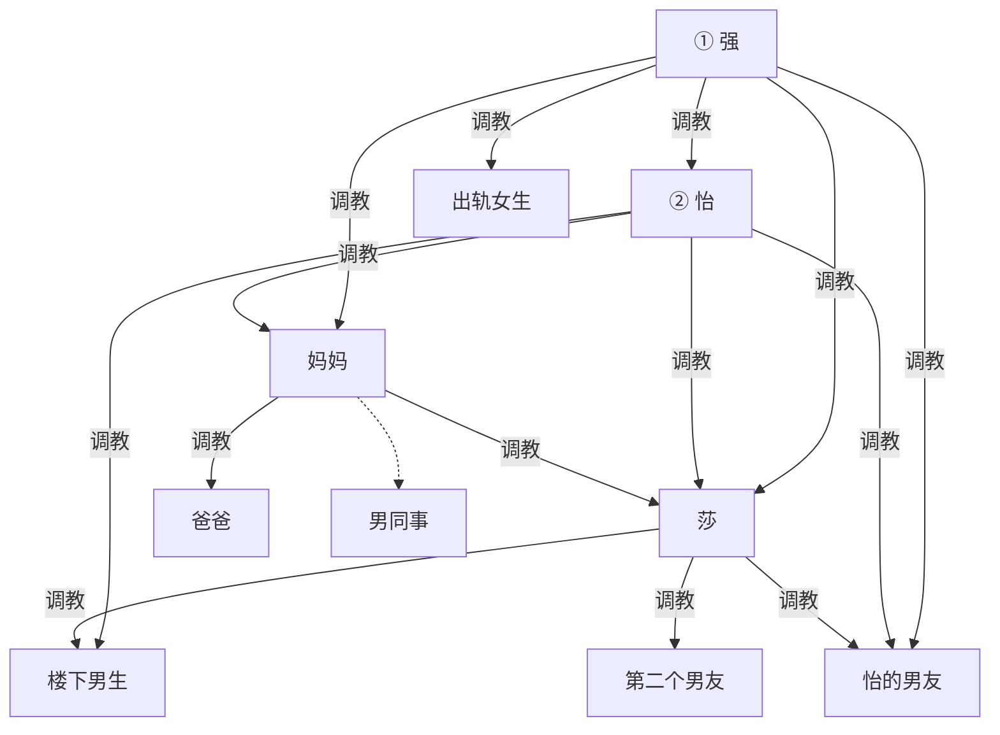

# 莎 / 怡 大纲（草稿）

性质：构思稿，不是正文。高三暑假按高考结束后、入学前写，角色按成年处理。不写高三校园日常。真实经历改编：读起来要像碰巧发生过。她已给完全改编许可，改编不另行问准。

---

## 前提

- 第三人称。主视角跟莎，必要时可切到别人（男同事晚上、强那边）。不要每人一章。名字：莎、怡、强。爸妈姓名、城市、单位后定或改淡。楼下男生、第二个男友、出轨女生、男同事、怡的男友暂用称谓。
- 可写可发，不漏真实信息；发布前给她看一眼，是脱敏和安全，不是改编许可。
- 两个刺激点：自己被辱；强势妈妈的反差。前半先立住后者，后半才裂。
- 已定改编：打屁股写进这个暑假当下；看见爸妈写进这个暑假，改成妈妈调教爸爸。两件事各是各的日子，中间隔着普通日子。
- 已定改编：出轨女同等或更漂亮、更骚，愿意更下贱地服侍强；强也玩腻了莎。被发现后他干脆甩了莎，跟新的在一起。莎卑微挽回无果。原文是他事后解释、她不想听，这里改掉。后来以上位成功的正宫自居，相遇时明里暗里拿雌竞上位羞辱莎，看不起，也提防。强在莎出租屋玩熟之后，觉得这地方好用，和女友不再开房，直接带来这里做爱，让莎服务他们两个。女友趁他淫威嘲笑莎，把心理优势坐实。仍是雌竞，不画她到莎的边；使唤莎的是强。
- 已定改编：男同事两种人设合成一条。当着妈妈面被训得像小孩；不当着她时强势，以体制内有前景自居高位。晚上想着妈妈，同时在女友身上发泄。秘书/司机线默认关掉。
- 已定改编：莎和第二个男友处一段时间，受不了自己在上位，分手，回头联系强。强玩新女友也有些腻了，来莎出租屋把她当母狗，先吵一顿、玩一顿。后来来的次数越来越多：敲门她就开，开了就被玩。玩熟了觉得这屋好用，不再跟女友开房，直接带来这里做爱，让莎服务他们两个。女友在他淫威下嘲笑莎。不复合，不当正宫。怡后知道，生气觉得她太下贱，狠狠调教；知道之后也拦不住门。单独来成习惯、带正宫来、怡加码默认不要挤同一天。有一次例外撞上，走第二条当场收怡。不画出轨女到莎的调教边。
- 已定改编：怡有时带自己的男朋友来莎出租屋调教他。莎和这个男奴都是她的奴，男奴更贱。怡要女生在上面，莎在他之上。有时让他服侍莎，有时用莎羞辱他。和强敲门、强带正宫来、怡加码默认不要挤同一天。有一次撞上见下条。原文只说见过两个、感觉她强势，细节是改编。
- 已定：楼下男生在怡被强收服之前，已经由怡收成男奴。强对她外面这些男奴没那么有兴趣，不写他去玩他们，也不由他指使再去收。当晚那个男友是自己冲上来才被打。
- 已定：怡要女生在这种男人之上。莎在男奴之上，楼下男生、男友都这样。是她定的位次。
- 已定：正宫不能踩在怡头上。强喜欢怡这种本身就强势的女生。打正宫只是他对怡动手的借口，要把怡收成母狗女奴，不是给正宫出气。怡不向正宫道歉。正宫之后只能不停作践自己来刺激他，不一定成功。
- 已定：怡先进家，再在出租屋被强收服。家规、求情、挡电视、打手心发生时，她还不是他的女奴，强也还没见过妈妈。强势的脸第一次在客厅里裂给她。撞上收怡排在这次回家之后。强第一次和妈妈见面更后，见家长就是这一次，不当客人，这一次才把她彻底变成母狗性奴。性这一层留给见面，不在手心里用掉。这一次画强 → 妈妈。正宫不跟着进家，也不跟着见家长。楼下男生不跟去。

---

## 全文调教结构

实线只画调教。楼下男生在怡被收服之前已由怡收成男奴，入图。强对外面这些男奴没兴趣，不画强到楼下男生。怡的男友入图；当晚他冲上来被强调教，所以有强 → 男友，事后强懒得再玩他。莎在这些男奴之上，是怡定的：女生在这种男人之上，所以画莎 → 楼下男生、莎 → 男友。莎调教第二个男友，入图。出轨女生被强调教、后来留下，入图。出租屋撞上，强调教并收怡，入图。闺蜜线原文没有调教；默认按方案甲不入图。若改用方案乙，另加「对象 → 闺蜜」，不连主链。男同事是职场加他想着她，虚线：妈妈 ‥ 男同事，边不标字。对女友若写成调教，才加实线「男同事 → 女友」，不连主链。爸爸只归妈妈。第二个男友只归莎。出轨女生只归强。正宫羞辱莎是雌竞，不画她到莎；她不能踩怡，不画她到怡。楼下男生和怡的男友不是同一个人。强调教莎是直接的，保留。怡调教莎、男友、楼下男生、妈妈，仍保留。强第一次见妈妈就收成性奴，所以有强 → 妈妈。权级上在强下面。

最高位是强。他喜欢怡的强势，收了她，但不让正宫踩她。打正宫只是收她的借口，她不道歉。正宫只能作践自己来刺激，不一定成功。怡先进家征服妈妈，那时还没被他收；强势的脸在客厅里先裂给她。出租屋收怡在这次回家之后。强第一次见面更后，才把妈妈收成性奴母狗，性这一层是新的。楼下男生在收怡之前已归怡，强不玩他。莎在楼下男生和男友之上。妈妈调教莎和爸爸。妈妈到男同事是虚线。莎调教第二个男友，受不了自己在上，分了。

---

## 出现过、未入图

- **闺蜜（同寝室友）、闺蜜的对象（强的室友）**：原文只有先处上、拉莎聚餐介绍强。默认方案甲：两人都比较弱势，不入图；强在他们寝室是大哥大，那是气场和座位，不是调教。备选方案乙：和莎情侣同构，对象调教闺蜜，才入图，仍不连主链。同构是「男上女下」对「强 → 莎」，不是闺蜜调教对象。
- **强的哥们**：强向他们炫耀式介绍莎。方案甲里他们听强的；方案乙里可以有另一个略强势的室友，但不要写成第二个强。出轨的事他们可能知道得比莎早，不要写成集体调教。
- **怡见过的另一个男朋友**：原文交过几个、见过两个。带来出租屋的那个已入图；其余仍不入图，也不写成强势那方来推翻「她调教他」。
- **男同事的女友**：被他拿来出气、听他摆编制，身上可能还被他想成别人。默认不入图。男同事本人已用虚线入图，不是调教。
- **年级主任**：高三时和妈妈是同学，对莎比较照顾。
- **出去玩的同学 / 楼下围观的人**：九点前那场和寝室楼下那场的背景人。
- **秘书、司机**：她建议过用来反衬妈妈，主线默认不写。

---

## 第一部　高三暑假

把妈妈立住。暑假是过出来的：摆鞋、自己洗袜子、开饭等爸妈落座、九点前回家、商场置衣服拍板在她、秋裤也是她说了算。爸爸偷买零食，包装袋扔小区外。外面训男同事像训小孩。这一场不要和打屁股、门缝挤在同一天。

男同事白天被训得像小孩。不当着她时换一副脸，对女友、对外人强势。晚上想着妈妈，同时在女友身上发泄，嘴里是编制、前途、自己才是高位。第三人称可以切过去，仍隔开几天，像碰巧看到他怎么消化。反衬两头：妈妈随手镇住一个人；爸爸回家仍服她，这个人回家找更弱的出气，想的却还是她。

这个暑假里有两件重事，不要排在同一天，也不要互为导火索。一件是妈妈调教莎：出门交代做事，莎看电视玩游戏，妈妈提早回来，按在腿上隔着裤子打二十多下，爸爸站在门口想拦不敢拦。打的时候不写莎的性反应。另一件隔了几天或几周，某个普通夜里被尿憋醒，路过卧室，门没关严：看见的是妈妈在调教爸爸，不是普通做爱。用同一张会咳一声的脸，不摆刑具、不请安、白天爸爸仍是丈夫。莎偷看一会儿，回房第一次在自己家里自慰。

这一部不写强、不写怡。调教：妈妈 → 莎，妈妈 → 爸爸。虚线：妈妈 ‥ 男同事。对女友仍默认不画。

---

## 第二部　强

住校，离妈妈远了。闺蜜（同寝）先处了强寝室的室友；户外聚餐，闺蜜拉莎去，介绍给强。两人怎么处，原文没写。两种改编，默认甲：

- 方案甲（更贴「碰巧发生过」）：闺蜜和对象都比较弱势。强是他们寝室大哥大，打球、座位、说话都围着他。闺蜜拉莎去聚餐，是想把室友带进这圈，不是她拿主意。强势追求、向哥们炫耀，本来就是大哥大的人在办。闺蜜情侣最多有点顺着、有点羡慕，不当众、不写第二套羞辱，不入调教图。
- 方案乙（同构）：对象对闺蜜，结构上像强对莎——男的拿主意，女的顺着。可以点到为止看见一两次（他让她去拿水、她看他眼色），不要写成另一个窗台磕头。入图：对象 → 闺蜜，不连主链。强仍可以是寝室里更出风头的那个，但不因此调教室友。

强势追求，旱冰碰碰车球场，第一次给他。热恋时打完球开房，后来羞辱向：窗台、镜子、大课不穿内裤、课间检查、脱鞋、闻酸臭、对球鞋磕头。偷看那晚不再重复。

出轨。那个女生同系不同班，同等或更漂亮，更骚，愿意更下贱地服侍他。强也玩腻了莎。发现、甩人、挽回不要挤在同一天：先是不对劲，再对上人，他懒得圆，干脆说玩腻了、就跟她了。莎卑微挽回无果——求复合、求再给一次、甚至想学着更下贱，他已经有人肯做、也更新鲜。原文他事后还来解释、她不想听，这里改成他甩、她求。分手后她仍喜欢被他调戏，觉得教了自己挺多，只是人已经不在了。

出轨女留下以后以上位成功的正宫自居。同系会碰上：球场边、食堂、系里活动，不要场场都撞。碰上了明里暗里拿这件事压莎——谁留下了、谁求过、谁比较会伺候。看不起莎被甩还低声下气；也提防，因为莎求过、还忘不掉，强玩腻过一次。她不调教莎，只雌竞。强可以在场装没看见，也可以一句带过，不要写成他安排两人互斗。

分手后处过第二个男友，比她大一届的学长，人弱。莎不自觉模仿妈妈对爸爸，也模仿一部分强对自己的那套；他顺着、受着。她并不开心，也不满足：觉得他太弱，既不能满足她，也不能征服她。处一段时间，受不了自己在上位，分手。回头联系强，接到第三部出租屋。这段证明她当上面的人当不成，也为怡打下她做对照。不要用闺蜜线来对照这段；对照留给妈妈/强/出轨女生/怡。

调教：强 → 莎，强 → 出轨女生，莎 → 第二个男友。方案乙才加：对象 → 闺蜜。

---

## 第三部　怡

同级男生寝室楼下喊名字。怡骂她怂逼，陪她下去，扇男生；人散了，突然抽她两个耳光。她下面湿了，差点跪下。之后使唤：取快递、外卖、买单、奶茶连她喝什么都是怡定的。扇耳光变成玩。聊天记录发朋友圈，她去点赞。这个男生当时被赶跑。后来、在怡被强收服之前，别的场合再碰到，被她反复公开羞辱，收成男奴。不要接在楼下那天晚上。他和带来出租屋的男友不是同一个人。怡要女生在这种男人之上，莎在他之上。强对这种外面的男奴没兴趣，不写他去玩，也不由他指使去收。考研租一居，怡来过夜：辱骂、洗袜子衣服、小怪兽。对莎仍偏玩心，不是正经女主人收女奴；对带来的这个男友更往下贱收奴，莎也在他之上。

有时怡带自己的男朋友来这间出租屋调教他。莎和他都是怡的奴，他更贱。怡要女生在上面，所以莎在他之上：服侍莎、被莎使，不是莎突然当主人收的。不要场场都带，默认也不要和强敲门、强带正宫、怡为那事加码挤在同一天。原文只是见过两个、感觉她强势，这一层是改编。强对这个人、对楼下男生都没那么有兴趣；男友是当晚自己冲上来才被打，事后他懒得再玩。

第二个男友分了以后，她回头联系强。强和新女友处一段时间也有些腻。先来一次出租屋，不复合，把她当母狗：先吵一顿（她还想要名分或只找她，他已经有正宫，只来玩），再玩一顿。后来次数越来越多，不必每次先吵：敲门，她就开，开了就被玩。不当女朋友，只当能随时来的那扇门。不要写成天天来；是越来越勤。不要写成抓奸。

玩熟了，他觉得这屋好用。后来和正宫做爱也不开房了，直接带到莎这里。让莎服务他们两个做爱——倒水、递套、擦、跪在边上，以及他随口使的。使唤她的是强。正宫趁他淫威嘲笑她：谁是正宫、谁开门、谁在自己床边伺候。看不起坐实成心理优势，提防也还在。这是雌竞，不是她调教莎。单独来成习惯之后才带人来，不要第一次敲门就两个人。

隔些日子被怡知道了——痕迹、消息、她自己漏的，不要强还在屋里，也不要正宫还在屋里。怡很生气，觉得她太下贱，狠狠调教一顿。加的是力度。知道之后强还是会来，她还是开门；怡拦的是莎，不是那扇门。带正宫来可以是怡知道之后更下贱的一步，不要和加码挤同一天。

进家在这一次撞上之前，也在毕业之前，不是回老家之后。怡还不是强的女奴。强不在场，也还没见过妈妈。正宫不来。楼下男生不跟去。

她带莎回家。气势从进门就比妈妈强。莎不是叛母：妈妈管，她不敢不听；怡管，她也不敢不听。不平等长在妈妈不敢对怡开口。

怡当众管莎、当众欺负她、玩她，完全不避爸爸妈妈。还对妈妈说：我在学校就这样帮你管女儿。意思是妈妈该谢她。

妈妈看见女儿被同龄、甚至更小的女同学这样欺负、这样玩，不舒服。她委婉求情不止一次。每一次都被怡顶回去，顶的方式一次比一次强势：先是一句带过，后来当着莎和爸爸的面驳，再后来求情本身就会挨训。求一次，斜一分。

家规照旧一件一件踩，妈妈一次都没把禁止说出口。踩顺了以后，怡不再只是不守妈妈的规矩，开始在家里定自己的规矩，并且用这些规矩管莎。莎不敢不听。然后她也开始训爸爸。再然后训到妈妈本人。妈妈第一次被她当面训，气势就从「不敢说她」变成「她会说我」。

再后来，妈妈主动执行怡的家规。爸爸还按从前妈妈定的规矩做事，不小心犯了怡的规矩，妈妈就主动罚他。怡自己也可以随时罚爸爸。

妈妈由此认定：自己要是犯了怡的规矩，也会被怡管教。位子就此坐实。她在家里特别小心，不敢碰那些规矩。越小心，越怕。怕到最后，有一次真的不小心破了规矩。怡在看电视，定过客厅这条线不许人挡。妈妈从卧室走到厨房，按老路线穿客厅，身子挡住了画面。不是干活，也不是去管莎。

电视不关。怡不追。叫她站过来，打一下手心。莎和爸爸都在，节目还在放。不跪，不上沙发。她自己走回来，把手伸出来。再往下的玩不放在这一下里。强势的脸第一次裂开，用在这里。

这条上爸爸被怡直接罚，可画怡 → 爸爸；妈妈罚爸爸仍是原来的妈妈 → 爸爸，只是规矩换成了怡的。怡 → 妈妈用接受手心这一次坐实。此时强还没见过她，也还没在出租屋收她。

有一次撞上，走第二条，当场收怡。进家已经发生过，不要写在这一晚。细步见下。没点外卖。强照旧敲，以为莎开。

开门前。怡正带着男友调教，莎在场。强带正宫来，预备让莎服务他们做爱。正宫带着嘲笑进门的心理。莎听见熟悉的敲门，胃先沉——今晚开的人不是她。

1. 开门对上。怡看见强，火上来。强一愣，脚已经进来，不当真对手。正宫还在门外，发现开门的不是莎，警惕。莎想上前给强让路，习惯比脑子快。男奴停下，看怡。
2. 闯。他肩一顶进门，这屋他熟。正宫跟上，眼睛先找莎。怡没挡住体积。莎让开。男奴往后。
3. 对骂。怡：玩我闺蜜还敢上门；转头骂正宫，骚货，女朋友不够骚才出来偷别的女人。强：一个女的牛逼得不行，玩两个女的加一个算不上男人的男人，也来叫板。正宫被骂刺一下，更要站他身后。莎被叫闺蜜，耻。男奴被「算不上男人」扫到，更缩。
4. 怡先动手，只敢打女的。表面很气，手先落到正宫脸上，不敢打强。正宫痛、羞，看强。强拿「谁打我女朋友」当借口，要的是收怡，不是给正宫出气。莎看出她没敢打他，胃更沉。男奴还没动，盯着怡。
5. 强对怡动手。借口是护短，人是冲着把她收成母狗去的。推、扇、按住。怡挣、骂，仍不敢认真打回去。正宫以为被护，笑出来；他不把这场让给她。莎怕，也湿。男奴看见女朋友被弄。
6. 男奴冲，不是一上来就软。看见女朋友被弄，扑过来抢人，真抓到、甚至打到一下。强不当男人打架，改成打老婆那一套：连扇耳光、揪头发按下去打、按着打，还手就加打。要有伤：脸肿、嘴角、站不稳。要打到真疼、真怕，不是一推就跪。他可能再扑一次，第二次已经怕，打得更像收拾家里人。骂也不像对男人：哭什么、算什么男人、跟女人似的。打到他不敢抬手、求、跪着不敢起。留下跪着看。强没当真出过汗，转回怡。
7. 玩怡。回头扇、操。按在她刚调教男奴的地方。男奴脸上带着伤跪着看女朋友被扇被操。莎被使过来。正宫只在他使下按手、递、骂。怡骂、踢，越骂越操。
8. 正宫想加码，把校园那套搬到怡身上。强不让她踩到怡头上。他喜欢怡这种强势，收的是这个人，不是让正宫骑上去。正宫只能看着，踩不成。
9. 嘴硬，身体先软。同构耳光。还不算收完。
10. 收成女奴。要对强本人身体和口头都臣服，当众做完才算。关于莎、男奴的口头就到这里，不再加：莎不是闺蜜是他的；旁边那个不算男人。不向正宫道歉，也不说不敢再动他女朋友。

身体上对强还要更多，都是她自己做，不是被摆：爬过去；自己把衣服解开、头发撩开给他抓；脸被扇了还把脸送回去；自己把腿分开、腰塌下去、屁股抬起来迎操；口交时自己含深、含着不躲；双手背到后面不挡；被操时自己往上送；舔他的脚，舔他的屁眼；射了不躲，脸上嘴里都接着，咽下去或自己舔干净；做完仍跪着，不自己穿上。少了爬、送脸、自己摆姿势、含着、舔脚、舔屁眼、咽、跪着不起来，只被按着操，不算身体上服完。

口头上对强本人还要更多，说给他听：叫强哥，被问就答强哥；说自己是他的女奴；说刚才跟他叫板是自己不配；说错了，求他打；求他操，说自己贱、想被他弄；问他满不满意，他说不够就再来；说以后听他的，他说停才停、他说跪就跪。还要接受他那一套，并且自己说出来：她这种女的，最多只能玩别的女人、玩一些不算男人的男人；在真正的男人面前，也是母狗。操着或刚操完磕头，把这些话说出口。少了向他求、认错、认自己是他的、问他满不满意、自己把这套说出来，只叫一声女奴，不算口头上服完。

男奴脸上带着伤跪在旁边看见。强收下，不当仪式。怡恨、耻，身体和话都已经给了。正宫想踩，踩不成。莎以后开门更没借口。莎仍在这个男奴之上。
11. 当晚收场。可以还操正宫，让刚收的怡和莎一起服务。或丢下一句还会来。进家已经在前面发生过。

现实线收到毕业回老家、偶尔要钱。见妈妈在毕业之前，不是回老家之后。

正宫之后还在，但不能踩怡。她要不停作践自己来刺激强，不一定成功。对莎仍是雌竞。不跟怡较劲成调教。

调教：强 → 怡，强 → 莎，强 → 正宫，强 → 怡的男友。怡 → 莎，怡 → 楼下男生，怡 → 男友。莎 → 楼下男生，莎 → 男友。权级上怡和莎都在强下面；莎在两个男奴之上。强不玩楼下男生。

---

## 第四部　强见妈妈

排在进家之后，也排在出租屋收怡之后。见家长就是这一次，不当客人。她白天已经怕怡，手心也挨过，但还不是性奴。怡已经是他的女奴，不挡在中间。他这一次把妈妈彻底变成母狗性奴。不重演家规和打手心。新的刺激是性这一层，以及他比怡更彻底。这一次画强 → 妈妈。正宫不跟着。楼下男生不跟去。

从进门到收完，场面还没拆。名分也还没定：出租屋是不复合，见家长却要一个进门的说法。

---

## 章节大纲

四部，二十八章。一章一件主事。同一章里可以隔天，不要把大纲标明「不要挤同一天」的事写成同一场。闺蜜默认方案甲，不单列章。第四部只占位置：名分和收妈妈的场面还没拆，不在章节里提前写步骤。

### 第一部　高三暑假（4章）

不写强，不写怡。

1. 家规。暑假过出来：摆鞋、自己洗袜子、开饭等爸妈落座、九点前回家、置衣服和秋裤她拍板。爸爸偷买零食，包装袋扔到小区外。
2. 男同事。白天被训得像小孩。隔几天切到晚上：想着妈妈，在女友身上发泄，嘴里是编制和前途。不和打屁股、门缝同一天。
3. 打屁股。出门交代做事，莎看电视玩游戏，妈妈提早回来，按在腿上隔着裤子打二十多下。爸爸站在门口想拦不敢拦。不写莎的性反应。
4. 门缝。隔了几天或几周。夜里被尿憋醒，门没关严，看见妈妈在调教爸爸，不是普通做爱。同一张会咳一声的脸，不摆刑具。莎偷看一会儿，回房第一次在自己家里自慰。

### 第二部　强（7章）

5. 聚餐。住校。闺蜜先处了强寝室的室友，拉莎去户外聚餐，介绍给强。强是寝室大哥大。闺蜜和对象都弱，不入图。
6. 第一次。强势追求，旱冰、碰碰车、球场，向哥们炫耀。第一次给他。
7. 羞辱。热恋时打完球开房。后来转到窗台、镜子、大课不穿内裤、课间检查、脱鞋、闻酸臭、对球鞋磕头。偷看那晚不重复。
8. 不对劲。出轨的前兆。还没对上人，也还没甩。
9. 甩。对上那个女生：同系不同班，同等或更漂亮，更骚，肯更下贱地服侍。他懒得圆，说玩腻了，就跟她了。莎求复合、求再给一次、想学着更下贱，无果。不和上一章同一天。
10. 正宫。球场边、食堂、系里活动碰上，不要场场都撞。她拿谁留下了、谁求过、谁比较会伺候来压莎。看不起，也提防。强装没看见，或一句带过。
11. 学长。比她大一届，人弱。她模仿妈妈对爸爸，也模仿强对自己的那套。处一段时间，受不了自己在上位，分手。回头联系强。

### 第三部　怡（14章）

12. 楼下。男生寝室楼下喊名字。怡骂她怂逼，陪她下去，扇男生。人散了，突然抽她两个耳光。她下面湿了，差点跪下。男生当时被赶跑。
13. 使唤。取快递、外卖、买单，奶茶连喝什么都是怡定的。扇耳光变成玩。聊天记录发朋友圈，她去点赞。
14. 男奴。别的场合再碰到楼下那个男生，反复公开羞辱，收成男奴。不接在楼下那天晚上。莎在他之上。强不玩他。
15. 过夜。考研租一居。怡来过夜：辱骂、洗袜子衣服、小怪兽。对莎仍是玩心，不是正经收女奴。
16. 男友。怡带男朋友来这间屋调教。他比莎更贱，莎在他之上：服侍莎，或被莎羞辱。不要场场都带。
17. 回头。强玩新女友也有些腻了，第一次来出租屋。先吵：她还想要名分，他已经有正宫，只来玩。再玩一顿。不复合。
18. 习惯。来得越来越勤。敲门，她就开，开了就被玩。不是天天来，也不必每次先吵。
19. 带来。习惯之后，和正宫不再开房，直接带到这里做爱。莎倒水、递套、擦、跪在边上。正宫趁他淫威嘲笑她。不要和第一次敲门挤在同一天。
20. 加码。隔些日子怡知道了。强和正宫都不在屋里。她觉得莎太下贱，狠狠调教一顿。知道之后门还是开。不和带正宫挤在同一天。
21. 进门。撞上之前，怡带莎回家。她还不是强的女奴，强没见过妈妈。气势从进门就压过妈妈。当众管莎、欺负她、玩她，说自己在学校就这样帮忙管女儿。妈妈第一次求情，被一句带过。家规开始被踩，妈妈没把禁止说出口。正宫不来，楼下男生不跟去。
22. 立法。再回家，可以隔成几次，不挤成一下午。求情被当面驳，再后来求情本身挨训。怡立自己的规矩，用来管莎。然后训爸爸。然后训到妈妈本人。
23. 手心。妈妈开始主动执行怡的规矩，爸爸犯了她就罚。怡也可以随时罚爸爸。妈妈自己挡住电视，站过来，打一下手心。莎和爸爸都在，电视不关。不跪。强势的脸在这里裂开。再往下的玩不放在这一下里。
24. 撞上。进家已经发生过。没点外卖。怡带着男友在调教，强带正宫来敲。开门、闯进、对骂。怡只敢打正宫。强拿这个当借口对她动手。男奴拼命，被按打老婆的方式打疼、打怕，带着伤跪着看。强玩怡。正宫想踩，踩不成。这一章收到还没认完。
25. 收怡。当众做完身体和口头的臣服：爬、送脸、自己摆姿势、含着、舔脚、舔屁眼、咽、跪着不起来；叫强哥，认女奴，求他，自己说出「这种女的在真男人面前也是母狗」。不向正宫道歉。关于莎和男奴的话不加。当晚可以再让她们服务正宫，或丢下一句还会来。

### 第四部　强见妈妈（3章）

26. 进门。见家长就是这一次，不当客人。怡已经是他的女奴，在场，不挡。妈妈白天已经怕怡，手心也挨过。正宫不跟着，楼下男生不跟去。用什么名分进门，还没定。
27. 性奴。这一次把她彻底变成母狗性奴。不重演家规，不再打手心。新的是性，以及他比怡更彻底。从进门到收完的步骤还没拆，写的时候再定。
28. 回老家。毕业。结构不再加层。莎回家，偶尔要钱。要钱的妈妈白天听怡的规矩，性上是强的母狗。

---

## 待问她

只问场面和细节，不问许不许可。

1. 出分后那个暑假，哪一件事最能说明她管得严。
2. 有没有九点前赶回来的一次（和谁、去哪）。
3. 置大学衣服有没有当场否决某件。
4. 训同事那次放暑假附近，还是只能当小时候的记忆。
5. 打屁股若写在这个暑假，导火索用哪件合适；当时说了什么、打完之后呢。
6. 门缝里调教爸爸，她更想看到哪一步（口头、姿势、打、命令）。
7. 亲戚朋友同事里有没有一句别人怕她的话。
8. 偷买零食有没有差点被发现。
9. 暑假有没有值得一提的同学或闺蜜；没有就不用编。
